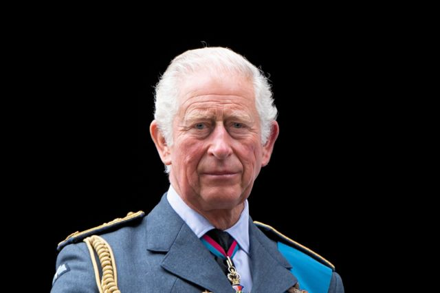
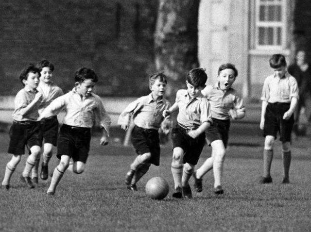
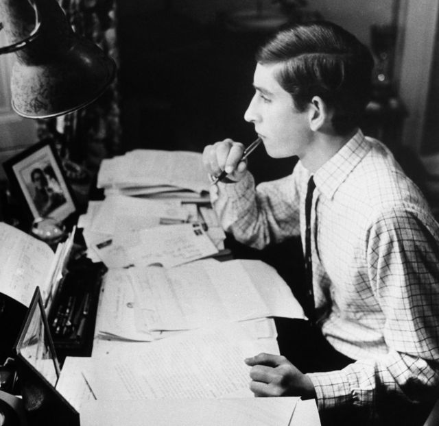
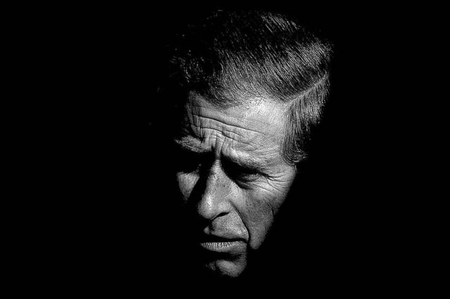
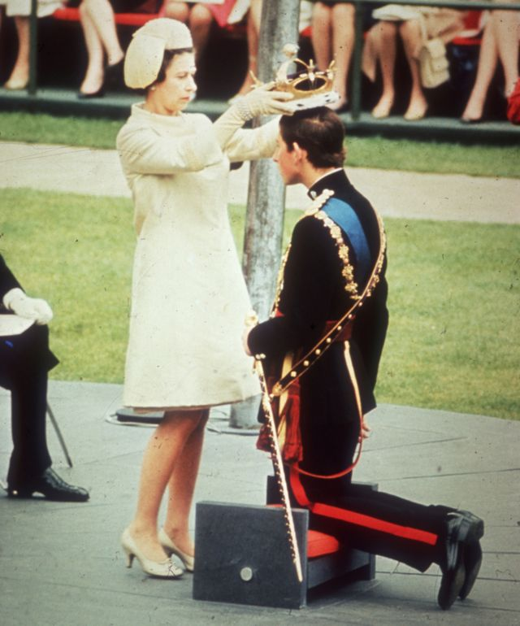
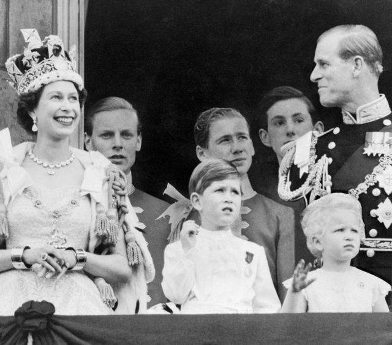
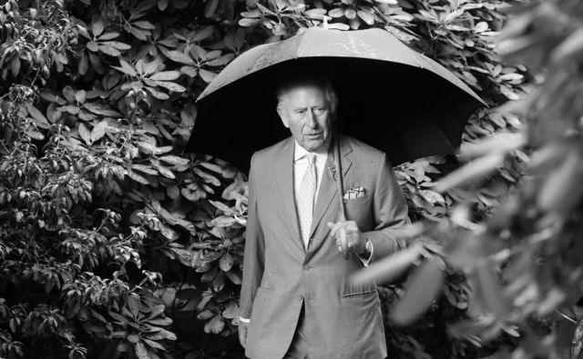

# [Uk] 英国国王加冕礼：谁是查尔斯三世？

#  英国国王加冕礼：谁是查尔斯三世？

> 图像来源，  Getty Images

**在女王伊丽莎白二世去世的那一刻，英国王位立即传给了她的继承人前威尔士亲王查尔斯。**

查尔斯三世任王储长达 70 年，是英国历史上等候继位时间最长的王位继承人，登基时 73 岁，亦是有史以来最年长的新君主。

查尔斯三世加冕典礼5月6日星期六在伦敦威斯敏斯特大教堂举行。

##  查尔斯是谁？

查尔斯·菲利普·亚瑟·乔治出生于1948年11月14日。他的母亲当时是伊丽莎白公主，查尔斯四岁时母亲被加冕为女王，他成为王位第一继承人。

查尔斯童年大部分时间在家受教育，八岁上学，成为第一个去学校的王位继承人。他曾就读于伦敦西部的Hill House小学，伯克郡的的（Cheam）一所预备学校和苏格兰东部的高登斯顿（Gordonstoun）学校。

> 图像来源，  Getty Images
>
> 图像加注文字，1957 年查尔斯在学校踢足球

查尔斯就读剑桥大学三一学院，先攻读考古学和人类学，后来又修了历史。他是英国王室第一位完成大学学位课程获得文凭的王位继承人。

1969年7月，20岁的查尔斯获授威尔士亲王衔，女王在卡纳温城堡（又译卡那封、卡纳芬） 给查尔斯戴上威尔士亲王王冠。典礼之前，查尔斯王子曾在阿伯里斯特威斯的威尔士大学学院学习威尔士语。

> 图像来源，  PA Media
>
> 图像加注文字，查尔斯在剑桥大学三一学院时，先攻读考古学和人类学，后来又修了历史。他是英国王室第一位完成大学学位课程获得文凭的王位继承人。图为1969年查尔斯在剑桥三一学院宿舍自习。

##  家庭生活

查尔斯1981年7月29日在圣保罗大教堂与戴安娜·斯宾塞女爵结婚。他们育有两个儿子：威廉王子出生于1982年6月21日，哈里王子出生于1984年9月15日。

查尔斯与戴安娜于1996年8月28日解除婚姻关系。之后，戴安娜王妃继续住在肯辛顿宫、从事公共工作。戴安娜1997年8月31日在巴黎的一场车祸中丧生。

2005年4月9日，查尔斯在温莎市政厅举行的民事仪式上与卡米拉结婚。

> 图像来源，  PA Media

##  新国王查尔斯三世

在女王伊丽莎白二世去世的那一刻，英国王位立即传给了查尔斯。

新国王封号查尔斯三世。这是查尔斯即位后做出的第一个决定。他可以从他的四个名字中任选一个——查尔斯·菲利普·亚瑟·乔治。

查尔斯并非唯一变更头衔的人。威廉王子和他的妻子凯特被封为康沃尔和剑桥公爵和公爵夫人，国王还授予他们威尔士亲王和王妃衔。

查尔斯的妻子卡米拉也有了新头衔：王后，英文 Queen Consort， 指君主配偶。

##  新国王确认仪式

女王去世三天后，查尔斯三世在圣詹姆士宫（James's Palace）的一项历史性仪式上正式获得王位继承理事会（Accession Council）确认，成为新国王。

王位继承理事会成员来自枢密院（Privy Council），枢密院是君主顾问机构，可以追溯到诺曼国王时期，目前有700多名成员，其中大部分是过去及目前的政界人士。

> 图像来源，  Getty Images
>
> 图像加注文字，女王授查尔斯王子威尔士亲王衔，1969年

大约200名枢密院成员参加了查尔斯王位继承理事会，1953年女王即位时人数同等。

确认仪式分两部分，国王参加第二部分。

首先，枢密院议长（Lord President）、保守党议员彭妮·莫当特（Penny Mordaunt）宣布女王去世。议会司仪宣读声明，包括查尔斯的国王头衔，也就是是查尔斯三世。

公告由一众人签署，包括王后、威尔士亲王、坎特伯雷大主教、大法官、约克大主教和首相。

王位继承理事会仪式的第二部分，和选举产生的国家元首、比如美国总统就任之初的“宣誓就职”不同，取而代之的是，查尔斯宣言表明将坚守宪政，宣誓保卫苏格兰教会，并签署两份文件以作记录。王后和威尔士亲王见证签署。

确认理事会仪式结束后，爱丁堡、卡迪夫、贝尔法斯特各自举行仪式，宣布新国王查尔斯三世即位。

##  查尔斯三世加冕典礼

新国王即位象征性的高潮是加冕礼。

由于需要周密准备，加冕礼不太可能在国王即位不久后举行。伊丽莎白女王于 1952 年 2 月继承王位，但直到 1953 年 6 月才加冕。

过去900年间，加冕礼一直在威斯敏斯特教堂举行。“征服者威廉一世”是第一位在威斯特敏斯特加冕的英国君主，查尔斯三世是第40位。

这是一项圣公会宗教仪式，由坎特伯雷大主教主持。仪式的高潮是大主教把圣爱德华王冠戴在查尔斯的头上——这顶纯金打造的王冠历史可追溯到 1661 年。

它是伦敦塔珍藏的王室珠宝的核心，只有在加冕礼上才由君主佩戴（尤其是，它重达 2.23 公斤，近 5 磅）。

与王室婚礼不同，加冕礼是国事活动，政府为此付费，并最终决定嘉宾名单。

> 图像来源，  Mirrorpix / Getty Images
>
> 图像加注文字，1953年伊丽莎白二世加冕礼后王室成员在白金汉宫阳台露面

##  英联邦元首

查尔斯三世还成为英联邦元首。

英联邦是一个由56个独立国家（总人口25亿）组成的联合体，在其中14个国家加上英国，国王是国家元首。

这些国家分别是：澳大利亚、安提瓜和巴布达、巴哈马、伯利兹、加拿大、格林纳达、牙买加、巴布亚新几内亚、圣克里斯托弗和尼维斯、圣卢西亚、圣文森特和格林纳丁斯、新西兰、所罗门群岛、图瓦卢。

> 图像来源，  Getty Images

**©全部图片版权所有**

