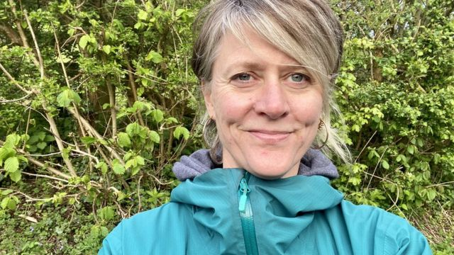
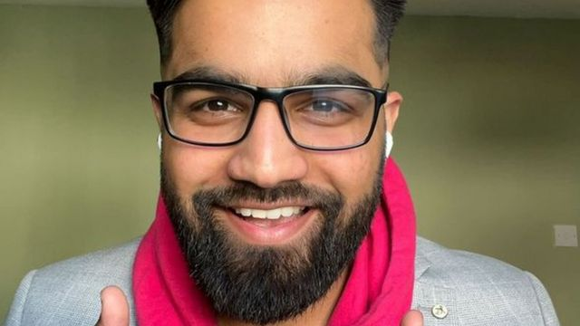
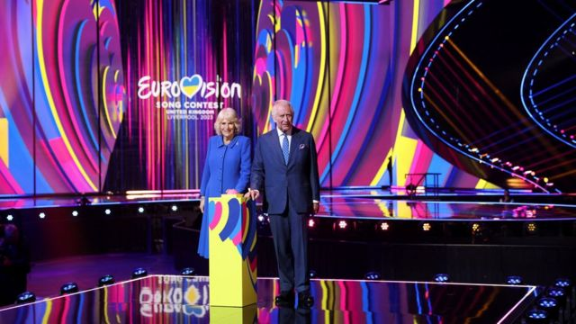

# [Uk] 英国国王查尔斯三世加冕礼：这些英国人为什么不会看？

#  英国国王查尔斯三世加冕礼：这些英国人为什么不会看？

  * 杰米·莫尔兰（Jamie Moreland）、雅斯敏娜·加西亚（Yazmina García） 
  * BBC记者 

> 图像来源，  Handout
>
> 图像加注文字，加冕礼令作为助产士的奥莉感到“真是怒了”。

**5月6日，预计将有数以百万计的民众观看英国国王查尔斯三世（King Charles III，查理斯三世）的加冕典礼。有些人可能会对那些人群、那些派对、那些排场和那些仪式万分陶醉，但另一些人却是会想尽办法躲开这个场合。**

BBC新闻部记者访问了四个表明不会观看加冕典礼的民众。

##  “这是在浪费一大笔钱”

奥莉（Oli）没有打算收看典礼。她说，君主制是一个过气的制度，应该废止。

“我认为这是在浪费一大笔公共资金，”51岁、来自斯特劳德（Stroud）的奥莉说。

对她而言，世袭的国家元首既不民主，也带有精英主义色彩。

“在我们的社会顶层有这么一小群精英飞黄腾达，然后其他人都在东奔西跑谋生计，养家糊口，”她说。

作为一名国民保健署（NHS）的助产士，她表示纳税人的钱本可以用在更好的地方。

“王室家庭有他们自己的私人财富，但是我们纳税人却还要在一场金融危机中来资助这次加冕游行，”她说。

她说，她不会看直播，而是会在医院当值，帮忙接生。

##  “我宁愿赖在床上吃甜甜圈”

> 图像来源，  Tarek Ahmed
>
> 图像加注文字，塔雷克说，他宁愿看一部三小时长的电影。

塔雷克·阿迈德（Tarek Ahmed）说，他没有“在乎到时会看几个小时”。

“我宁愿赖在床上吃甜甜圈，”这个来自肯特郡的21岁市场营销行政人员说。

塔雷克说，他没有决定自己要不要支持王室家庭。

“如果他们能让国家多赚点钱，有好日子，就意味着有更多钱给到NHS和教育系统，但是如果不是这样，那我不想他们在。我不知道答案，”他说。

BBC《广角镜》（Panorama）节目委托民调机构YouGov进行的调查显示，民众广泛支持保留君主制，58%的人更倾向于以王室为国家元首——只有26%的人更倾向于由民选官员担任元首。

塔雷克打算在星期六早上和家人一起看最新一部《阿凡达》（Avatar）电影，不过可能会在之后看一下加冕典礼的快速回顾。

“我可能会看精华，看王冠戴到他头上的那一刻——那是个历史瞬间。”

虽然对加冕典礼有这样的看法，但是塔雷克还是期待这个公共假日。

“我们能多休一天，这是全国人民应得的，”他说。

##  “我不觉得查尔士值得当国王”

> 图像来源，  Joana Firmino
>
> 图像加注文字，乔安娜将会飞去菲律宾旅行，而不是“浪费时间”看庆典

乔安娜·费尔米诺（Joana Firmino）说，她不喜欢查尔斯国王，也不想看着他戴上王冠。

“我不认为他会成为一个好榜样，”这个来自肯特郡的21岁侍应生说。

乔安娜很喜欢伊丽莎白二世女王。女王逝世时，她感到“极度崩溃”。

但是她担心，由于查尔斯与第一任妻子、威尔士王妃戴安娜之间令人深受折磨的关系，他或许“不会作出好决定”。她说，他的儿子威廉王子（Prince William）会是“一个好得多的国王”。

“如果是威廉加冕，我肯定会看。但是我不想花几个小时看一个我不是很喜欢的人戴上王冠成为国王，我不认为他值得，”她说。

乔安娜将会在假期飞去菲律宾度假。

“我不会浪费我的时间。我会尽情享受阳光和热带海滩，”她说。

##  “我会在欧洲歌唱大赛上班”

> 图像来源，  Luke Dudley
>
> 图像加注文字，卢克将会在利物浦忙于为欧洲歌唱大赛筹备彩排，日程“塞得满满”。

卢克·都得利（Luke Dudley）在欧洲歌唱大赛（Eurovision Song Contest）上做聚光灯打灯师，并表示“连轴转”的彩排日期意味着他无法看加冕庆典。

“日程挤得很满，我们在笃定地遵守着日程表，”他说。

27岁的他来自曼彻斯特，在灯光部工作，为舞台上的艺人和主持人准备重要的灯光。

> 图像来源，  Reuters
>
> 图像加注文字，在利物浦，卢克见证了查尔斯国王和卡米拉王后主持欧洲歌唱大赛的开幕仪式

对于错过“一个我们的重大历史时刻”，卢克感到失望。

“朋友和家人都计划好开派对了，所以实在是个大遗憾。我喜欢那排场，那仪式感还有它当中一切的名场面，”他说。

虽然卢克无法参加加冕典礼的家庭派对，但他说，他“不能错过像欧洲歌唱大赛这样的机会。”

“我兴奋得不得了，什么都比不了。”

##  更多关于英国国王加冕典礼的报道：

