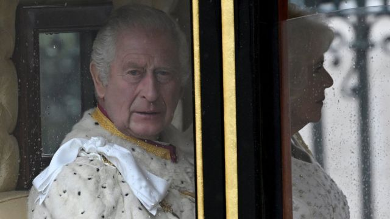
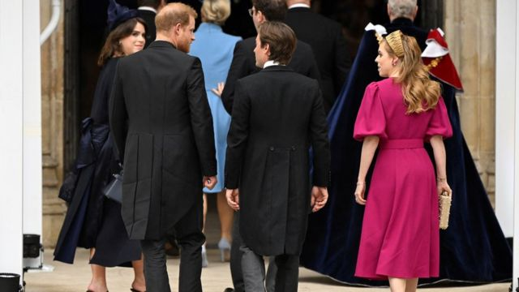
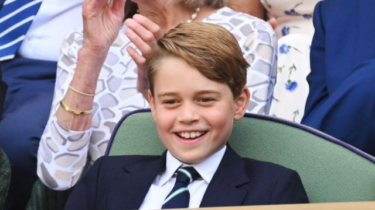
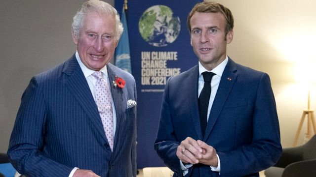
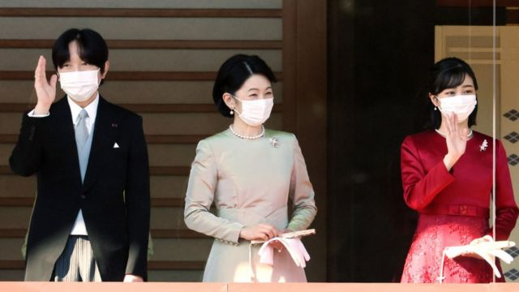
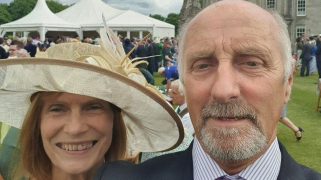

# [Uk] 英国国王查尔斯三世加冕典礼：哪些嘉宾去了？谁去不了？

#  英国国王查尔斯三世加冕典礼：哪些嘉宾去了？谁去不了？

> 图像来源，  Reuters

**英国国王查尔斯三世（King Charles III，查理斯三世）加冕仪式在伦敦举行，出席典礼的嘉宾也已陆续现身。**

5月6日，国王在伦敦威斯敏斯特教堂与妻子王后卡米拉（Camilla, the Queen Consort）一同加冕。

与1953年为其母亲举行的上一次加冕仪式相比，查尔斯三世选择了一个更短小、更多样化的仪式。

邀请函已经发给大约2000人——以下是我们知道的嘉宾名单。

##  英国王室成员

与许多活动一样，家庭往往排在第一位，查尔斯国王和卡米拉王后的许多家庭成员都将出席。

威尔士亲王及王妃——威廉王子（Prince William）和妻子凯特，以及国王的两个兄弟姐妹——安妮长公主（Anne, the Princess Royal）和爱丁堡公爵爱德华王子（Prince Edward, Duke of Edinburgh），都将出席。

虽然此前有很多猜测，萨塞克斯公爵哈里王子（Prince Harry, Duke of Sussex）确认将出席，但他的妻子梅根（Meghan Markle, Duchess of Sussex）不会。加冕仪式恰好是他们的儿子阿奇王子的四岁生日。

> 图像来源，  Reuters
>
> 图像加注文字，萨塞克斯公爵哈里王子出席了加冕典礼，但他的妻子梅根没有参加。加冕仪式恰好是他们的儿子阿奇王子的四岁生日。

约克公爵安德鲁王子（Prince Andrew, the Duke of York）会去——但他的前妻约克公爵夫人萨拉·弗格森（Sarah Ferguson）将不会出席。

他们的女儿碧翠丝公主（Princess Beatrice）和尤金妮公主（Princess Eugenie）作为王位的第九和第十一顺位出席——还有安妮公主的女儿扎拉·廷德尔（Zara Tindall）和她的丈夫迈克· 廷德尔（Mike Tindall）。

> 图像来源，  Getty Images
>
> 图像加注文字，乔治王子是王位第二顺位继承人。

查尔斯国王和卡米拉王后的孙子们都将到场，其中一些人还会参加仪式。

威廉王子和凯特的儿子、王位的第二顺位继承人乔治王子（Prince George ），将是“荣誉四骑士”（pages of honour）之一。

王后的三个孙子，格斯（Gus）和路易斯·洛佩斯（Louis Lopes）、弗雷迪·帕克·鲍尔斯（Freddy Parker Bowles ）和她的曾侄子亚瑟·埃利奥特（Arthur Elliot）将担任同样的角色，成为国王穿过威斯敏斯特教堂一行的成员之一。

##  政治家、领导人和外国皇室成员

关键的政治人物和全球领导人也将出现在2000名与会者中——值得注意的是，作为一个国事场合，政府控制着嘉宾名单。

英国现任首相里希·苏纳克（Rishi Sunak）将出席，还有内阁大臣和上议院的议员们。

多名英国前首相，如莉兹·特拉斯（Liz Truss）和托尼·布莱尔（Tony Blair），以及苏格兰新任第一部长胡姆扎·优素福（Humza Yousaf）也会出席。

> 图像来源，  PA Media
>
> 图像加注文字，查尔斯国王原定于3月访问法国。

法国总统埃马纽埃尔·马克龙（Emmanuel Macron）出席加冕典礼。此前，查尔斯国王对法国的国事访问因抗议活动而被推迟，但一位消息人士告诉《泰晤士报》，马克龙将出席，以显示他对英国的"友谊、尊重和敬意"。

美国总统拜登（Joe Biden）在4月的一通电话中告诉查尔斯国王他不会出席，但确认第一夫人吉尔·拜登（Jill Biden）代表他出席。

波兰总统安杰伊·杜达（Andrzej Duda）和澳大利亚总理安东尼·阿尔巴内斯（Anthony Albanese）都表示他们计划出席——当地新闻报道说巴基斯坦总理谢巴兹·谢里夫（Shehbaz Sharif）和菲律宾总统费迪南德·马科斯（Ferdinand Marcos）也将出席。

据了解，英联邦各国的宗教领袖和代表也将出席。

俄罗斯、白俄罗斯、缅甸、阿富汗、叙利亚、委内瑞拉和伊朗的世界领导人将不会出席。朝鲜和尼加拉瓜已经得到了以外交级别出席的机会。

据报道，外国王室成员将打破传统，前往伦敦参加仪式。

> 图像来源，  Getty Images
>
> 图像加注文字，日本的文仁亲王夫妇

这包括摩纳哥的阿尔伯特亲王（Prince Albert）和夏琳公主（Princess Charlene），西班牙的菲利普国王（King Felipe）和莱蒂西亚王后（Queen Letizia），日本的文仁亲王夫妇，以及瑞典的卡尔十六世·古斯塔夫国王（King Carl XVI Gustaf），他将由其女儿维多利亚公主（Crown Princess Victoria）陪同。

欧盟委员会主席乌苏拉·冯德莱恩（Ursula von der Leyen）也将出席，她曾于2月在温莎城堡与查尔斯国王喝茶会面。

##  志愿者、军队和慈善工作者

国王查尔斯和卡米拉还邀请了850名社区代表参加仪式，以表彰他们的慈善工作。

这包括450名大英帝国勋章（BEM）获得者和400名来自王室选定团体的年轻人。

> 图像来源，  PA Media
>
> 图像加注文字，约翰·安德森（John Anderson）

被授予大英帝国勋章的退休消防员约翰·安德森（John Anderson）说，他对被邀请感到“很荣幸”。

另一位受邀者是被称为“帐篷男孩”的少年马克斯·沃西（Max Woosey），他在帐篷里睡了三年，为当地临终关怀机构筹集资金。

在其他地方，6000多军人将参加加冕仪式——使其成为70年来最大的军事仪式。

数以千计的退伍军人和英国国民保健服务（NHS）工作人员也被邀请从白金汉宫前的一个特别观礼台观看加冕仪式、游行和飞行表演。

##  对名人出场的猜测

人们一直在猜测，国王和王妃的名人朋友是否会被邀请参加加冕礼。

由于与王子信托基金的关系，至少有几个人已经得到确认，王子信托基金是国王几十年前创立的年轻人的慈善机构。电视明星安特（Ant）和戴克（Dec）是亲善大使和该慈善机构的长期支持者，他们将出现在威斯敏斯特教堂。

英国《时尚》杂志编辑爱德华·恩宁福（Edward Enninful）和歌手莱昂内尔·里奇（Lionel Richie）也将加入他们的行列，他们也是大使。一些在年轻时受到信托基金支持的人也被邀请。

虽然没有其他高调的人物宣布他们会去，但与皇室有密切联系的名人可能会参加。

也有传言说贝克汉姆夫妇（David and Victoria Beckham）可能会出现在嘉宾名单上。他们都参加了威廉王子和凯特的婚礼，以及哈里王子和梅根的婚礼——这位前英格兰足球运动员排了12个小时的队瞻仰女王伊丽莎白二世的灵柩。

