# [Uk] 英王查尔斯加冕仪式现场标志性瞬间：威廉轻吻父亲脸颊，哈里未获登白金汉宫阳台

#  英王查尔斯加冕仪式现场标志性瞬间：威廉轻吻父亲脸颊，哈里未获登白金汉宫阳台

6 小时前

**2023年5月6日星期六，英国国王查尔斯三世和王后卡米拉的加冕礼于伦敦威斯敏斯特大教堂举行。**

沿袭近千年的英国国王加冕礼现在是欧洲仅存的同类仪式。

不过，此次加冕礼比伊丽莎白二世女王1953年的加冕礼时间更短，规模更小，代表的宗教信仰更加多样化。

加冕日上午，查尔斯和卡米拉在皇家骑兵护卫队的陪同下，从白金汉宫前往威特敏斯特教堂，期间路过一系列伦敦地标景点，包括林荫大道（The Mall）、海军拱门（Admiralty Arch）、绕过特拉法加广场、沿着白厅（Whitehall），穿过议会广场（Parliament Square）。这就是所谓的"国王游行"（The King's Procession）。

加冕仪式结束后，国王和王后及其他王室成员返回白金汉宫，在标志性的阳台上向公众挥手致意。

国王车队抵达举办加冕仪式的地点威斯特敏斯特大教堂。

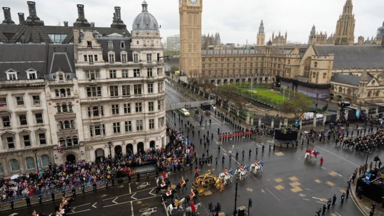

> 图像来源，  Reuters

超过6000名英国武装部队成员参加游行，使其成为过去70年来最大的仪仗行动。来自英国和英联邦各地的人员也参加了游行。

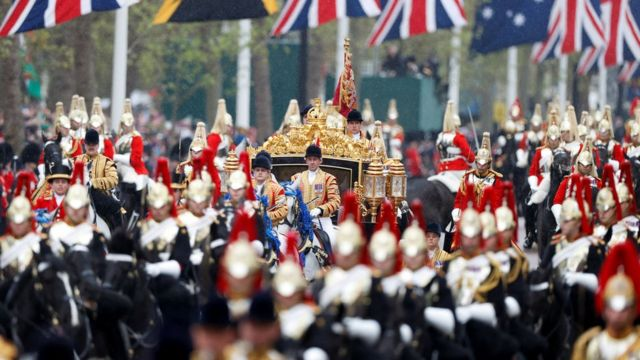

> 图像来源，  Getty Images

国王和王后乘坐一辆相对现代化的马车，2014年首次启用的“钻禧”马车前往威斯敏斯特大教堂，这部马车配有电动车窗和空调。

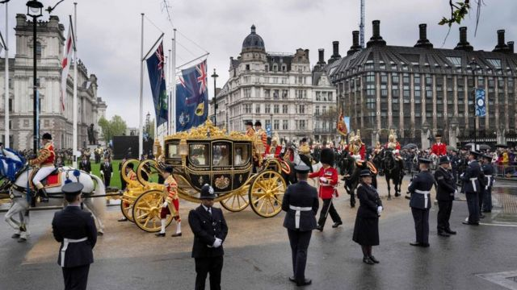

> 图像来源，  Getty Images

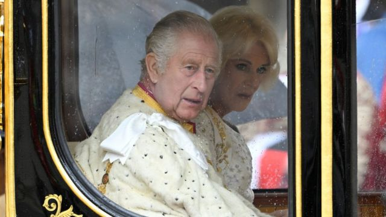

> 图像来源，  Getty Images

在“国王游行”过程中，英国民众云集于街道两边，用欢呼声迎接查尔斯的马车到来。也有反对君主制的抗议者，手举标语，有抗议者被警方带走。

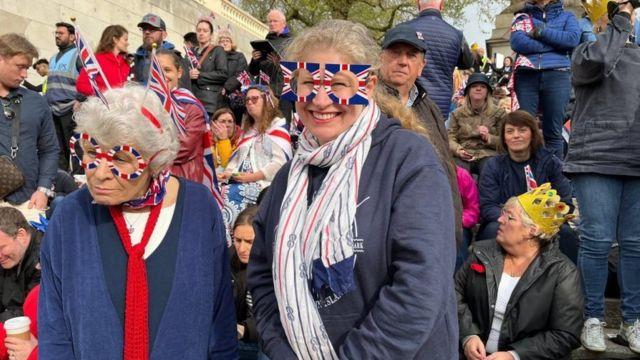

> 图像来源，  Getty Images

抗议者手中的标语写着“不是我的国王”、“寄生虫国王”、“这个国家是我们的”。

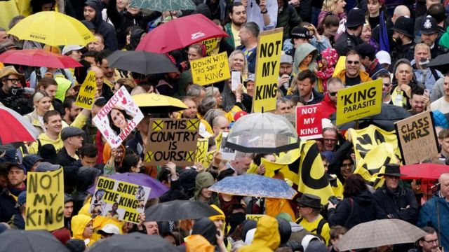

> 图像来源，  Getty Images

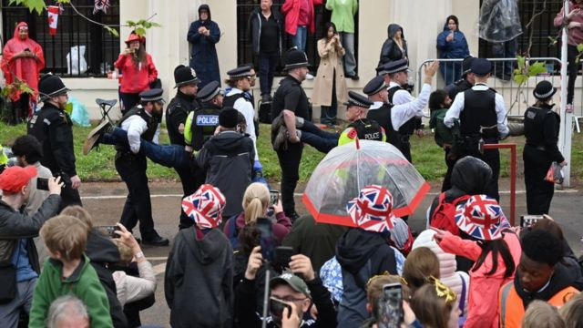

> 图像来源，  Getty Images

英国历代君主加冕礼秉承在威斯敏斯特教堂举办的传统。威斯敏斯特教堂英国王室的专属礼拜堂，见证了历代君主加冕、王室大婚、王室葬礼等重要时刻。“征服者威廉一世”是第一位在威斯特敏斯特加冕的英国君主，查尔斯三世则是第40位。

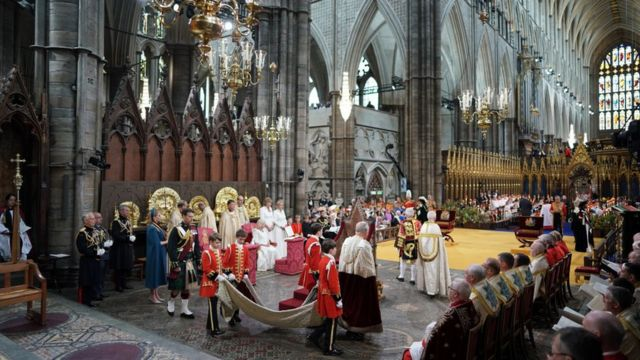

> 图像来源，  Getty Images

哈里王子出席加冕仪式，但他的妻子梅根未出席。加冕仪式当日恰好是他们的儿子阿奇王子的四岁生日。查尔斯国王的弟弟安德鲁王子近年来丑闻缠身，他也出席了加冕仪式。

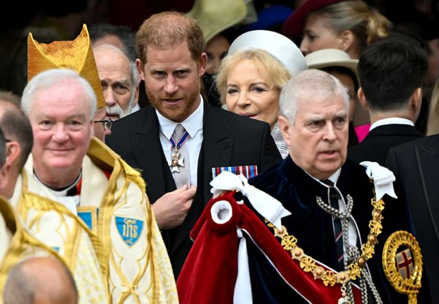

> 图像来源，  Toby Melville / Pool

国王进入威斯敏斯特教堂，他的孙子乔治王子在他身后，手托他的长袍。乔治目前是王位第二顺位继承人。

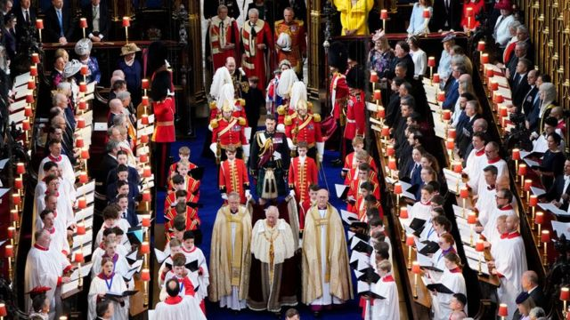

> 图像来源，  Getty Images

威廉王子夫妇和他们的另外两个孩子夏洛特公主和路易王子。威廉王子目前是王位的第一顺位继承人。

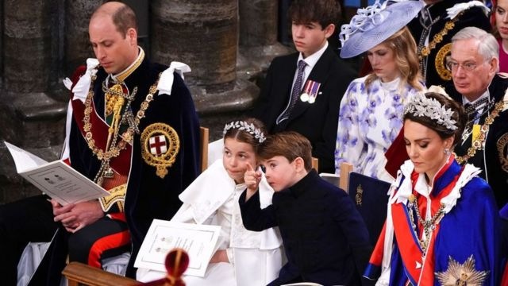

> 图像来源，  Getty Images

恩膏是仪式的重要程序——国王脱下加冕长袍，坐在加冕椅上。坎特伯雷大主教把根据秘方配制的圣油涂抹在国王的手、胸部和头部，圣油已知含有龙涎香、橙花、玫瑰、茉莉和肉桂等。此外，为查尔斯配制的圣油不含任何来自动物的成分。为了保护国王隐私，恩膏仪式过程用屏风遮蔽。

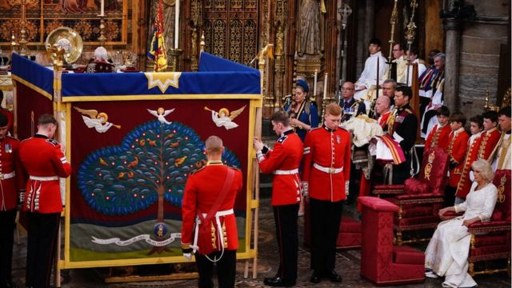

> 图像来源，  Getty Images

授权礼，授予君主的物品包括代表宗教和道德权威的王室宝球（Royal Orb），代表权力的权杖和“君主权杖”，一根上面有白色珐琅鸽子的金棒，象征着正义和怜悯。最后，坎特伯雷大主教将圣爱德华王冠戴在国王的头上。

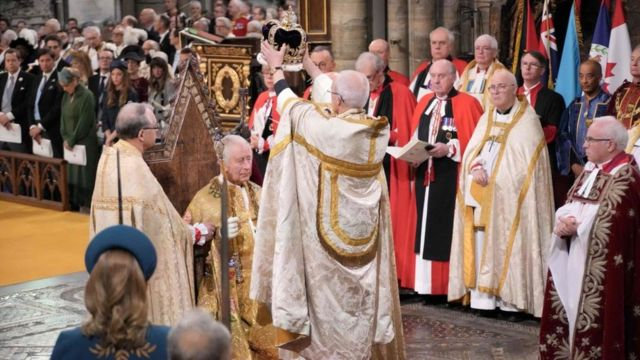

> 图像来源，  Getty Images

加冕后，查尔斯国王的儿子和第一顺位继承人威廉王子亲吻他的父亲。

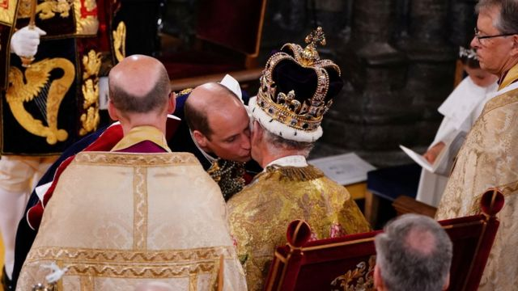

> 图像来源，  Reuters

卡米拉王后接受加冕。

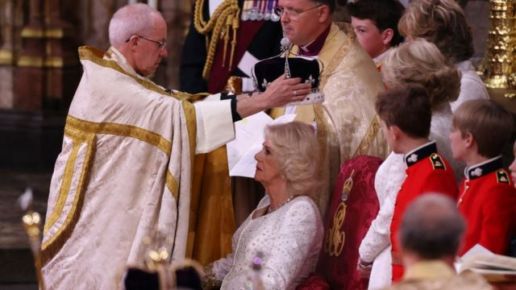

> 图像来源，  Getty Images

登基和致敬——国王离开加冕椅，移步王座。大主教、王室成员等跪拜致敬。

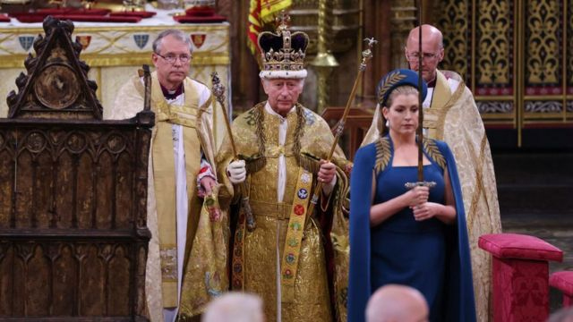

> 图像来源，  Getty Images

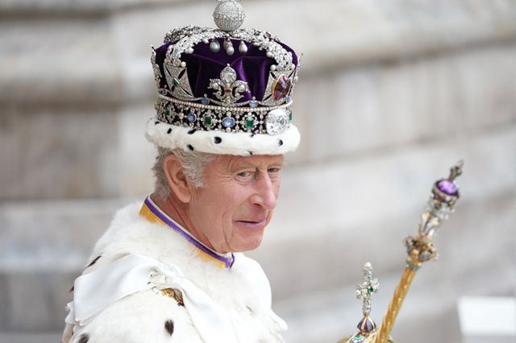

> 图像来源，  Dan Charity / Pool

查尔斯和卡米拉在加冕仪式后乘坐1830年代以来历次加冕礼中都曾使用的“黄金马车”返回白金汉宫。

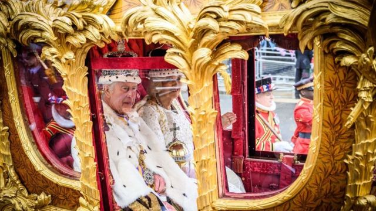

> 图像来源，  Getty Images

威廉王子和凯特王妃一家乘坐另一辆马车一同返回白金汉宫。

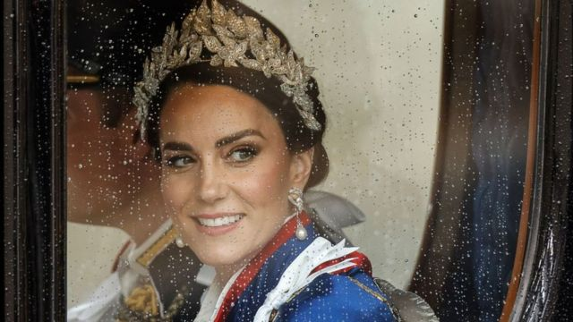

> 图像来源，  Getty Images

有8个英联邦国家派遣军队参与游行，护送国王的马车。

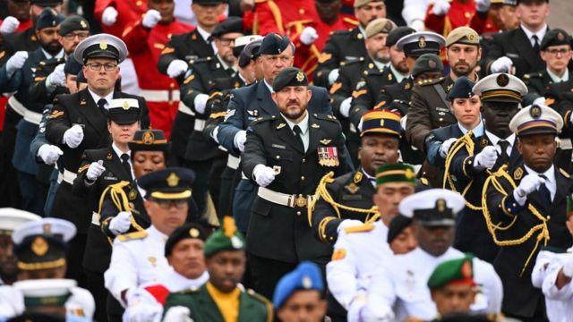

> 图像来源，  Getty Images

国王和王后出现在白金汉宫阳台，向民众挥手致意，标志着整个仪式的结束。大部分王室成员都一同出现在阳台，BBC获悉，哈里王子未获邀请登上白金汉宫的阳台。

1953年6月2日，伊丽莎白二世加冕仪式上，四岁的查尔斯王子手托下巴，左边是他的奶奶玛丽王后，右边是他的小姨玛格丽特公主。

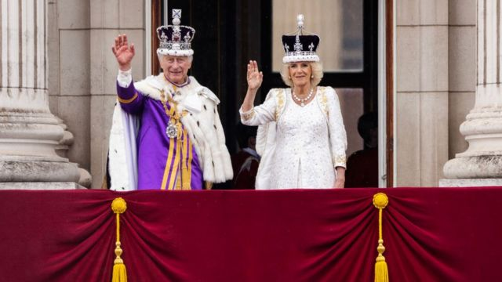

> 图像来源，  Getty Images

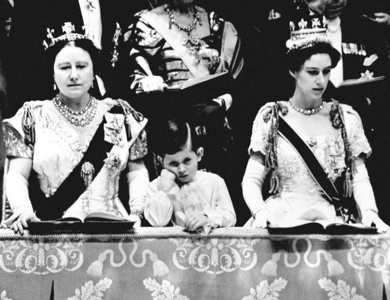

> 图像来源，  PA

