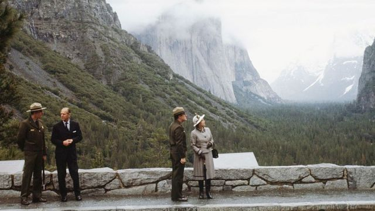

# [Uk] 美国联邦调查局文件：80年代有人意图刺杀英女王

#  美国联邦调查局文件：80年代有人意图刺杀英女王

> 图像来源，  Getty Images
>
> 图像加注文字，英国伊丽莎白女王二世与美国前总统里根。

**美国联邦调查局（FBI）最新公布的文件显示，英国女王伊丽莎白二世在1983年访问美国期间面临潜在暗杀威胁。**

美国联邦调查局公布了一份与已故女王前往美国旅行有关的文件。

这些文件显示，在英国女王访问期间帮助确保女王安全的联邦调查局，为何曾担忧爱尔兰共和军的威胁。

旧金山的一名警官得知了暗杀威胁。

根据这份文件，一名经常光顾旧金山一家爱尔兰酒吧的警官对联邦特工提出警告，他讲述了在酒吧遇到的一名男子打来的电话。

警官说，这名男子告诉他，他在为“在北爱尔兰被橡皮子弹打死”的女儿报仇。

这一威胁发生在1983年2月4日，大约一个月后，英国女王伊丽莎白二世和她的丈夫菲利普亲王会访问美国加州。

“他试图伤害伊丽莎白女王，他会从金门大桥上扔下一些东西，扔到正在金门大桥下航行的皇家游艇‘不列颠尼亚’号上，或者试图在伊丽莎白女王参观约塞米蒂国家公园时杀害她。”文件称。

为了应对这一威胁，美国特勤局计划“在游艇靠近时关闭金门大桥上的人行道”。目前还不清楚约塞米蒂国家公园采取了什么措施，但访问还是照常进行。联邦调查局没有公布逮捕的细节。

根据美国媒体提交的《信息自由法》的要求，这份102页的机密文件周一被上传到联邦调查局的信息数据仓库网站（Vault）。

已故女王对美国的多次访问，包括1983年对西海岸的访问，都是在北爱尔兰问题加剧的紧张局势中进行的。

1976年，已故女王在纽约参加美国建国200周年庆典。

这些文件揭示了一名飞行员是如何被传唤的，因为他驾驶一架小型飞机飞越炮台公园，飞机上写着“英格兰，滚出爱尔兰”。

> 图像来源，  Getty Images
>
> 图像加注文字，英国女王伊丽莎白二世和菲利普亲王参观约塞米蒂国家公园。

这些文件显示，对他们认为是针对已故女王的真正潜在威胁，联邦调查局如何保持警惕。

1979年，她的表弟蒙巴顿勋爵死于爱尔兰共和军在爱尔兰斯莱戈镇海岸附近的一次轰炸。

1989年，在已故女王亲自访问肯塔基州之前，美国联邦调查局的一份内部备忘录写道：“爱尔兰共和军对英国君主制构成威胁的可能一直存在。”

它还称：“波士顿和纽约被要求对爱尔兰共和军成员对伊丽莎白二世女王的任何威胁保持警惕，并立即向肯塔基州的路易维尔提供同样的信息。”

已故女王拥有赛马，众所周知，她一生中曾多次访问肯塔基州，享受该州的马术亮点，包括肯塔基赛马节。

在1991年的一次国事访问中，已故女王计划与乔治·布什总统一起观看巴尔的摩金莺队的棒球比赛。

美国联邦调查局警告特勤局，“爱尔兰团体”正计划在体育场举行抗议活动，“一个爱尔兰团体已经预订了一大批看台门票”。

调查局告诉NBC新闻，除了本周公布的记录外，可能还有“额外的记录”存在，但它没有设定公布这些记录的时间表。

