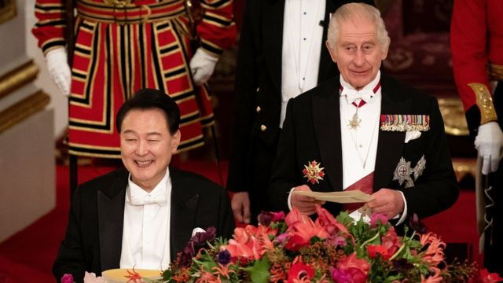
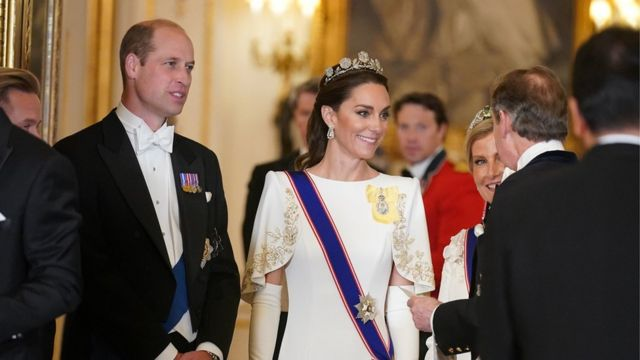
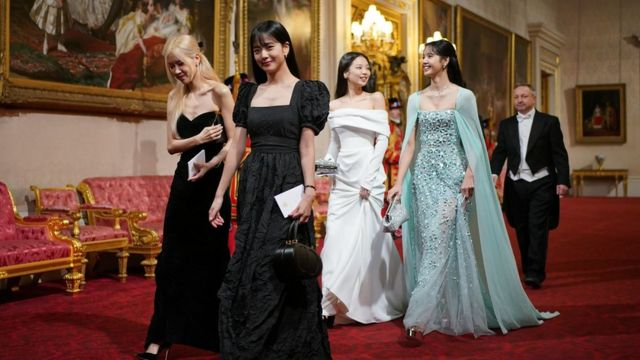
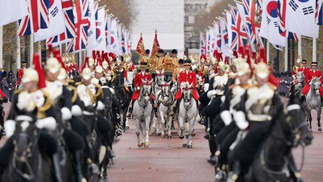
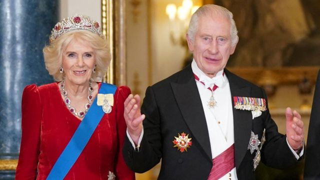

# [Uk] 红地毯、国宴、K-pop，英王查尔斯高规格接待韩国总统尹锡悦

#  红地毯、国宴、K-pop，英王查尔斯高规格接待韩国总统尹锡悦

  * 肖恩·考赫兰（Sean Coughlan） 
  * 王室事务记者 

> 图像来源，  PA Media
>
> 图像加注文字，英国查尔斯国王在国宴上说了几句韩语。

**英国查尔斯国王利用白金汉宫国宴的隆重场合，出人意料地提到了韩国流行文化。**

英国国王在欢迎韩国总统尹锡悦前来进行国事访问的第一天，提到了K-pop明星女团“Blackpink”和“防弹少年团”（BTS）的名字。

英王在宴会致辞中赞扬了韩国文化“引人入胜的魅力”。

不过，他承认自己并不太懂“所谓的‘江南Style’”。

但是尹锡悦总统并没有像拜访美国总统乔·拜登（Joe Biden）时那样一展他的卡拉OK歌艺，当时韩国领导人唱了一段《美国派》（American Pie）。

相反，韩国总统表示在年轻时，他和他的朋友们“都是披头士（The Beatles）、皇后（The Queen）和艾尔顿·约翰（Elton John）的粉丝”。可以想见，他在这里说的“皇后”是指那支流行乐队，不是英女王。

国事访问是一种结合华丽排场和务实政治的“软实力”展现，而在一个与中国关系趋于紧张的地区，为韩国铺出红地毯是对一个越来越重要的盟友和贸易伙伴显示出尊重。

> 图像来源，  PA Media
>
> 图像加注文字，威廉王子与凯特王妃也作为王室成员欢迎韩国宾客。

在白金汉宫的国宴厅，重要人物全数出席，韩国宾客受到了国王、王后、威尔士亲王和王妃，以及首相里希·苏纳克（Rishi Sunak，辛伟诚）的欢迎。

韩国最著名的“儿子”、热刺足球队球员孙兴慜（Son Heung-min）并不在场，但是K-pop女团“Blackpink”成员都是座上客。

以外交大臣身份重返政界一线的卡梅伦勋爵（Lord Cameron）则坐在与安妮公主相隔两个座位的位置。

工党领袖基尔·斯塔摩爵士（Sir Keir Starmer，施纪贤）和自由民主党党魁埃德·戴维（Ed Davey）也是座上客。他们面前是铺排精致的六种不同的葡萄酒杯和一整套金饰镀银餐具。

用法语编写的菜单包括水煮蛋、雉鸡肉和半圆形芒果冰淇淋甜品。

> 图像来源，  PA Media
>
> 图像加注文字，K-pop女团Blackpink成员成为白金汉宫的座上客。

酒单上包括1989年的木桐酒庄（Mouton-Rothschild）红葡萄酒和康沃尔的嘉美河谷酒庄（Camel Valley）葡萄酒。

这些都是奢华的场合，在精致餐饮烘托下的外交活动，使用超过4000件物品的19世纪晚宴规格。

桌面设置如同迎接总统的军队游行一般精准对称——每位客人的用餐位置都是46厘米。

每位客人的座位前都有一个名牌，可能有些人稍后就会把它偷走作为纪念品，哪怕坎特伯雷大主教也在场。

但是有一些宾客则只有他们的头衔，比如首相和外交大臣。

因为国王是环保回收的忠实支持者，所以如果这些角色持续换人的话，至少纸板铭牌还可以继续使用。

当天早些时候，韩国代表团在英国皇家骑兵卫队阅兵场受到了隆重的欢迎，随后总统伉俪一同坐上马车在伦敦林荫道上进行了一段巡游。

1000多名士兵参加了阅兵仪式，在秋色笼罩的皇家绿园里响起了礼炮。

威尔士王妃身着一袭鲜艳的红色。

> 图像来源，  PA Media
>
> 图像加注文字，韩国代表团在英国皇家骑兵卫队阅兵场受到了隆重的欢迎，随后总统伉俪一同坐上马车在伦敦林荫道上进行了一段巡游。

除仪式活动之外，这样的国事访问还具有严肃的外交和经济目的。

英国国王在宴会致辞中提到了韩国作为“民主、人权和自由堡垒”的战略地位，但也警告说“这些价值观很遗憾地正受到以往在我们生活的时代里少有的挑战”。

在林荫道上，骑兵卫队的马具碰出的叮当声，仿佛象征着收银机里钱币碰出的声响——之后要讨论的就是贸易协议了。

预计韩国总统和苏纳克首相将在周三（11月22日）签署《唐宁街协议》（Downing Street Accord），旨在促进贸易和支持“全球稳定”。

高科技和绿色能源也将包括在商业合作的领域当中。

此外也有计划要加强执行对朝鲜的制裁，并阻止其“非法武器项目”，韩国海军与英国皇家海军也会进行联合海上巡逻。

“长期的全球伙伴关系对我们的繁荣和安全至关重要，”苏纳克说，他并表示“紧密的关系已经推动了我们两国之间210亿英镑的投资”。

> 图像来源，  Reuters
>
> 图像加注文字，查尔斯国王在国宴上赞扬韩国流行文化的全球影响力。

