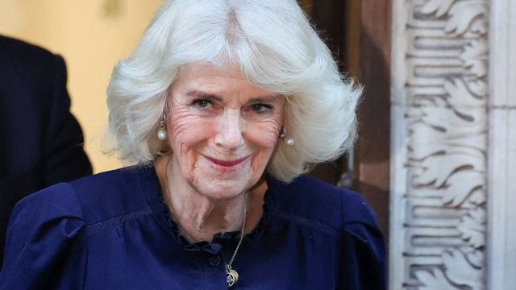

# [Uk] 白金汉宫表示英王查尔斯三世确诊患有癌症

#  白金汉宫表示英王查尔斯三世确诊患有癌症

  * 肖恩·考赫兰（Sean Coughlan） 
  * BBC王室事务记者 

3 小时前

> 图像来源，  PA Media

**白金汉宫表示，英王查尔斯三世（King Charles III）确诊患有某种癌症。**

该癌症是在他最近接受前列腺增大（摄护腺肥大）治疗期间被发现，但并不是前列腺癌（摄护腺癌）。

癌症的类型并未披露，但根据白金汉宫的声明，查尔斯于周一（2月5日）开始接受“定期治疗”。

75岁的查尔斯将暂停他的公开活动，而王后卡米拉和威廉王子将在他接受治疗期间代替他履行职务。

关于癌症的阶段或预后，白金汉宫并没有披露更多细节。

不过，白金汉宫表示，国王查尔斯“对治疗感到完全正面，并期望尽快全面恢复公开活动职务”。

##  白金汉宫的声明全文

虽然他将暂停公开活动，但将继续履行作为国家元首的宪法职责。

他在星期日于桑德令罕宫（Sandringham，又译山静咸宫或山均汉姆）的一次礼拜仪式中出现。 当时他向人群挥手致意。

他一周多前在伦敦的一家私人医院接受了前列腺手术。

他选择公开他的前列腺治疗，目的是鼓励更多男性进行前列腺检查。

据说，他很高兴能提高人们对这一问题的认识，英国国民保健服务（NHS）的网站指出，关于前列腺状况的问题激增。

據了解，查爾斯是在最近接受前列腺增大治療期間被發現癌上癌症，但並非前列腺癌。

他將接受治療，但據信癌症處於早期階段。

> 图像来源，  Reuters
>
> 图像加注文字，王后卡米拉步出与国王查尔斯一同到达的伦敦中部一间医院。

查尔斯将暂停出席公开活动，而王后卡米拉和威廉王子将在他接受治疗期间代替他履行职务。

75岁的查尔斯将继续履行作为国家元首的宪法职责。

癌症治疗可能包括化疗——用于杀死癌细胞的药物;放射治疗——一种使用辐射杀死癌细胞的治疗;或是寻找并攻击癌细胞的标靶癌症药物。

> 图像来源，  PA Media

