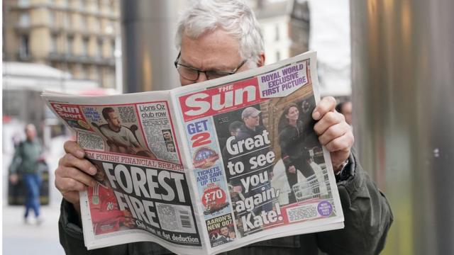
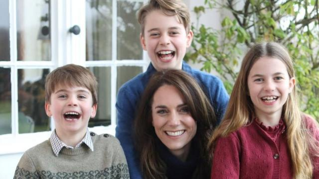
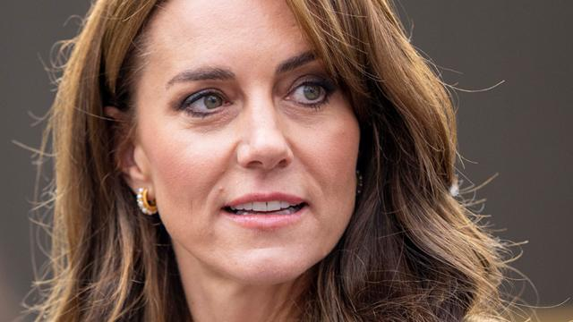
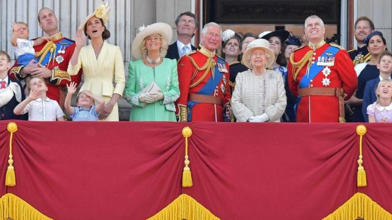

# [Uk] 英国王室：凯特替身阴谋论如何在社交媒体上疯传

#  英国王室：凯特替身阴谋论如何在社交媒体上疯传

  * 玛丽安娜·斯普灵（Marianna Spring） 
  * BBC虚假信息与社交媒体事务记者 

> 图像来源，  Jonathan Brady/PA Wire
>
> 图像加注文字，这个由《太阳报》刊登的威廉王子和凯瑟琳的照片，是王妃1月份腹部手术后的首张视频图像。

**“这是一个替身！这不可能是凯特！”**

今天早上，我在社交媒体上看到的第一个视频是一个业余侦探在宣传一个虚假的阴谋论，说《太阳报》刊登的威廉王子与凯特王妃在农家商店的片段实际上是一个著名的职业模仿者。

没有任何证据表明事实如此。这只是社交媒体上传播的有关凯特健康状况的虚假理论的最新例子。

凯特在1月份接受腹部手术后就没有再出现在公众面前，这引发了人们对她的质疑和疯狂的猜想。

肯辛顿宫表示，王妃正在康复中，预计复活节后将重返公共生活。

媒体也助长了这种社交媒体狂热，并填补了信息真空，这与我调查过的其他事件如出一辙——这些事件的核心人物都受到了严重伤害。

它会给家人和朋友造成伤害，更广泛地说，它会削弱公众的信任。

王室在社交媒体上发布的一张王妃和孩子们的母亲节照片经过了剪辑，这让本已活跃的关于凯特的社交媒体话题变得更加火热。

王妃随后道歉，并对修改照片一事负责。

> 图像来源，  Prince of Wales
>
> 图像加注文字，这张母亲节照片引发了一场关于图片编辑的争论，后来被图片社封杀了。

虽然没有迹象表明这段录像被以任何方式修改过，但它还是引发了更多的阴谋论，以及嘲讽。

替身阴谋论起源于社交媒体，不仅在我的TikTok上被推荐。

它还在“X”（推特的前身）上向我推送。这两个网站的算法都是根据它认为用户可能想看的内容来推送内容的。

一整天中，在我的TikTok“推荐”页面和X上，都有几十个宣扬这一阴谋论的视频和帖子。

我发现，根据社交媒体网站自己的数据，在不到24小时的时间里，关于替身的虚假说法在X上获得了超过1200万次浏览，在TikTok上获得了超过1100万次浏览。

哪些用户在分享呢？

在通常位于美国的X账户上，几乎每小时都在发布有关威尔士王妃的消息。有几个账号还打上了蓝勾。这些蓝勾过去只给经过验证的账户。现在则可以付费购买，以换取你的内容在社交媒体网站上获得更显著的位置。

我给世界各地发布这些视频的几十个博主发了消息，他们中的很多人都在放大和分析威尔士王妃的面部特征，并与相似照片中的特征进行比较。

> 图像来源，  Getty Images

一位来自美国、名叫埃斯梅拉尔达（Esmerelda）的TikTok博主发布了类似的替身视频，有290万人观看。

她告诉我，她以前并没有发布过关于王室的帖子，但这次“真实的公众关注”促使她这么做。

她告诉我：“我通常会试着回应那些提出主张的人，并总结他们所说的一般情况——无论我是否同意相同的说法。”

“如果我发现有些人的说法肯定有偏差，那么我就会再拍一个视频，然后说：‘嘿，这个说法现在已经被推翻了，原因如下’。”

德国用户卡里（Carry）也分享了同样的阴谋论，她告诉我，她对自己在TikTok上发布的内容并不“感到内疚”。

“在我看来，言论自由至高无上，这一点也应该被允许在社交媒体上得到体现。”

##  威廉王子和凯特的视频无法阻止网络谣言

**BBC王室事务记者肖恩·考赫兰（Sean Coughlan）**

一对夫妇周末去购物的模糊视频成为国际话题。

她看起来怎么样？真的是他们吗？您看到社交媒体上那些疯狂的猜测了吗？

这些由《太阳报》刊登的威廉王子和凯瑟琳的照片，是王妃1月份腹部手术后的首张视频图像。

温莎的王室成员在农家商店附近的意外现身表明，她已经恢复了健康，看上去很放松，面带微笑。

在此之前，我们只见过一张凯特坐在汽车里的模糊照片，以及母亲节那张清晰但备受争议的全家福照片。

由于担心照片被数码篡改，图片社撤回了这张照片，这让人们对她的健康状况更加焦虑不安。

与社交媒体上的离奇说法相比，这段视频所展示的情况要乐观和日常得多。

她看起来很好，可以和丈夫一起外出，在离家不远的高档农家店里活动活动腿脚。

这并不能阻止谣言的传播，现在人们会猜测这是否真的是他们，但这是迄今为止凯特病情好转的最明显证据。

我们得知这段视频是由一位市民拍摄的。这对王室夫妇不可能以为去当地的商店闲逛，而不会被拍到。

肯辛顿宫的回应还是强调隐私的重要性，尤其是在凯特手术后恢复期间。

这幅图片可能会很方便地平息一些谣言，但同时也提出了一个尴尬的问题：对于一对想要保护家庭生活的夫妇来说，哪些时刻应该被视为隐私？

上个月，当美国媒体刊登狗仔队拍摄的王妃照片时，英国媒体并没有刊登。但这一次，这些私人时刻的照片却随处可见。

区别在于社交媒体上大量质疑声、虚假说法和对这对夫妇的疯狂猜测。新闻真空亟待填补。

这一切是如此激烈，以至于出现了关于阴谋论的阴谋论。这一切都被安排好的吗？真的只是人们在社交媒体上哗众取宠吗？

威廉王子、凯特及其公关团队敏锐地意识到了这种压力。他们是千禧一代的王室成员，不会与外界的言论隔绝。

在这场媒体风暴中，他们可能会畏手畏脚，但直到凯特在复活节后重返公众视线，这场风暴可能才会真正结束。

现在，人们看到这对夫妇周末出去买了一些东西。他们可能会想，接下来他们要为隐私权付出多少代价。

> 图像来源，  Getty Images
>
> 图像加注文字，2019年女王伊丽莎白二世生日，英国王室成员在白金汉宫阳台观看皇家空军飞行表演。

在这场狂热中，媒体也被指责重复和分享网上发布的无证据阴谋论。但正是在社交媒体上，这些内容似乎达到了最极端的地步，而且受众数以百万计——在许多情况下远远超过传统媒体。

尽管没有任何迹象表明购物片段被以任何方式修改过，但侦探们仍在继续分享这样的视频——积累了数百万的浏览量，也增加了新的粉丝。

根据TikTok的指导原则，该社交媒体网站不允许“误导性或虚假的、可能对个人或社会造成重大伤害的内容，无论其意图如何”。

此前，TikTok还曾表示，该网站正在“减少那些宣扬阴谋论的内容的传播范围”，这些阴谋论称王室和其他权势团体在没有证据的情况下参与了险恶的阴谋。

X没有回应BBC的置评请求。该网站在其指导方针中表示，捍卫和尊重用户的声音是其核心价值观之一。

