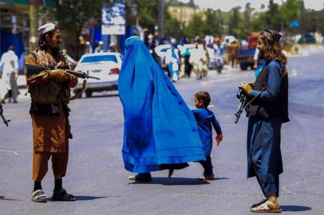
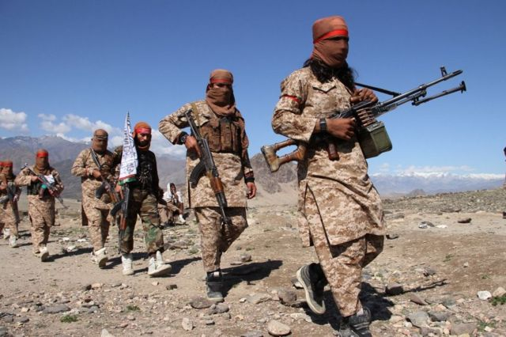
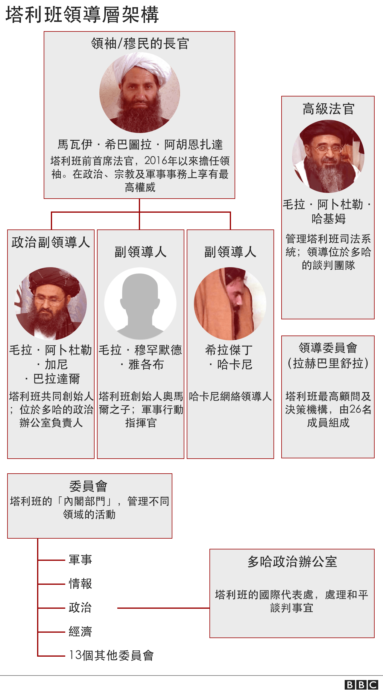
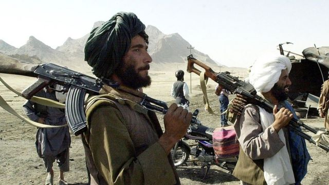
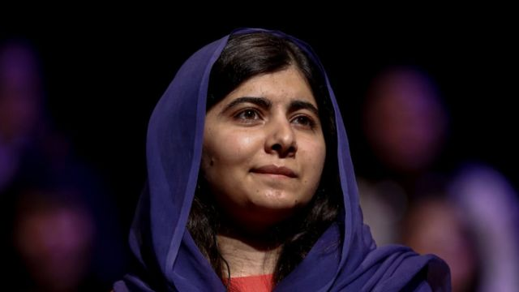
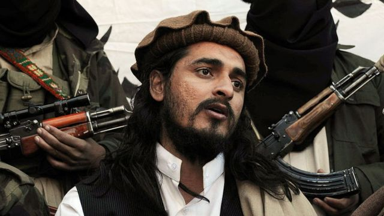

# 重新掌控阿富汗一周年 塔利班是谁？

#  阿富汗：重掌喀布尔控制权的塔利班是谁？

最近更新： 2022年8月15日

> 图像来源，  EPA
>
> 图像加注文字，塔利班在阿富汗重新掌权已经整整一年

**2021年8月，被以美国为首的联军赶下权坛20年的塔利班重新进入阿富汗首都喀布尔，再度掌权。**

2021年春夏，塔利班组织不断进攻，快速夺回阿富汗大片地区的控制权，包括各大主要城市。8月15日，塔利班攻至首都喀布尔，随后占领总统府。

塔利班曾在1996年至2001年第一次统治阿富汗。2001年911恐怖袭击后，美国及其盟友攻入阿富汗，当年12月，塔利班政府倒台。

塔利班在2018年同美国开始直接对话。2020年2月，双方在多哈达成和平协议，美国承诺撤军，塔利班则承诺会防止针对美国部队的攻击。

这份协议中的其他承诺还包括，不允许“基地”组织（al-Qaeda）及其他极端主义组织在塔利班控制的地区及正在进行全国性和平谈判的地区活动。

但在第二年，塔利班继续针对阿富汗安全部队和平民发起攻击，并在全国迅速推进。

几个星期之内，塔利班就全面掌控了阿富汗，这是该组织1996年到2001年第一次掌控阿富汗期间没有做到的。

谁是塔利班？

> 图像来源，  Getty Images
>
> 图像加注文字，2020年3月，塔利班士兵在阿富汗拉格曼省。在美军开始撤军后，塔利班不断向前推进。

##  掌权之路

塔利班在普什图语中意味“学生”。在苏联军队从阿富汗撤出之后，这个组织最早出现于上世纪90年代早期的巴基斯坦北部。

据信这个以普什图族为主的运动最早出现在神学院内，大部分资金来源于沙特阿拉伯，宣扬逊尼派伊斯兰教一种强硬的教义。

普什图族人的分布横跨巴基斯坦与阿富汗。塔利班做出的承诺是，一旦掌权，他们将重建和平与安全，并执行他们自己的严格版本的伊斯兰教法（Sharia）。

塔利班在阿富汗的影响力从该国西南部迅速向外扩张。1995年9月，他们占领了位于阿富汗与伊朗交界地的赫拉特（Herat）省，整整一年后，他们又占领了阿富汗首都喀布尔，将时任总统拉巴尼（Burhanuddin Rabbani）政权赶下台（拉巴尼也是抵抗苏联入侵的阿富汗圣战者的创始人之一）。截至1998年，塔利班已经控制了阿富汗近90%的领土。

此时的阿富汗人对圣战者的暴行和苏联人被赶走后的内斗已经感到厌倦，当第一次看到塔利班的出现时，他们普遍对这个组织表示欢迎。塔利班早期得到支持主要是由于他们成功消除了腐败，遏制了违法行为，使得他们控制下的道路和地区更加安全，从而促进经济繁荣。

但塔利班也推行或支持符合他们对伊斯兰教法严格诠释的惩罚措施，例如对被定罪的杀人犯和通奸者进行公开处决，以及对判处犯有盗窃罪的人进行截肢。他们要求男性必须留胡须，女性必须穿着遮盖全身的罩袍（burka）。

塔利班还禁止电视、音乐及电影，不允许10岁及以上的女童上学。他们被指控有各种侵犯人权与文化的行为。其中最臭名昭著的例子发生在2001年，当时塔利班不顾国际社会的强烈反对，炸毁了阿富汗中部著名的巴米扬佛像（Bamiyan Buddha）。

这一次这种过激行为没有再次发生，但塔利班被指犯下了一系列有据可查的虐待行为，包括杀害反对者，殴打、拘留记者和阿富汗维权抗议者。

女性不再被允许在没有男性陪伴的情况下长途旅行，虽然不需要穿蒙面全身罩袍布卡（Burka），但已被命令在公共场合遮住面部，大多数女性不可以工作。

> 图像来源，  Getty Images
>
> 图像加注文字，2001年10月31日，塔利班枪手在坎大哈附近的高速公路。

巴基斯坦屡次否认自己是塔利班组织的设计者，但毫无疑问的一点是，许多最初加入这场运动的阿富汗人曾在巴基斯坦的宗教学校（madrassas）接受教育。

巴基斯坦既是在塔利班于阿富汗掌权时少数承认该政权的三个国家之一（另两个为沙特阿拉伯与阿联酋），也是最后一个同塔利班切断外交关系的国家。

塔利班曾一度威胁要从他们在西北部掌控的地区破坏巴基斯坦的稳定。其中最为高调且国际社会最为谴责的事件之一是，2012年10月，女学生马拉拉（Malala Yousafzai）在家乡明戈拉（Mingora）放学的路上遭到枪击。

不过两年后，在白沙瓦（Peshawar）学校屠杀事件后的一次重大军事进攻行动中，塔利班在巴基斯坦的影响力被极大削弱。在2013年的美国无人机袭击中，至少三名巴基斯坦塔利班关键人物被杀，其中包括该组织头目哈基穆拉·马苏德（Hakimullah Mehsud）。

> 图像来源，  Getty Images
>
> 图像加注文字，马拉拉曾在2012年10月遭塔利班士兵枪击。

##  基地组织“避难所”

2001年9月11日纽约世界贸易中心遭遇袭击之后，全世界将目光投向阿富汗塔利班。塔利班被指控为袭击头号嫌疑人——奥萨马·本·拉登和他的基地运动提供避难所。

2001年10月7日，由美国领导的军事同盟在阿富汗发动袭击，同年12月第一周，塔利班政权垮台。在全世界最大规模的搜捕行动之下，塔利班组织当时的头目穆罕默德·奥马尔（Mullah Mohammad Omar）及本·拉登等其他高级人物逃离了抓捕。

许多塔利班高级领袖据称在巴基斯坦城市奎达（Quetta）避难并在那里指导塔利班运作。但巴基斯坦政府否认奎达舒拉（Quetta Shura）这一组织的存在。

尽管阿富汗境内的外国军队数量空前，但塔利班仍然逐步恢复并扩大了其影响力。阿富汗的大片地区变得更不安全，国内的暴力水平上升至2001年以来新高。

塔利班对喀布尔发动过多次袭击，2012年9月，该组织还对北约基地进行过一次高调攻击。

> 图像来源，  AFP
>
> 图像加注文字，巴基斯坦塔利班领导人哈基穆拉·马苏德在2013年一场美国无人机袭击中身亡。

2013年塔利班宣布，计划在卡塔尔开设和谈办公室，外界一度对阿富汗谈判实现和平抱有期望。但是各方的互不信任仍然很高，暴力仍在持续。

2015年8月，塔利班承认他们隐瞒了奥马尔死亡的消息长达两年多之久。此前有报道称，奥马尔由于健康问题在巴基斯坦一家医院去世。之后，塔利班表示，该组织暂且搁置数周以来的内乱，团结在一个新的领袖——曼苏尔（Mullah Mansour）周围。曼苏尔此前是奥马尔的副手。

几乎同时，塔利班在2001年被击败后首次夺取了一个省会城市的控制权，这个城市为昆都士（Kunduz），在战略上具有重要地位。

曼苏尔在2016年5月的一场美国无人机袭击中身亡，取代他的为他生前副手马瓦伊·希巴图拉·阿胡恩扎达（Mawlawi Hibatullah Akhundzada）。阿胡恩扎达至今仍控制着塔利班。

##  重新掌权

在一系列直接谈判之后，2020年2月，美国与塔利班达成和平协议。在这随后的一年时间里，塔利班似乎改变了战术，不再对城市和军事前哨发起计划缜密的攻击，而是转为以恐吓阿富汗平民为目的的定向暗杀行动。

他们的目标包括记者、法官、和平人士、身居要职的女性，这似乎表明，塔利班并没有改变他们的极端主义意识形态，只是改变了战略。

阿富汗官员担心，该国政府在没有国际支持的情况下容易受到塔利班的影响，但新任美国总统拜登在2021年4月宣布，所有美国军队将在9月11日之前离开阿富汗，这一天正是纽约世贸中心遭袭20周年纪念日 。

塔利班开始反攻，夺取大片领土，并最终在外国势力撤出后再次推翻喀布尔政府。

他们攻势迅猛，10天内横扫阿富汗，8月6日拿下第一个省会，到了8月15日，已经攻到喀布尔城门。

塔利班闪电般的推进速度迫使数以万计的阿富汗人逃离家园，许多人前往喀布尔，其他人逃往邻国。

生活在塔利班统治下的阿富汗人未来仍然充满不定因素，虽然许多人因为战争已经结束略感宽慰，但是，数百万人仍然在为生存苦苦挣扎。

塔利班重新掌权后，没有任何国家承认塔利班政府。

2021年8月，美国无人机攻击在喀布尔杀死基地组织领导人扎瓦希里，这让批评者更加难以相信塔利班已经翻开了新的一页。

在女性就业、言论自由、女生受教育等问题上，塔利班组织中的强硬派似乎占上风。这意味着，阿富汗可能无法很快拿到他们迫切需要的外国援助金。

