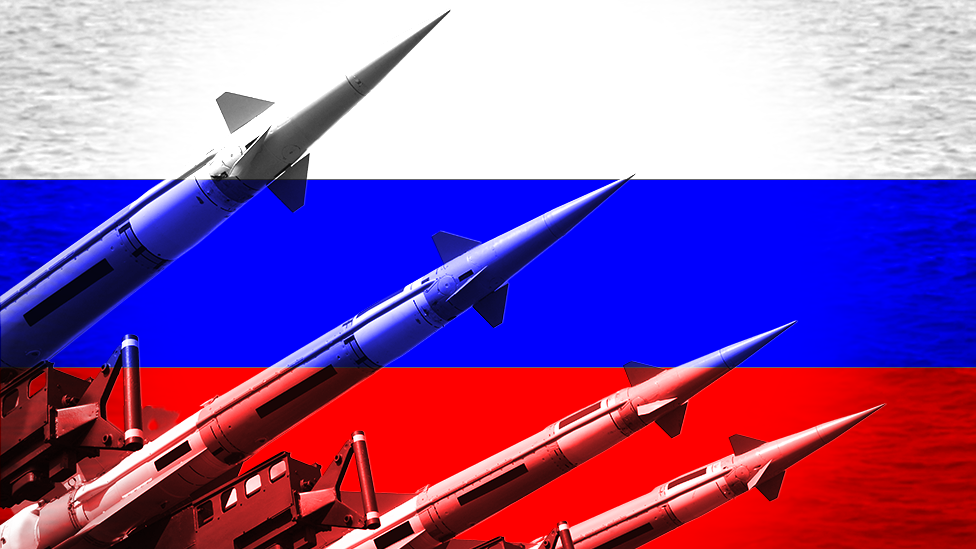
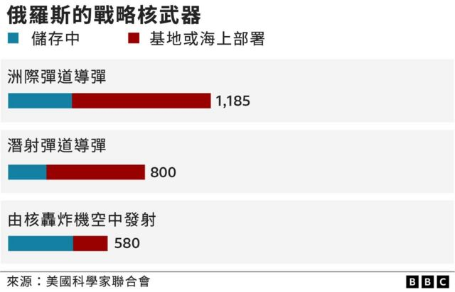
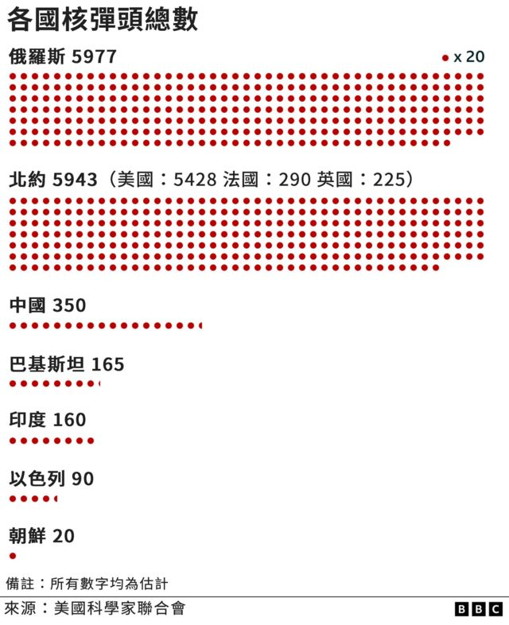
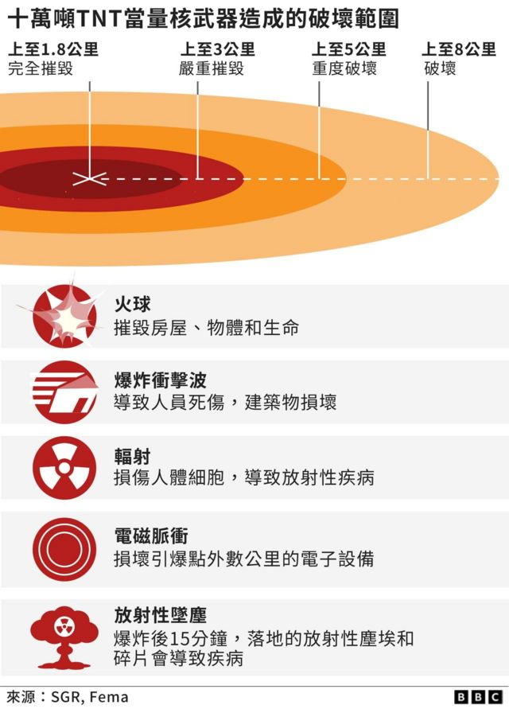

# 乌克兰战争：俄罗斯有多少核武器？

#  乌克兰战争和普京“核威胁”：俄罗斯和各国的核武器现状

最近更新： 8 小时前

**俄罗斯总统普京（Vladimir Putin）宣布部分军事动员的同时还警告说，他会使用“我们掌握的一切手段”捍卫俄罗斯领土。**

普京此言再次引起世界各地对核武器的关注。

但和普京从前的核威胁一样，分析人士认为，他的行动或许应被解读为警告其他国家不要升级对乌克兰的干预，而不是任何暗示使用核武器的意愿。

核武器已经存在了近80年，许多国家将其视为继续保障国家安全的一种威慑力量。

##  俄罗斯有多少核武器？

所有关于核武器的数据都是估计的，但根据美国科学家（Federation of American Scientists）的数据，俄罗斯拥有5977枚核弹头，即可引发核爆炸的装置，其中包括约1500枚已退役并将被拆除的核弹头。

在剩余的将近4500枚核弹头中，大多数被认为是战略核武器，即包括弹道导弹或火箭，可以进行远距离攻击。这些武器通常与核战争有关。

其余的则是体型较小、破坏力也较小的核武器，它们用于战场或海上的短程使用。

但这并不意味着俄罗斯已拥有数千枚远程核武器。

专家估计，目前俄罗斯已“部署”的核弹头约有1500枚，它们被部署在导弹、轰炸机基地或海上潜艇上。

##  与其他国家相比如何？

全世界有九个国家拥有核武器，包括中国、法国、印度、以色列、朝鲜、巴基斯坦、俄罗斯、美国和英国。

包括中国、法国、俄罗斯、美国和英国在内的191个国家签署了《不扩散核武器条约》（NPT）。

根据该协议，这些国家必须减少其核弹头库存，并在理论上致力于彻底销毁这些核弹头。

自1970和1980年代以来，这份条约已减少了这些国家储存的核弹头数量。

印度、以色列和巴基斯坦从未加入《不扩散核武器条约》，而朝鲜在2003年退出了该条约。

以色列是这九个国家中唯一一个从未正式承认其核计划的国家，但人们普遍认为以色列拥有核弹头。

乌克兰没有核武器，尽管总统普京曾提出相关指控，但没有证据表明乌克兰曾试图获得核武器。

##  核武器的破坏力有多大？

核武器从设计层面即是为了造成最大程度的破坏。

破坏程度取决于一系列因素，包括:

  * 弹头的大小 
  * 它在离地面多高的地方引爆 
  * 当地环境 

但即使是最小的弹头也可能造成巨大伤亡和持久的后果。

二战期间，在日本广岛造成14.6万人死亡的原子弹释放的能量约等于1.5万吨TNT烈性炸药。

而现在的核弹头释放能量可以超过100万吨当量。

在核爆炸的直接影响区，几乎没有人能幸存下来。

在一道眩目的闪光之后，会出现巨大的火球和冲击波，可以摧毁数公里内的建筑物和物品。

##  什么是“核威慑”？它起作用了吗？

维持大量核武器的理由是，拥有完全摧毁敌人的能力可以防止对方攻击你。

一个广为人知的术语是“相互保证毁灭”（Mutual assured destruction）。

尽管进行了多次核试验，其技术复杂性和破坏力也在不断增加，但自1945年以来，核武器从未在战场上被使用过。

俄罗斯的政策也承认核武器仅是一种威慑力量，并列举了四种使用核武器的情况：

  * 发射弹道导弹攻击俄罗斯联邦或其盟国领土 
  * 对俄罗斯联邦或其盟国使用核武器或其他类型的大规模毁灭性武器 
  * 攻击俄罗斯联邦的重要政府或军事场所，威胁其核能力 
  * 在国家生存受到严重威胁的情况下，使用常规武器侵略俄罗斯联邦 

##  分析：普京深思熟虑后的选择

_**BBC安全事务记者 戈登·科雷拉（Gordon Corera）**_

核武器的阴影从一开始就笼罩着这场冲突，普京深思熟虑后决定这样做。

他在自己处于不利地位的时候用过核武器威胁——例如，在战争之初莫斯科未能实现迅速推翻乌克兰政府的计划之后，（当时普京将俄罗斯的核威慑置于“特别”戒备状态）；现在又在乌克兰的反攻从俄军手中收复失地之时。

普京希望提醒人们的是，这些武器的毁灭性威力能够恐吓和威慑他的对手，迫使他们重新考虑。

还有一个国内动机，俄罗斯民众会担心部分动员令以及普京自己有关北约以某种方式威胁俄罗斯本身的说法。谈论核武器也是一种安抚国内舆论的方式，即，尽管形势不利，但俄罗斯仍然有能力自卫。

俄罗斯军事定律指明，只有在俄罗斯国家本身受到威胁时才会使用核武器。值得注意的是，普京用的是防御性说法，是要对他所说的西方核威胁做出回应。

他还提到的这不是“虚张声势”，指的是俄罗斯领土完整受到威胁的情况。一个重要的问题是，在乌克兰领土上举行的全民公决结束之后，俄罗斯会认为其领土延伸到哪里。

所有这些都表明，动用核武器远非迫在眉睫，甚至是不可能的。

虽然不能完全排除使用核武的可能性，特别是如果普京感到俄国国家安全受到威胁，但西方目前的反应更可能是，密切关注俄罗斯的行动，而不是言论，并继续专注自己的战略。

