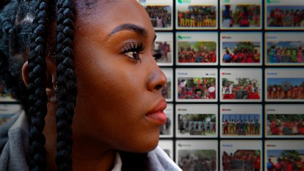

# [World] BBC调查：追踪中国网络上侮辱黑人视频的幕后黑手

#  BBC调查：追踪中国网络上侮辱黑人视频的幕后黑手

**BBC调查：追踪中国网络上侮辱黑人视频的幕后黑手**

**2020年，一段令人震惊的影片开始在中国社交媒体上传播。一群非洲儿童被教导用汉语重复喊出“我是黑鬼，智商低”的句子。**

这段影片在中国国内和其他地区都引发愤怒，但它是在哪里拍摄的，拍摄者是谁一直是谜团。

BBC《非洲之眼》记者鲁纳科·塞利纳（Runako Celina）和马拉维记者亨利·姆汉戈（Henry Mhango）花费数月时间，调查背后的视频制作产业。令人震惊的是，它并不仅限于歧视，还涉及虐待和剥削指控。

马拉维负责儿童福利的部长帕特里夏·卡利亚蒂（Patricia Kaliati）表示，本片反映的内容是“对马拉维儿童和国家的侮辱”，当局已对此展开调查。

调查记者：鲁纳科·塞利纳（Runako Celina）、亨利·姆汉戈（Henry Mhango）

制片人：基娅拉·弗兰卡维拉（Chiara Francavilla）

剪辑：苏珊娜·范胡米森（Suzanne Vanhooymissen）、马修·布拉德利（Matthew Bradley）

监制：丹尼尔·亚当森（Daniel Adamson）

