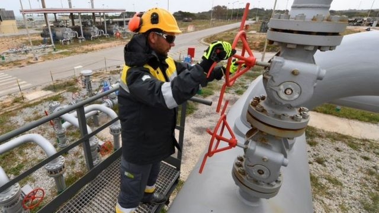
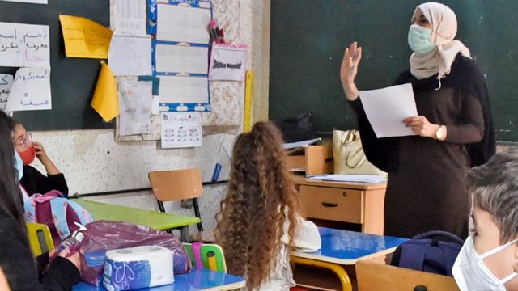
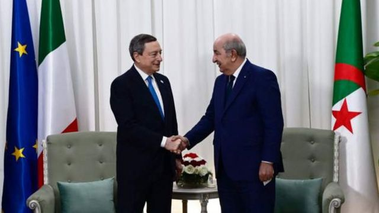

# 阿尔及利亚有意成为金砖国 “底气”何来？

#  阿尔及利亚有意成为金砖国 “底气”何来？

2022年8月4日

> 图像来源，  Getty Images
>
> 图像加注文字，阿尔及利亚向意大利亚输送天然气的管道

**非洲国家阿尔及利亚表示希望加入金砖国家，又宣布要加强英语教学，体现了阿尔及利亚在国际能源格局转变下的经济兴起和东西方平衡外交。**

据路透社的消息，阿尔及利亚总统阿卜杜勒-马吉德·特本表示，对加入金砖国家有兴趣。

2001年，英国经济学家、时任美国高盛公司首席经济师吉姆·奥尼尔首次提出金砖国家（BRIC）这一概念，因为巴西、俄罗斯、印度、中国和南非国名的英文首字母正好是与英语的砖（Bricks）类似。金砖国家特指世界新兴市场。

2022年世界能源和经济格局发生巨变之际，特别是俄国乌克兰战争爆发后，阿尔及利亚这个前法国殖民地似乎突然在国际舞台上变得日为重要。

一个明显可见的证据即是，大国高层领导纷纷造访，其中包括美国国务卿布林肯，中国外长王毅和俄国外长拉夫罗夫。

在2022年世界经济面临严峻形势之际，阿尔及利亚何来的国际吸引力？

##  经济和教育需求

阿尔及利亚总统特本在公开的电视采访中称，阿尔及利亚满足了加入金砖国家的大部分条件，而金砖国家对阿尔及利亚也很感兴趣，因为阿尔及利亚是一个重要的经济和政治力量。

而他在另一场电视讲话中宣布，这个前法国殖民地将于2022年晚些时候开始在小学教授英语。他强调英语做为一种国际语言的重要性。

阿尔及利亚于1962年从法国获得独立，此前一场血腥的八年战争继续使两国关系复杂化。在机构和商业管理中继续使用法语是一个敏感的话题。

阿拉伯语和塔马塞特语，由阿马齐格或柏柏尔少数民族使用，是该国的官方语言。但特本总统强调加强英语教学，被认为是为了满足学者和大学生日益增长的需求。

根据目前阿尔及利亚的学校课程，中学向14岁以上的学生提供英语教学，而小学生在9岁时就开始学习法语。

> 图像来源，  AFP
>
> 图像加注文字，阿尔及利亚的官方语言是阿拉伯语和塔马塞特语，但小学生在9岁时就开始学习法语。

1990年代初阿尔及利亚民众发起过一项类似的倡议，让父母有权在小学时为子女选择法语和英语。

但它在法国引起了愤怒，阿尔及利亚政府内部的亲法游说团体呼吁放弃该计划，导致最后阿尔及利亚教育部长被解雇。

分析称，宣布加强英语教学，体现了阿尔及利亚在能源经济收益大幅增长后的文化自主性。

##  俄乌战争与能源变局

自从俄国乌克兰关系紧张后，石油天然气价格大涨，阿尔及利亚作为世界石油天然气重要的生产和出口国受益匪浅。

阿尔及利亚的支柱经济产业是石油天然气，它是非洲使用跨境管道向欧洲供应天然气的最大供应商。阿尔及利亚原来就是欧盟第二大天然气供应国，俄乌战争前就占据欧盟天然气市场的1/4。

在欧美因为2021年俄国乌克兰紧张局势和2022年爆发战争对俄国实施制裁下，欧洲各国纷纷大幅减少从俄国进口石油天然气，转向增加进口的一个重要来源是阿尔及利亚。这让阿尔及利亚在欧盟的市场迅速扩大，填补了欧盟拒用俄国能源出现的一定市场空间。

阿尔及利亚的天然气出口量2021年创纪录地增长43%，达到 550 亿立方米，其中 80% 以上流向欧洲。

2022年4月，意大利总理德拉吉访问阿尔及利亚，并与该国签署了一项新的天然气供应协议，将天然气进口量增加约40%。

> 图像来源，  Algerian Presidency/BBC World Servic
>
> 图像加注文字，意大利总理德拉吉访问阿尔及利亚，并与该国签署了一项新的天然气供应协议，将天然气进口量增加约40%。

另外，阿尔及利亚大片的沙漠地区拥有丰富的太阳能潜力，绿色能源建设的前景也相当巨大。

欧洲大国也因为阿尔及利亚拥有丰富的自然资源和靠近欧洲的优势，正在开始不断向阿尔及利亚能源基础建设提供投资。

##  东西方平衡外交

但阿尔及利亚并没有在俄乌战争问题上完全支持西方制裁俄国的立场，主张通过对话、谈判政治解决乌克兰危机，并且对联合国大会有关要求俄罗斯停止对乌克兰使用武力决议中投了弃权票。

法新社报道称，为了避免与莫斯科对立，阿尔及利亚还重申，该国对欧洲的额外出口能力太有限，无法替代俄罗斯的天然气。

而作为粮食与日用品主要依赖进口的国家，阿尔及利亚特别关注乌克兰危机在能源和粮食安全领域造成的影响。

2021年8月，阿尔及利亚以邻国摩洛哥支持本国分裂势力和西撒哈拉领土问题为由，断绝了与摩洛哥的外交关系，并关闭了经摩洛哥通往欧洲的一条输气管线，一度造成摩洛哥国内天然气供应紧张。

2022年7月底，摩洛哥国王穆罕默德六世发表公开讲话，希望能与阿尔及利亚政府一起努力，恢复两国外交关系，实现两国关系正常化。

阿尔及利亚是与中国第一个建立“全面战略伙伴关系”的阿拉伯国家，是中国在海外最大的承包工程市场之一。

