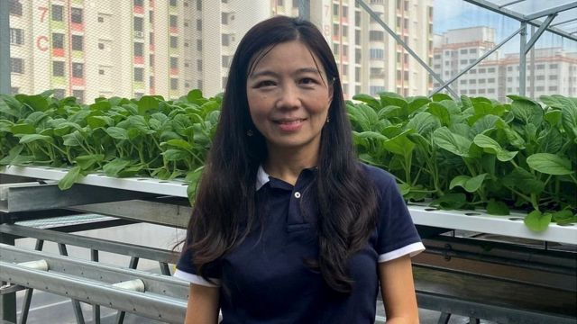
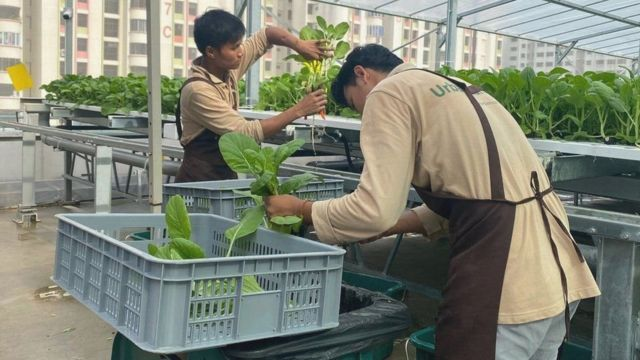
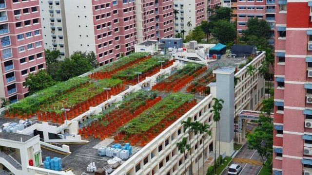

# 新加坡如何把多层停车场变成农场

#  城市农场：新加坡如何把多层停车场变成农场

  * 梁艳婷(AnnabelleLiang) 
  * BBC驻新加坡记者 

2022年8月8日

> 图像加注文字，吴丽娇的高层屋顶农场

**吴丽娇（Eyleen Goh）在新加坡一个停车场的顶层上经营着一家农场。她说，这并非是一桩小生意 - 这家农场为周边的零售商每天提供400公斤的蔬菜。**

“新加坡很小，但我们有许多停车场。能在这里拥有农场以满足社区居民的需求几乎就是我们的梦想，”吴丽娇说。

目前，至少有十几个这样的房顶农场在新加坡这个东南亚城市国家发芽生根。

作为增加当地粮食生产计划的一部分，政府在2020年开始租赁这些不同寻常的场地。这个人口550万的国家目前90%以上的食品需要进口。

但人口稠密的岛国新加坡空间稀缺，这意味着土地昂贵。新加坡有世界上最贵的房地产。

一名农场主告诉BBC，他第一个停车场地块的高昂价格意味着他不得不放弃，搬到一个较便宜的地方。

当BBC新闻访问吴女士的农场时 -- 一块只有大约三分之一足球场地大小的地方 -- 那里正是一片繁忙的景象。

工人们正在采摘、修整和包装菜心。

> 图像加注文字，工人们正在采摘蔬菜。

与此同时，在另一端，一名员工正忙着移植幼苗。

“我们每天都在收获。取决于我们种植的蔬菜品种，每天收获可以从100公斤，到200公斤，或是到400公斤不等，” 吴女士说。

她说，开办农场大约需要100万新元 (约等于489万人民币)，其中大部分钱花在帮助加速收割的设备上了。

虽然她得到一些补贴，吴女士说，她的生意目前还没有盈利。

她雇佣10名员工，每年还需要支付大约9万新元的租金租赁这块地和另外一个停车场，另外一个停车场目前仍在准备过程中。

“我们兴建阶段正好赶上新冠疫情，因此物流成本要贵得多，耗时也更长，”吴女士解释说。

“而且，这是政府的第一个屋顶停车场招标，整个过程对每一个人来说都是新的体验，”她补充说。

新加坡的房顶农场主们也正在寻找其他方式赚钱。

吴庭宽（Nicholas Goh，与吴女士没有亲属关系）说，他设法通过每月向人们收取一定费用在他的城市农场摘菜赚取了利润。

他说，这一主意特别受到附近住家的欢迎，因为“这是一种社区方式，而非商业模式。”

然而，另外一位城市农场主李健（Mark Lee）说，高成本迫使他搬到另外一栋只收取“微不足道”费用（即租金较低）的工业建筑。

李先生说，“蔬菜归根结底也只是蔬菜而已。你可以买到最新鲜和质量最好的，但人们为此能支付的金钱有限。我们这里说的又不是什么松露。”

##  “生存问题”

> 图像来源，  NATURE'S INTERNATIONAL COMMODITY
>
> 图像加注文字，屋顶农场近年来开始在新加坡展现萌芽。

屋顶农场并非是新加坡旨在增加粮食产量的唯一方式。

该国大部分本地农产品来自政府大力补贴的高科技设施。根据官方数据，2020年，新加坡共有238个有许可的农场。

新加坡食品局（SFA）说，有些农场已经盈利，可以扩大生产增加利润。

SFA发言人对BBC说，“食品安全对新加坡来说是一个生存问题。作为一个资源有限，但却与全球紧密相连的城市小国，新加坡很容易受到供应中断和外部冲击的影响。”

该发言人说，“这就是为什么我们不断采取措施，确保我们基本资源至关重要的原因。”

今年早些时候，当该地区的几个国家禁止或限制一些关键食品出口时，食品安全问题成为新加坡关注的焦点。

由于乌克兰战争和新冠疫情推高了从主食到原油的一切成本，那些依赖进口的各国政府试图保护其食品供应。

到2030年， 新加坡希望能生产本国所消费食品的30% - 这是目前数量的三倍以上。

新加坡南洋理工大学的陈维宁（William Chen）教授表示，应该为城市农场提供更多支持。

陈教授说，“有一些措施已经到位，比如来自SFA的提高生产力的补助金，以及定期举办农贸市场以鼓励消费者购买本地农产品。”

陈维宁目前是南洋大学食品科学和技术项目的主任。“也许可以考虑帮助当地农场主采纳一些简单技术，”他说。

但李光耀公共政策学院助理教授阿科特（Sonia Akter）认为，高昂的运营成本仍然是城市农场主面临的一个主要挑战。

“新加坡正在为这一领域工作的企业家提供大量的补贴和财政支持，”她说，“问题是当政府支持停止时，这些农场是否能够运作，并具有商业可行性。”

再回到被新加坡大都市被摩天大厦环绕的吴女士的屋顶农场，这里似乎与传统的农业景象有着天壤之别。

然而，吴女士呼应了在她之前几辈农民的心声：“放弃不是一种选择。挑战越大，回报也就越多。”

