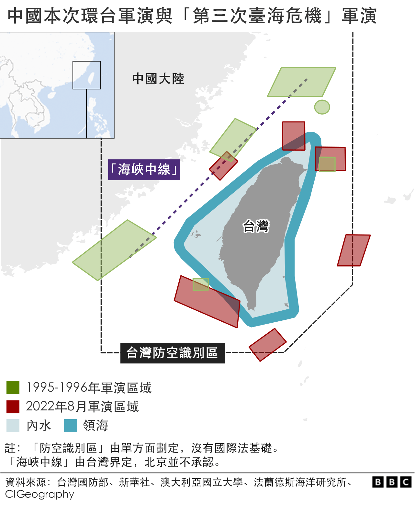

# 台湾危机给拜登的对华策略带来什么改变？

#  台湾危机给拜登的对华策略带来什么改变？

  * 芭芭拉·布莱特-厄舍尔（Barbara Plett-Usher） 
  * BBC驻美国国务院记者 

2022年8月5日

> 图像来源，  Getty Images
>
> 图像加注文字，资深民主党人佩洛西访台使美国总统拜登处理与中国关系时“非常头痛”。

**美国众议院议长南希·佩洛西访问台湾，使美国总统拜登处理与中国关系时非常头痛，后者是美国在全球最主要的竞争对手。分析人士警告，未来有许多风险。**

中美关系的基础是美国在台湾问题上的战略模糊。

北京声称台湾是中国的一部分，台湾则说自己是独立的，美国说台湾不是独立的，但将其当作盟友，三方都没有对自己的主张采取积极行动，维持这种脆弱的平衡似乎是最不坏的选择。

但佩洛西访问台湾，使上述安排背后的矛盾之处暴露无遗，这种脆弱的平衡已经变得十分紧张。

佩洛西是25年来访问台湾的最高级美国官员，中国对她的访问愤怒不已，而中美关系已经低至冰点，此次危机使拜登面临的局面更加复杂。

而且，美国正在专注于俄乌战争，此次危机增加了美国被卷入与另一个大国冲突的风险。

美国政府内部的不合，使台湾看起来像是华盛顿地盘争夺战的一部分，这没有什么帮助。

佩洛西是民主党人，也是长期的对华鹰派，她获得国会强大的共和党议员们的欢呼，他们也同意，中国对台湾威胁日益增长之时，美国国会对台湾的访问表现出难能可贵的团结。

在白宫的民主党同僚们则认为，国会是独立于行政部门的，因此没有资格阻止她赴台。

私下里，拜登派助手警告她，现在是在中国领导人的政治敏感时期，及其背后的风险。佩洛西被告知，习近平将在11月面临一次重要的党代会，同时面临相当大的国内压力，不能显得软弱。

当佩洛西决定离开时，美国政府不得不为此举辩护并淡化其重要性，强调这并不代表美国的“一个中国”政策有所改变。

但美国政府承认，中国政府会反应剧烈，并可能在数周甚至数月内持续推出反制措施。

在中国以实弹军事演习包围台湾之时，华盛顿的观点仍然是，习近平旨在“锚定”其行动，以避免公开开战，这是双方都不想看到的。

但这是双方脆弱关系中一个爆炸性事件。

“美国和中国既没有政治空间，也没有真正的关系和机制来防止这样的事件变成全面的危机，”丹尼·拉塞尔（Danny Russel）表示。他曾是亚太地区的外交官，现在在亚洲协会政策研究所（Asia Society Policy Institute）工作。

他认为，佩洛西的访问将把中国的想法锁定在最强硬的部分，并真正消除那些主张耐心和谨慎的想法。

两个全球大国在解决一系列其他问题上已经出现功能障碍，这将进一步加深摇摇欲坠的情形。

对美国来说，中国对俄罗斯的外交支持排在问题列表几乎最高处，但正在进行的贸易战紧随其后，再次是需要共同应对气候变化和朝鲜核风险。

拜登总统上任时，习近平在国内愈发威权，对外则愈发强硬。美国的回应则是将北京定义为战略竞争者和美国最大的长期挑战。中国并不喜欢这一框架，而双方在尽可能寻求合作上并没有取得进展。

白宫现在说其目标是建立“护栏”，以管理分歧，两国领导人之间直接达成共识。

但台湾已经提出了“可信度的问题”，德国马歇尔基金的亚洲专家葛来仪（Bonnie Glaser）说。“我确实认为，习近平会觉得他不能相信拜登的话。”

在这方面，佩洛西的访问只是冰山一角。在这之前，还有一系列其他行动让中国怀疑美国正在与台湾关系正常化，尤其是拜登先生暗示他对该岛的防务承诺比美国政策所确定的要更强硬。

葛来仪说，现在需要的是一个“集中的、安静的、坦诚的对话”，摆脱标准的模棱两可的剧本，明确指出红线。

如果在11月的G20峰会期间，能够成功安排两国领导人面对面会谈，也许这将成为可能。这可能有助于稳定两国关系，但不太可能超越危机管理的范畴。

