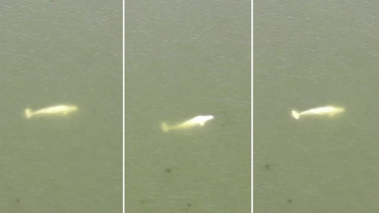

# 白鲸误入塞纳河 法国当局研究如何解救

#  白鲸误入塞纳河 法国当局研究如何解救

2022年8月5日

> 图像来源，  SDIS 27 / Reuters TV
>
> 图像加注文字，航拍画面显示这头白鲸正在塞纳河上游荡。

**法国塞纳河中出现一头白鲸，当地官员们正在研究如何拯救它。**

他们表示，这头白鲸目前在巴黎西北面约70公里的弗农（Vernon）附近一道水闸处游弋。

官方敦促民众远离这头似乎体重不足的鲸鱼。

白鲸更适合在寒冷的北极水域生活。这头白鲸离开其自然栖息地，向南偏离如此之远，让专家们感到困惑不解。

路透社援引环保组织海洋守护者协会法国分会（Sea Shepherd France）负责人拉米亚·埃森拉利（Lamya Essemlali）表示：“现在的挑战将是如何喂养牠，并试图伴随牠游回海洋。”

埃森拉称，把这头白鲸带出水面是不可能的，因为太危险了。

航拍画面显示，牠在河中缓慢游动。

当地官员没有报告这牠鲸鱼的大小，但一只成年白鲸可以长到4米多长。
 今年5月  ，一头虎鲸在诺曼底的塞纳河里游泳后被发现死亡。当时，计划利用声音刺激引导这头4米长的雄性虎鲸返回大海，但以失败告终。专家们后来认为牠得了重病。
 2019年  ，英国官员报称，在格雷夫森德（Gravesend）附近的泰晤士河中发现了一具鲸鱼尸体。

与此相隔仅仅几周前，在同一水域游泳的一头座头鲸也被发现死亡。有观点认为，牠可能由于方向感错误，在涨潮期间游进了泰晤士河。

