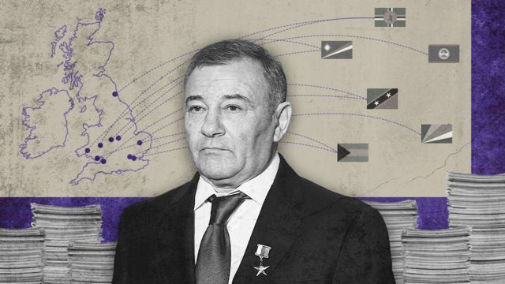
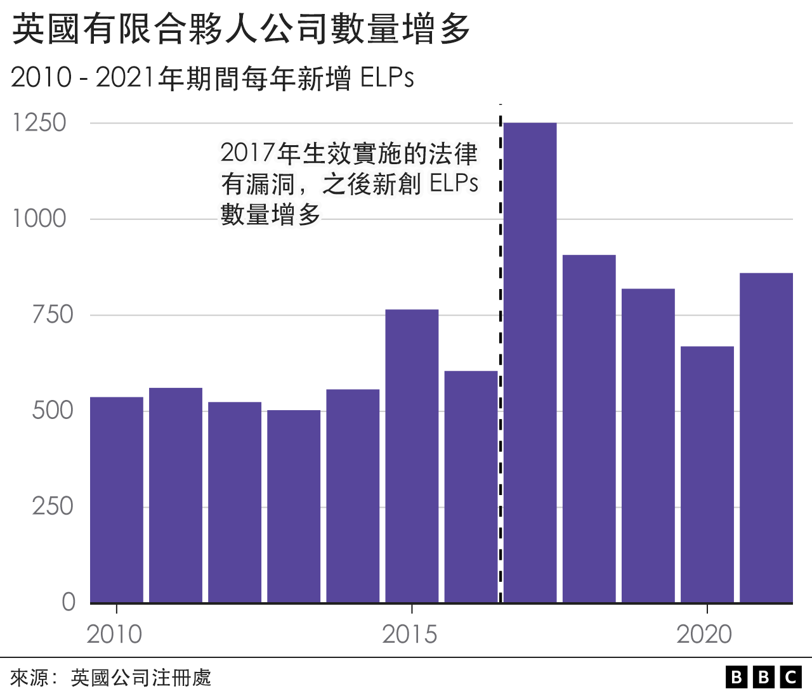
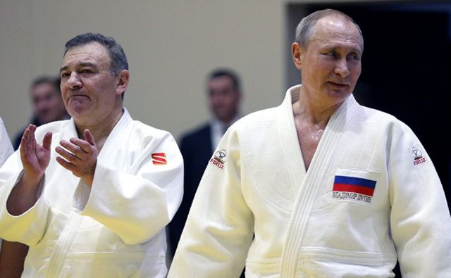
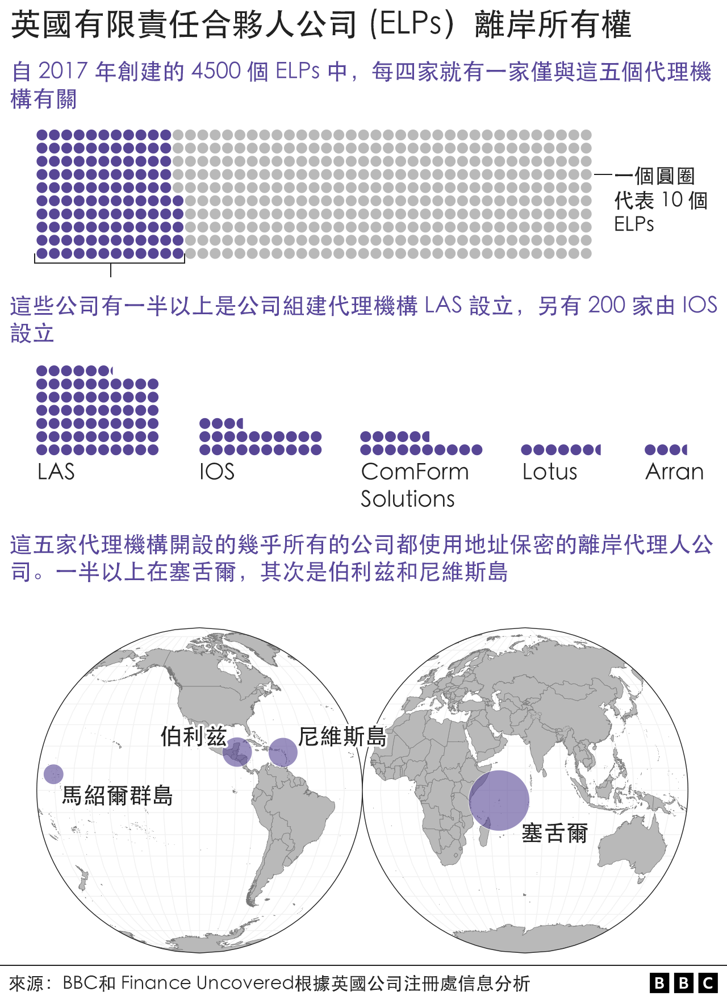
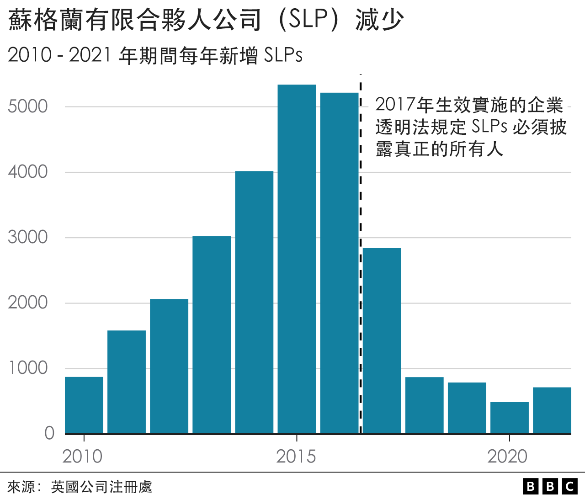
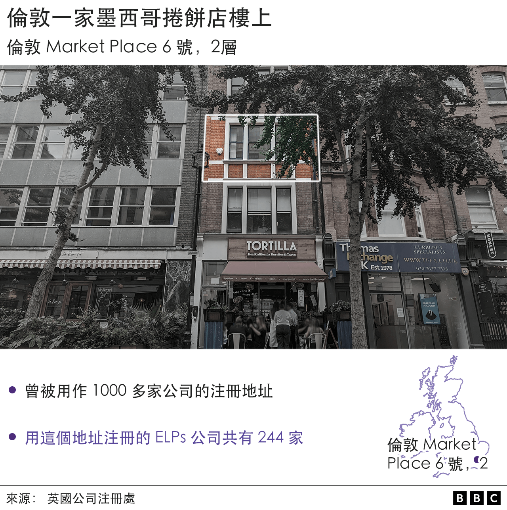
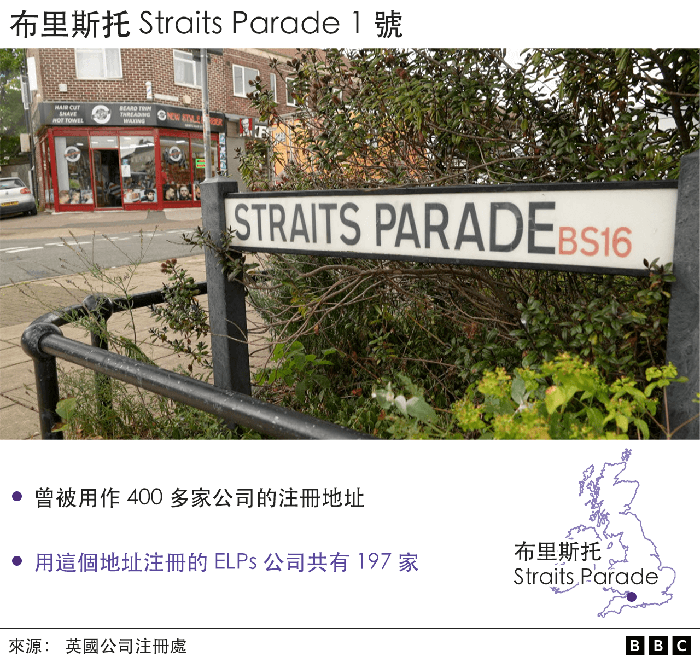

# 被制裁的俄罗斯寡头钻了英国企业透明法漏洞

#  被制裁的俄罗斯寡头如何钻了英国法律的漏洞

  * 奥利佛（James Oliver）、斯泰里亚诺（ Nassos Stylianou）、达尔格伦（ Will Dahlgreen）、斯万（ Steve Swann） 
  * BBC 数据新闻团队和 BBC 《广角镜》 节目 

2022年8月8日

> 图像加注文字，阿尔卡季·罗滕贝格（Arkady Rotenberg）

**调查发现，俄罗斯总统普京核心圈成员、受制裁的俄罗斯寡头发现并钻了英国企业保密和透明度法律中的漏洞。**

阿尔卡季•罗滕贝格 (ArkadyRotenberg) 和鲍里斯·罗滕贝格（Boris Rotenberg）兄弟是普京的柔道伙伴。他们利用的法律漏洞，涉及一种不需要披露真正所有者的公司。

英国政府部长们承认，这类被称为英国有限责任合伙人公司（ELP）的类别有可能被犯罪分子滥用，令人担忧。

英国广播公司（BBC）和 Finance Uncovered （金融揭秘）  的联合调查发现，有证据显示许多 ELP 与欺诈、恐怖主义和洗钱有关联。

在2016 - 2017年间，政府出台了一些措施，强制几乎所有英国公司都披露真正的所有者，但 ELP 不受这些新的企业透明法规约束。

自那时起，新成立的这类公司超过了4500家。

BBC与金融揭秘合作展开调查，分析泄露的文件和数千份公司记录，这些文件显示 ELP 成为规避反洗钱法的途径。这些法律要求英国公司披露真正的所有者或重要控制者。

ELP 公司是合法的，适用于房地产公司、投资及养老基金等，它们享受税务优惠等优势，且投资者的风险责任金额有限。

与大多数公司不同，ELP 没有单独的法律身份，这意味着他们不能拥有资产，没有受益所有人，也不能合法地开设银行账户。

但我们的调查发现，有文件揭示有些 ELP 有实益拥有人，并有证据显示有些 ELP 曾开立银行账户及协助金融罪案。金融犯罪专家格雷厄姆·巴罗（Graham Barrow）说，它们也“容易被滥用”，因为被要求公开的业务活动信息很少。

我们的数据显示，自2017年以来，新成立的 ELP 数量增加了 53%。

皇家联合研究所英国经济犯罪组负责人海伦娜·伍德（Helena Wood）说：“我真希望自己对这种规模感到震惊，但我绝对没有，我只是感到沮丧和无奈。”

调查还发现：

  * 泄露的文件显示，ELP 被作为“替代解决方案”进行营销，以规避企业透明法规； 
  * 只有五家被称为公司组建代理机构的公司负责成立了 1500 家 ELP，其中数百家拥有相同的注册地址，其中包括伦敦市中心一家墨西哥卷饼店楼上； 
  * 正式文件中用来掩盖英国公司真正所有者身份的一位71岁的瑞士陶瓷艺术家是160 多家 ELP 公司的签名人； 
  * 参与调查波士顿马拉松爆炸案的美国联邦调查局（FBI）特工调查了一个注册地址和布里斯托一家理发店地址相同的 ELP 公司。 

自新的企业透明法生效后的五年内，新成立了4500 多家 ELP 公司，2017年之前的五年中，新成立的 ELP 总计 2950 家。

> 图像来源，  Getty Images
>
> 图像加注文字，阿尔卡季·罗滕贝格和普京一起练柔道

我们已经确定，在那些利用 ELP 保密性的人中，有普京总统核心圈的成员。

就是罗滕贝格兄弟，阿尔卡季和鲍里斯。他们是2020年美国参议院委员会调查的对象。该委员会表示，他们利用遍布全球的壳公司网络来逃避俄罗斯2014年吞并克里米亚后美国实施的制裁。这些公司被用来购买价值千百万美元的艺术品。

其中一家公司是ELP，Sinara，成立于2017年1月，主要营业地点位于距离伦敦牛津圆环（Oxford Circus）仅一箭之遥的地址，业务涉及“旅游和票务服务”。

在2017年7月至2018年6月期间，这家公司向一位艺术顾问发了“14 次电汇，每次 9500 美元，总计13.3 万美元”（10.9 万英镑）；参议院的报告称这名顾问“为罗滕贝格的购买提供了便利”。

根据英国法律，不需要披露 Sinara 的实际拥有者。Sinara于2019年解散。

工党议会议员玛格丽特·霍奇女爵（Margaret Hodge）说：“像罗滕贝格家族这样在美国多年受到制裁的人，却仍能够利用英国的公司架构，通过这些架构将他们的钱从俄罗斯带出来，然后随意花掉。这是一个丑闻。” 她是议会一个关于税收和腐败的专责小组主席。

BBC试图联系罗滕贝格夫妇，没有得到回应。

大多数有限合伙企业是由所谓的公司组建代理人建立的，他们提供注册地址和行政支持。

BBC和金融揭秘发现，自2017年以来新注册的 4500 家 ELP 中，四分之一是由五家英国代理机构成立的。

这些机构在为东欧和前苏联的客户创建匿名英国公司方面有过往记录。他们注册成立的一些公司也与包括洗钱在内的金融犯罪有关。

公司记录显示，这些机构中最多产的是 LAS，由英国俄裔会计师埃莱娜·道布奇克（Elena Dovzhik）和她的拉脱维亚业务伙伴伊奈塔·乌提纳尼（Ineta Utināne）经营。这位英国女商人通过 LAS 赚了数以百万计的美元，公司的业务包括为东欧和中亚的客户组建和管理数百家匿名英国公司。

与 LAS 有关联的一些公司后来卷入了犯罪活动。其中一家，Always Efficient LLP，用 LAS 提供的伦敦地址注册的公司，被发现是最大的俄语比特币交易所 BTC-e 的幕后操控者。该交易所于2017年被美国司法部因洗钱指控而关闭。

2021年，使用 LAS 联系地址的 fazze.com 网站被指在俄罗斯发起了一场围绕疫苗的虚假信息运动，传播阿斯利康疫苗会把接种者变成黑猩猩的谣言。

LAS 告诉 BBC，它“在2017年”终止了对 Always Efficient LLP 的服务，因为后者违反了"我们的条款和条件"。

关于 fazze.com，LAS表示：“可能是非法和未经授权使用我们的地址服务，因为在我们的历史数据库中没有确切或类似的详细信息。”

LAS 还负责建立大量另一种类型的英国公司，称为苏格兰有限合伙人公司（SLP）。 2017年 Bellingcat 一项调查发现  ，LAS 是"2015年至2017年间最多产的 SLP 创办代理"。

当时，SLP 不必披露其真正的所有者。但在这类公司一再牵涉到重大国际洗钱丑闻之后，英国政府修改了法律，这些公司必须提供有关最终拥有或控制人的信息。自那以后，SLP 注册数量几乎立即下降了近一半。

在 SLP 法律发生变化后，根据 BBC看到的泄露文件， LAS 将注意力转向了 ELP 。

在2017年5月18日通过电子邮件发送给客户的最新消息中，LAS 在“替代解决方案” 的标题下建议把 ELP 作为“撤离SLP的途径，或作为SLP的替代品”。

这份文件是国际调查记者联盟（ICIJ）获得的泄露数据 ——“潘多拉文件” ——中的一份。它声称：“目前，这种合伙人企业的优势是，它们不是也不会受到有关控制人信息披露的法律的约束。”

现在，我们的调查发现，与 LAS 有关的一些 ELP 公司涉嫌参与犯罪活动。

其中包括 Donnea Business LP 旗下的 ELP 公司，它们被指在乌克兰逃税，还有另一家名为Cosalima Trade LP 的 ELP，由俄罗斯当局通缉的一名俄罗斯商人控制，涉及一宗 500 万英镑的欺诈犯罪。

LAS 老板道布奇克说：“我们知道，多年前我们为一些最终被指控从事非法活动的公司提交了注册文件，但在注册之前，我们无法获得此类信息。

“我们（从未）参与过我们前客户的任何商业活动，只协助我们的企业客户完成公司的组建过程，邮件转发服务，（和）法定备案。

“我们从未支持任何形式的欺诈或非法活动。”

她解释说，她的公司“加强了对所有国际客户的尽职调查”，“如果我们的任何客户被举报涉嫌参与非法活动......服务立即终止”。

Donnea Business LP 和 Cosalima Trade LP 都用 LAS 提供的伦敦注册地址。

Cosalima 的注册地址是 Market Place 6号的二楼，位于伦敦市中心 Fitzrovia 一家不相关的墨西哥卷饼店楼上。

这里是大约 800 家有业务活动的公司注册地址，也是英国 ELP 公司最常用的地址之一。过去五年，有 240 多个 ELP 在此注册。

插入对讲机按钮上的纸片只列出一家公司 - 1000 Apostilles Ltd，由 LAS 的 乌提纳尼拥有。

LAS 表示，“Market Place 6号的租约今年到期”。

ELP 的另一个常用地址在布里斯托。

布里斯托鱼塘区的 Straits Parade 街 1 号现在是一家土耳其发廊。

那里也是另一家组建机构 Arran 用来注册英国公司的地址，包括 197 家 ELP。

在该地址注册的公司与贿赂，欺诈和其他金融犯罪有关。

我们的调查发现，2013年在那里注册的一家叫 Rivelham 的 ELP 在 FBI 调查2013年美国波士顿马拉松爆炸案时曾被注意、标记。

德意志银行编撰的可疑活动报告中提到 Rivelham LP，这被作为对炸弹袭击嫌犯金融交易调查的一部分交给 FBI 特工。

这些报告来自泄露的提交美国财政部的可疑活动报告（称为FinCEN文件），没有确定谁实际拥有 ELP，但记录了它在2012年12月至2013年1月的短短一个月内参与 116 笔可疑交易，总额超过 730 万美元（600万英镑）。

BBC 试图联系 Arran 老板，但没有收到任何回应。

虽然像 Straits Parade 街 1 号和 Market Place 6 号这样的地址可能透露哪个公司组建代理机构参与了 ELP，但几乎没有提供任何关于其幕后真正拥有者的线索。

虽然 ELP 合伙人的姓名可以在提交给英国公司注册处的文件中找到，但通常会看到这些姓名是在伯利兹和塞舌尔之类国家注册的匿名公司。

而且，为这些公司签署文书的人也不太可能是公司的真正所有者。

通常，他们是代理签名人，有偿签署文件，通常对公司正在做的事情一无所知。

一位频繁露面的代理签名人是瑞士的露丝·内德哈特（Ruth Neidhart），住在塞浦路斯，现年71岁。她是陶瓷艺术家，制作瓷娃娃和珠宝，有时为儿童生日派对安排陶器绘画课程。

我们对英国公司注册处数据的分析显示，自2016年以来，在 IOS，另一家公司组建代理机构，安排下她签署了 160 多家 ELP 的文件。

内德哈特夫人没有回应BBC 的置评请求。

调查还发现，LAS 最多产的代理签名人之一是住在伦敦的30岁出头的罗马尼亚人亚历山德鲁·特尔纳（Alexandru Terna）。他为 LAS 替客户创建的至少 306 个 ELP 签了公司文件。

在回答 BBC 书面问题时，特尔纳表示，他是“通过 LAS International” 或一家相关公司安排参与这项工作的，“代表所有公司的所有者；我们与这些公司签订了受托人/代理人服务协议”。

他补充说：“正如你信中提到的，我们从未参与过任何公司的控制或管理。”

活动人士表示，BBC 对 ELP 的揭秘显示英国法律改革早就应该进行了。

“多年来，我们一直在警告政府这些不透明的法律结构存在这些问题，”皇家联合服务研究所智囊团的伍德说。

“透明度是他们说的最好的消毒剂，我们需要成桶的这种消毒剂来对付这类英国有限合伙公司。”

历届英国政府都未能堵住反洗钱法中的主要漏洞，与政界要人的承诺形成鲜明对比。

早在2014年，政府就曾考虑对 ELP 采取行动，但未能如愿。第二年，时任首相戴维·卡梅伦（David Cameron）宣布，他绝不让英国成为“世界各地腐败资金的避风港”。

政府在2018年承认，有限合伙公司存在风险，并且“在大规模洗钱丑闻后，担心它们被犯罪分子滥用”。

俄罗斯入侵乌克兰后，鲍里斯·约翰逊（Boris Johnson）表示，他希望“揭开俄罗斯公司的套娃”，揭示其真正的所有者。

政府表示，没有证据证明 ELP 被严重滥用。一位政府发言人说：“英国已经拥有世界上最强大的反洗钱监控措施，必须继续升级我们治理力度以打击滥用英国企业系统的犯罪分子。

“这就是为什么我们正通过即将出台的《经济犯罪法案》来使监管英国有限合伙公司的法律现代化，这个法案将收紧注册要求并提高透明度 —— 确保只有那些在法律许可范围内行事的人才能留在英国登记册上。

但这些建议似乎不包括堵塞 ELP 漏洞，要求披露真正的所有者或公司背后的关键控制者。

_**设计：里瓦尔特（Erwan Rivault）和托辛斯基（Jana Tauschinski）**_

