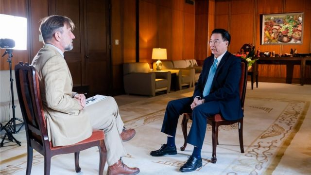
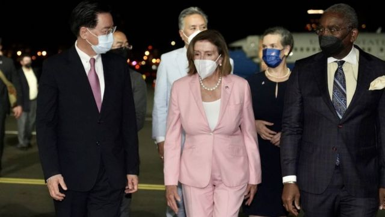

# BBC专访台湾外交部长吴钊燮：“保卫台湾是我们自己的责任”

#  BBC专访台湾外交部长吴钊燮：“保卫台湾是我们自己的责任”

  * 傅东飞（Rupert Wingfield-Hayes） 
  * BBC记者，发自台湾 

2022年8月8日

> 图像来源，  台湾外交部
>
> 图像加注文字，吴钊燮说："保卫台湾是我们自己的责任。"

**台湾外交部长吴钊燮近日接受BBC独家访问，他为美国国会众议员议长佩洛西（Nancy Pelosi；裴洛西、波洛西）短暂但具争议的台湾之行进行辩护。**

吴钊燮谴责了中国从周四（8月4日）开始在台湾周边进行的大规模军事演习。

他表示，佩洛西的访问“意义重大”，中国的回应不会阻止未来民主国家政治领袖受邀访问台北。

吴钊燮还警告称，中国在领土方面的目标远不止台湾。

过去六年来，吴钊燮的公众形象一直反映了台湾在争取更多国际认可。他促成了佩洛西的访问，目前正在处理协调有关访问带来的相当可怕的后果。

但这位台湾外交部长并不打算道歉。佩洛西此行的宗旨就是让人们注意到这个经常被遗忘且鲜为人知的岛屿。

北京视台湾为中国的一个省份，最终将回归中国。不过，台湾认为自己是与中国大陆有所区分的自治岛屿。

但世界领导人凡是对这一主权问题有所暗示，都会激怒中国。中国周五（8月5日）宣布，已对佩洛西及其家人实施制裁。

吴钊燮表示：“中国长期试图在国际上孤立台湾。”

“像佩洛西议长这样的重要领导人有机会访问台湾是非常重要的。可以提高台湾的知名度，让国际社会了解台湾是民主国家。”

他很快补充说，不是台湾挑起了这场危机，而是北京在试图改变规则。

他表示：“我们希望维持现状。台湾对中国大陆没有管辖权，中华人民共和国对台湾也没有管辖权。这就是现实。”

他所说的是，中国国民党领导人蒋介石在国共内战失败后逃往台湾，从此73年来两岸分治。

> 图像来源，  Reuters
>
> 图像加注文字，中国军方发射的飞弹“穿越台湾上空”的消息已经引发台湾舆论关注。

几十年来，两个对立的中国独裁政权，即信奉民族主义思想的国民党和信奉共产主义思想的中共隔海相望，都没有强大到可以攻击对方。

但在过去的25年里，有两件事发生了变化。中国富裕了，台湾走向了民主。

走向民主带来一个截然不同的政党在台北掌权——由蔡英文和吴钊燮领导的民进党。他们骨子里是台湾人，不再信奉中国的民族主义思想，而是崇尚民主和人权。

吴钊燮自豪地告诉我：“就民主程度而言，台湾在东亚排名数一数二。”

“在自由指数上，台湾排名第一，在经济自由指数上，台湾也排名第一。台湾人民坚持民主、自由和人权的价值，这让台湾走向民主世界。”

的确，美国非营利研究组织“自由之家”（Freedom House）将台湾列为“自由”地区（该组织在2022年将中国列为“不自由”）。并且，美国布鲁金斯学会（Brookings Institution）在很大程度上称赞台湾的民主化。

台湾的问题是，中国大陆富有了，并利用财富建造了巨大的战争机器。与此同时，台湾太长时间依赖100英里宽的台湾海峡以及美国来保障安全。

吴钊燮承认，这种说法已经站不住脚了。

他说：“保卫台湾是我们自己的责任。”

“我们有这个意愿和能力。我们需要其他国家向台湾提供防御物资，但保卫台湾是我们的责任，我们不要求其他国家牺牲生命来保护台湾。”

这样说很勇敢。台湾的年轻世代似乎比父母一代拥有更强的战斗意志。

> 图像来源，  Taiwanese Foreign Ministry / Handout via Getty
>
> 图像加注文字，美国众议院议长佩洛西(中)在2022年8月2日降落在台湾台北松山机场后受到台湾外交部长吴钊燮(左)的欢迎。

但计算机模型显示，中国人民解放军可以在几天内击溃台湾的过时军队。吴钊燮表示，如果允许这种情况发生，那会是巨大的错误，只会鼓励中国越走越远。

他称中国的行为是“扩张主义”。

“看看他们对香港问题的处理，或者对东中国海（中国称东海）和南中国海的主权主张。这是典型的威权国家的扩张主义。 ”

“这个地区的国家需要警惕中国的企图。台湾不会是中国扩张主义野心的最后一块版图。”

_蒂凡妮·维尔特默（Tiffany Wertheimer）补充报道。_

