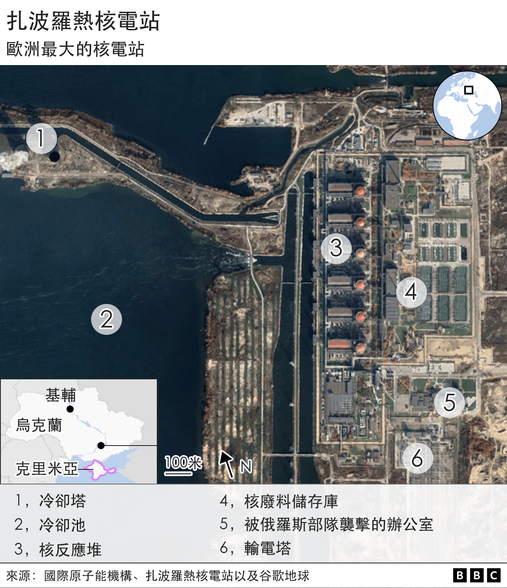
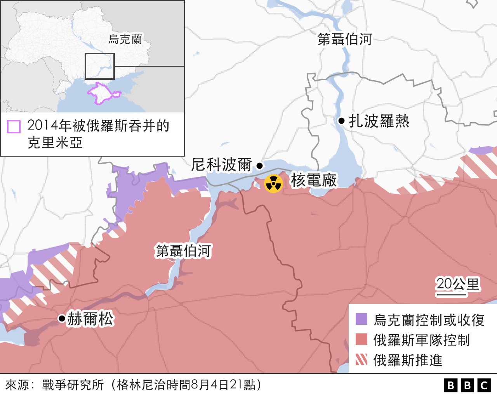
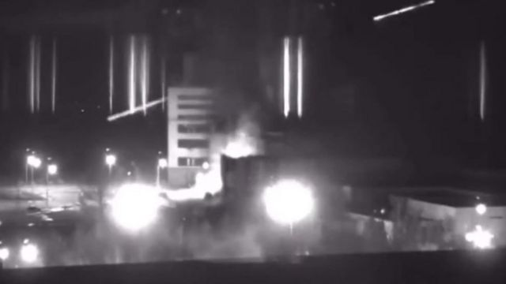

# 俄罗斯占领下的乌克兰核电站到底有多危险？

#  扎波罗热：俄罗斯占领下的乌克兰核电站到底有多危险？

最近更新： 2022年9月7日

> 图像来源，  Reuters
>
> 图像加注文字，俄罗斯军队控制着欧洲最大的扎波罗热核电站。

**联合国属下的国际原子能署（IAEA）呼吁推动乌克兰核电站的安全，争取乌克兰南部俄罗斯控制的欧洲最大的核电站——扎波罗热核电站周边非军事化。**

国际原子能署周二（9月6日）公布的报告表示，虽然发射在扎波罗热周边的导弹并没有造成核泄漏，但对核电站安全一直构成潜在威胁，有可能导致有严重安全后果的核泄漏。

该报告列出了核电站中因战争受损的部分，包括：一座装有核燃料的建筑物、一座储存放射性废物的设施和一座装有警报系统的建筑物。

8月上旬，乌克兰核能机构说，俄罗斯火箭破坏了扎波罗热核电站，虽然没有核辐射泄漏，扎波罗热核电 的一个氮氧装置以及一条高压电线受损。

国际原子能署报告还说，对扎波罗热核电站安全运行至关重要的异地电源已经多次被切断。

报告强调：国际原子能机构仍然极为关注扎波罗热的情况。

扎波罗热核电站现在情况究竟如何？最坏可能会怎样？国际社会应该采取什么措施保障核电站的安全？

##  核电站到底发生了什么？

俄罗斯在今年3月初，即全面入侵乌克兰后的第二周接管了扎波罗热核电站。

俄国和乌克兰部队之间的战斗十分接近在埃涅尔戈达尔（Enerhodar）镇附近的核电站，核电站其中一个建筑物着了火，随之引起全欧洲的关注。

该核电站有6个压水反应堆以及几个核废料储存库。

当时，乌克兰一名工人称核电站遭到“直接炮击”， 其中一个反应堆受损。

核电站大火最终被扑灭，但联合国安全理事会随后就此事件召开紧急会议，美国和英国谴责了对核电厂的炮击行为。

甚至连很少批评俄国的中国也表示对核安全担忧。

而俄国则以指责“乌克兰破坏者”纵火作为回应。

从7月中旬开始，由于俄罗斯军队被指责从该设施附近地带开火，人们对扎波罗热核电站的安全担忧开始加剧。

由乌克兰控制的城市尼科波尔（Nikopol)市市长亚历山大·萨尤克（Alexander Sayuk）告诉《纽约时报》，该市经常遭到俄军炮击。

“他们藏身于核电厂”，他说，“因此他们将不会受到袭击。”

乌克兰试图通过使用具有针对性的“神风无人机”（kamikaze drones）进行打击，但由于担心击中核反应堆风险，其军队无法使用西方国家最近提供的多管火箭系统。

非政府组织“核威胁倡议协会”（Nuclear Threat Initiative）的高级主管罗斯（Nickolas Roth）告诉BBC俄语，这一情况是前所未有的。

“我们正在见证之前军事行动中从来没有见过的事情，”他说，“ 俄罗斯正在利用核设施作掩护。”

##  可能发生的最坏情况是什么？

> 图像来源，  Getty Images
>
> 图像加注文字，3 月的监视录像显示，随着俄罗斯军队的推进，核电厂开始发生火灾。

核反应堆最明显的风险是，如果其中之一受到炮弹或火箭袭击，外部的保护壳可能会受损。虽然反应堆在设计时是可以承受一定的外部压力和破坏的，但却无法承受实弹冲击。

如果反应堆的外壳或是冷却系统被损，几乎可以肯定会发生核泄露。同时，还有核爆炸或氢爆炸的风险。

乌克兰独立核能源专家科沙纳表示，如果一枚火箭击中其中一个反应堆，随后的核泄漏将对欧洲、俄罗斯吞并的克里米亚以及整个乌克兰都会产生影响。

俄国物理学家安德烈·奥扎洛夫斯基（Andrey Ozharovsky）专门研究核废料安全处理问题。他解释说，一旦扎波罗热核电站发生事故，它将会导致释放大量放射性铯-137，它是核裂变的副产品，它以通过空气长距离散播而闻名。

铯-137扩散将对人体健康产生潜在灾难性后果，同时还可能污染农业用地从而影响未来几年的收成。

此外，还取决于天气以及风力和风向，它还会波及更远的国家。

核专家们说，除了核反应堆以外，扎波罗热的核废料储存设施也同样存在风险。如果它们受到火箭袭击或炮击，无论是有意还是意外，都将会产生危险后果。

##  国际社会能做什么？

《日内瓦公约》禁止攻击核电站，根据《日内瓦公约》1949年第一议定书，如果可能引发洪水或核辐射造成“严重”平民损失，则限制攻击大坝、堤坝以及核电站。

但同时，如果电厂为军事而非民事用途，则可以成为打击的合法目标。

类似规定还适用于位于危险基础设施附近的军事目标，但不鼓励打击这类目标。

乌克兰已经请求国际社会“关闭扎波罗热核电站上方的领空” - 即提供防止该设施受到直接袭击的空中防御措施。

但这似乎不可能得到执行，因为支持乌克兰的国家担心此举会被俄罗斯解读为直接参与冲突。

