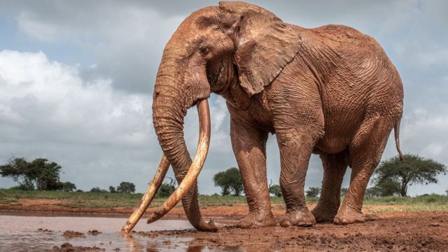
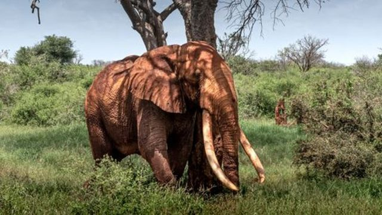
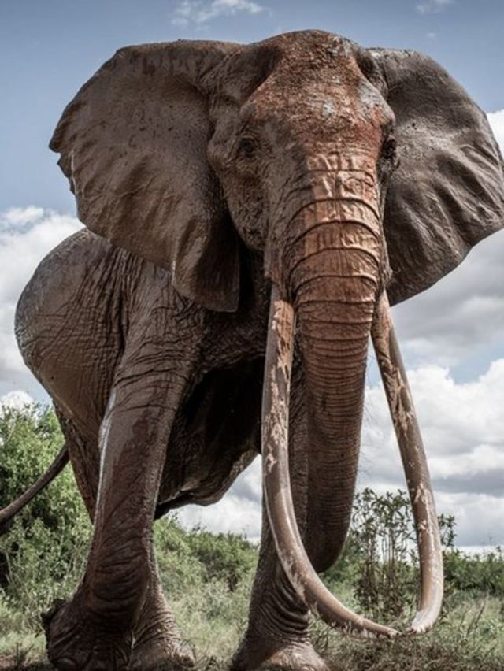
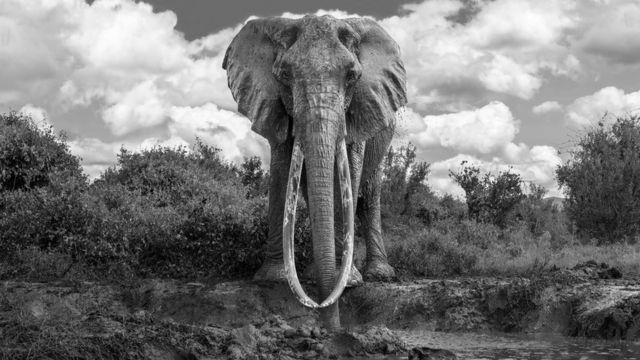
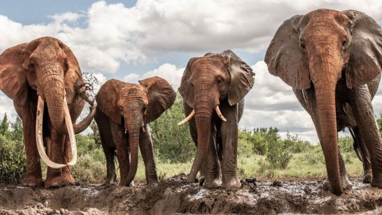
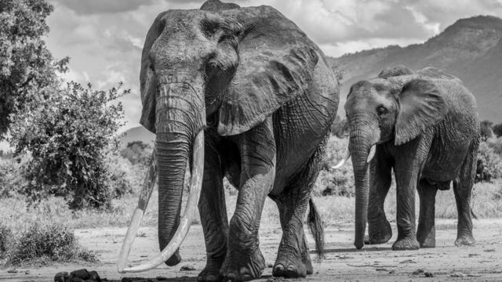
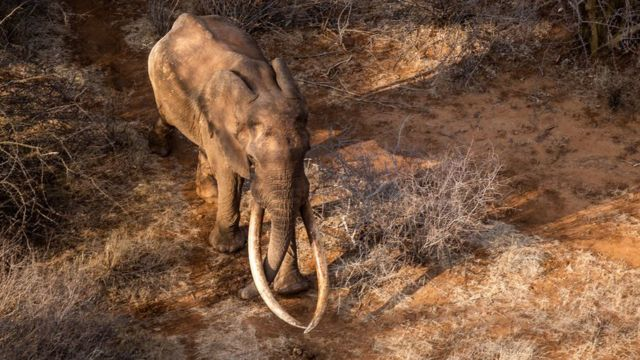
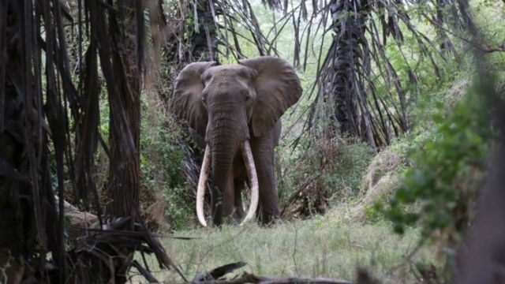

# 世界大象日：非洲超级獠牙象“珍稀、不凡，必须保护”

#  世界大象日：非洲“超级獠牙象”的悲歌

  * 斯瓦米纳森·纳塔拉杨（Swaminathan Natarajan） 
  * BBC国际部 

2022年8月11日

> 图像来源，  Tsavo trust
>
> 图像加注文字，具有超级象牙的野生大象只剩下大约20几头。

**环保人士说，具有超级象牙的野生大象只剩下二、三十头，它们让人联想到猛犸象，其象牙长到可以触及地面。肯尼亚察沃国家公园是其中九头长牙象的家园。在“世界大象日”到来前（8月12日），BBC采访了环保人士尼克·哈勒，他讲述了这些威武的大象对他的意义。**

“第一次见到超级獠牙大象，我心中充满敬畏。那是一个非常特别的时刻，”尼克·哈勒（Nick Haller）说。

尼克是为察沃基金会工作的一名飞行员，其工作包括保护超级獠牙大象（也称超级象牙大象，或象牙王，Super tusker elephants ），这些大象的象牙就像已经灭绝的猛犸象那样，能垂到地面上。

“观赏有着如此美丽象牙的动物，那是一个你自感如此渺小的时刻，”

世界自然保护联盟（IUCN）说，野生非洲象只剩下大约41万5千头左右（此外还有大约5万头亚洲象），但只有大约20多头大象有超级象牙。

在世界大象日（8月12日）之际，我们来看看为什么这一小群大象的生存如此重要。

> 图像来源，  Tsavo Trust
>
> 图像加注文字，当哈勒第一次看到一头名叫卢加德的超级獠牙大象时，他被迷住了。

##  稳重、温和的大象

哈勒第一次见到一只超级象牙大象大约在4年前，当时他正在肯尼亚察沃国家公园驱车旅行。

他说，“我记得非常清楚，与一头有着如此美妙象牙的大象亲密接触。当你看到一头具有超长象牙的大象时，一目了然的是，这是一头非常特别的大象。它们很稀有，我们必须保护。”

> 图像来源，  Tsavo Trust
>
> 图像加注文字，像这头具有标志性的母象的象牙没有着地。

这头大象当时没有同伴，缓慢地移动。

“它很温和，愿意让人接近。”

所有超级象牙大象都有名字。哈勒后来了解到，他在树荫处看到的这头大象名叫卢加德（Lugard）。

> 图像来源，  Swaminathan Natarajan
>
> 图像加注文字，大象用象牙来收集食物以及抵御其他大象。

“卢加德现在非常有名。他是一头威武、雄壮的大象，”哈勒兴奋地说。

##  有名字的大象

卢加德是在占地4万2千平方公里的国家公园中9头超级獠牙大象之一。

哈勒认为，像这样有着如此巨大象牙的大象一共仅剩下20多头。

> 图像来源，  Tsavo Trust
>
> 图像加注文字，一些母象，例如像左边这头象也有长象牙。

“非洲象的象牙平均长2米，重23公斤。而超级獠牙大象的象牙可以长到3米，并超过50公斤，”哈勒说。

可以想象长出如此大的象牙需要很长时间。大多数超级獠牙大象年龄已经超过了50岁。

“野生大象平均寿命为60岁左右，因此，可以说它们已经接近其自然寿命的尾声，”哈勒说。

一些所谓的标志性母象也会长出超出寻常的象牙，但不会长达地面。察沃国家公园中目前至少有5头这样的母象。

> 图像来源，  Tsavo Trust
>
> 图像加注文字，超级象牙象和标志性长牙母象仅在极少数范围内有发现。

“我们还有27头正在成长的超级象牙大象。它们的象牙已经很大，但还不到超级的程度。如果有足够的时间和空间，它们可能成为超级象牙大象，”哈勒说。

在比邻的安波塞利保护区以及博茨瓦纳和坦桑尼亚也发现了超级象牙象。

##  偷猎者的威胁

大象用象牙挖掘、举起物体、剥树皮，并与其他大象争斗确立主导地位。

> 图像来源，  Tsavo Trust
>
> 图像加注文字，察沃国家公园有9头超级象牙象，以及5头长象牙的“标志性母象”。

“你可以看出在象群中，超级象牙象绝对比其他象更受尊重。据我所观察，它们是象群的首领，”哈勒说。

非洲公象和母象都长象牙。但来自美国普林斯顿大学的研究已经发现，许多母象正在演化成没有象牙的象，这是它们对偷猎的一种进化反应。在许多地方，偷猎已经导致大象数量锐减。

> 图像来源，  Tsavo Trust
>
> 图像加注文字，超级象牙象受到其他成员的尊重。

超级象牙象总是成为偷猎者和战利品狩猎者袭击的目标。

2017年，名为萨陶二世（Satao 2）的超级象牙王在察沃公园被人杀害。自那时起，人们加强了地面和空中监测措施，但这些大象既没有装无线电标记，也没有全天候跟踪措施。

今年4月，一名战利品狩猎者出资5万美元射杀了博茨瓦纳最大一头象牙王。

> 图像来源，  Nick Haller
>
> 图像加注文字，尼克从空中监测象牙王。

哈勒说，超级象牙王仅在有限的范围内被发现，因此，超长象牙的进化可能取决于基因。

##  保护未来

“我们相信这是基因遗传。保护它们的基因库，并能让它们尽可能多的繁殖非常重要。我们有20多头正在成长的超级象牙王，我们认为它们是先前超级象牙王的后代，”尼克说。

> 图像来源，  Tsavo Trust
>
> 图像加注文字，偷猎是对超级象牙王的最大威胁。

哈勒驾机飞跃幅员辽阔的保护区，寻找偷猎者。

“看到大象在野外是一种巨大的喜悦。我们应该继续尽我们最大的努力来保护它们，以便我们的孩子和他们的孩子能有机会亲眼看到这些长着壮观象牙的大象。”

