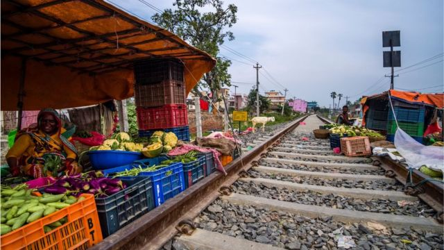
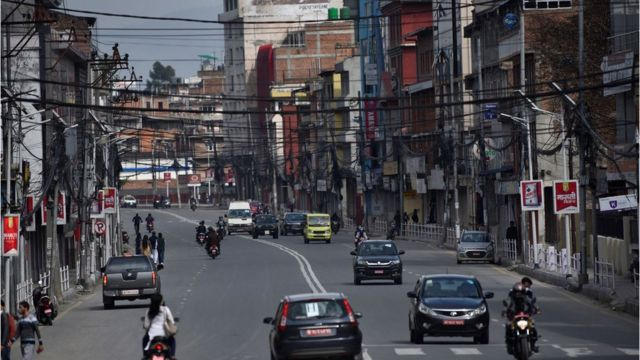

# 中尼铁路：将建跨喜马拉雅立体互联互通网络

#  中尼铁路：将建跨喜马拉雅立体互联互通网络

2022年8月12日

> 图像来源，  Getty Images
>
> 图像加注文字，王毅表示，中国使用对尼援款支持中尼跨境铁路可行性研究，年内派专家赴尼泊尔开展踏勘。

**中国外交部周四（8月11日）披露，中国外交部长王毅同来华访问的尼泊尔外长卡德加举行会谈，宣布将构建跨喜马拉雅立体互联互通网络。**

王毅还表示，中国使用对尼援款支持中尼跨境铁路可行性研究，年内派专家赴尼泊尔开展踏勘。

**从“陆锁国”变** **“** **陆联国** **”**

虽然明确了中尼跨境铁路的进展情况，但对于中尼铁路的建设工期等详细问题，中国外交部发言人汪文斌周四在记者会上并未解答。

对于跨喜马拉雅立体互联互通网络，其实王毅在2021年12月就有提到。

> 图像加注文字，从西藏珠峰大本营附近的绒布寺看珠穆朗玛峰。尼泊尔与中国接壤，中间隔着喜马拉雅山脉。

当时他在尼泊尔重建国际会议时指出，要推进两国跨境铁路项目可研工作，完善跨喜马拉雅立体互联互通网络，帮助尼泊尔实现从“陆锁国”变“陆联国”的梦想。

今年3月，王毅同尼泊尔外长卡德加举行会谈时也强调，中国支持尼泊尔更加深入参与“一带一路”建设，愿加快推进重点合作项目，“特别是推进中尼跨境铁路项目，建设跨喜马拉雅立体互联互通网络。”

##  中尼铁路之难

中尼铁路提案始于2016年，当时尼泊尔总理奥利访华，与中国签署了10项协议，其中包括两国间建设铁路的计划。

> 图像来源，  Getty Images
>
> 图像加注文字，今年3月，王毅同尼泊尔外长卡德加举行会谈时也强调，中国支持尼泊尔更加深入参与“一带一路”建设，愿加快推进重点合作项目

最初，印度对尼泊尔与中国签署铁路协议感到不满，但是尼泊尔领导人强调，对于尼泊尔这样的内陆国家，采取贸易多样化是正确的选择。

另外，也有分析指出，项目耗资巨大，尼泊尔可能会过分依赖中国的贷款。

2018年6月，中尼政府签署跨境铁路合作协议，连接西藏日喀则和尼泊尔首都加德满都。

2019年10月，习近平对尼泊尔进行国事访问，中尼发表联合声明，启动吉隆至加德满都跨境铁路项目可行性研究。

成都世通研究院执行院长龙兴春周四对《环球时报》称，这条跨境铁路项目如果最终建成，对尼泊尔的经济肯定是一个好兆头，因为这个内陆国家与中国的交通连接目前依赖于几个陆地港口，在大雪或地质灾害中无法运行。

龙兴春说，这条铁路将使尼泊尔能够利用中国巨大的市场，促进双边贸易和投资流动。

> 图像来源，  Getty Images

但修建一条这样的铁路并不容易。今年4月，中国驻尼泊尔大使侯艳琪受访时承认，中尼跨境铁路面临许多困难和挑战。

“该项目需要穿越喜马拉雅山脉，在不足200公里的路段落差超过1000米，还需解决沿途地质条件复杂、自然灾害频发等诸多技术难题。据初步测算，整条铁路桥隧比超过90%，每公里造价约2亿元人民币。”她说。

侯艳琪还指出，该项目和其他许多在尼泊尔的基础设施项目一样，面临新冠疫情、征地、拆迁、生态环境保护等一系列挑战。她希望中尼两国主管部门加强沟通协调，也希望尼泊尔改善营商环境。

