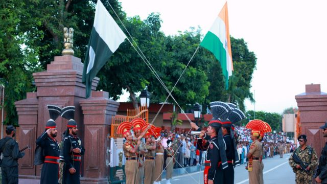
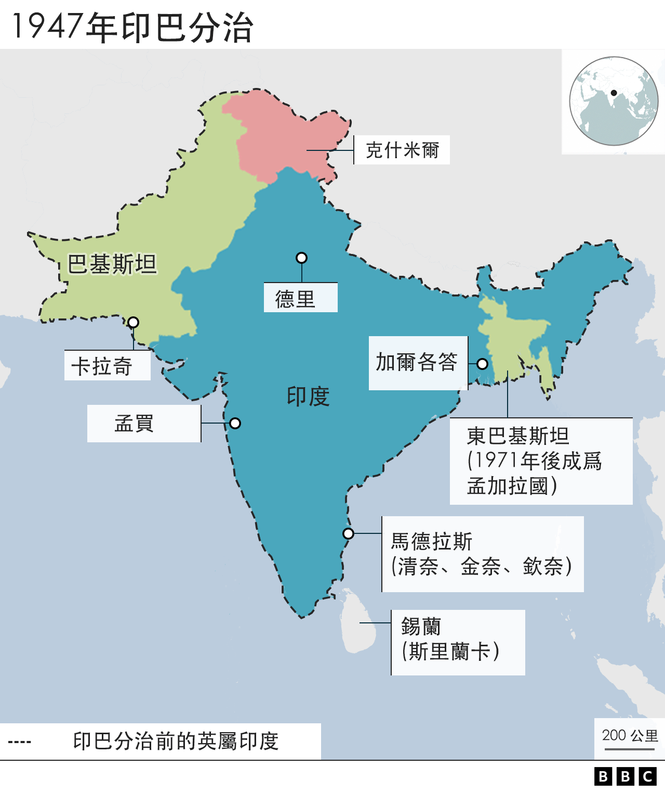
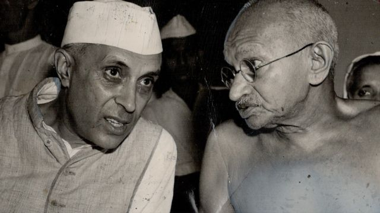
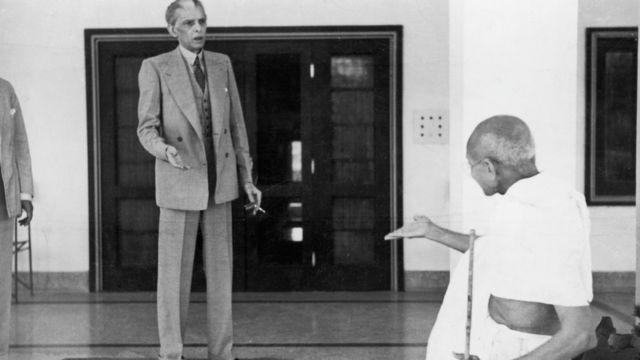
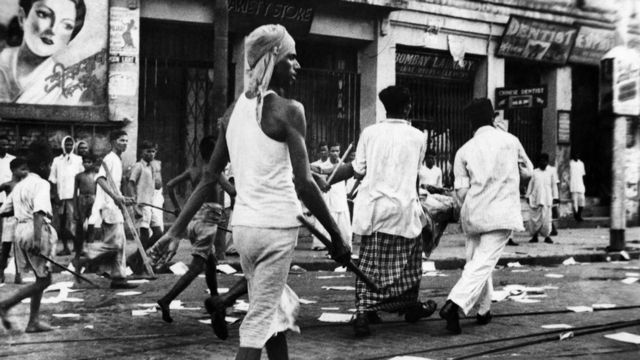
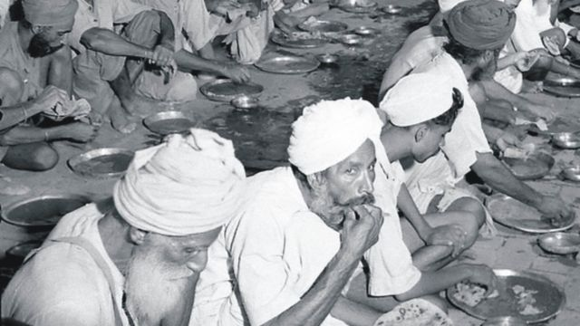
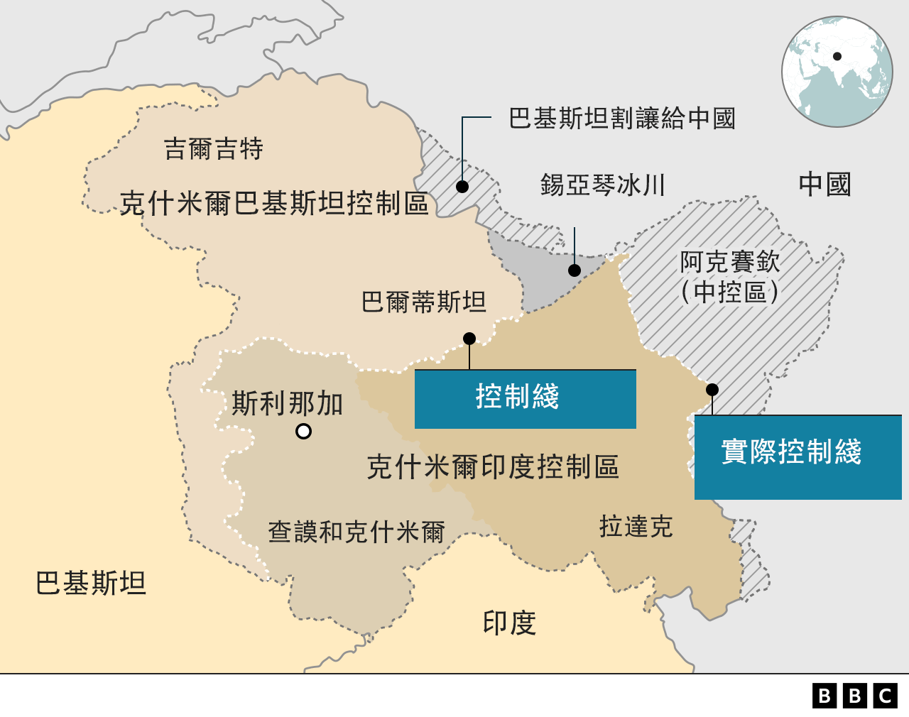
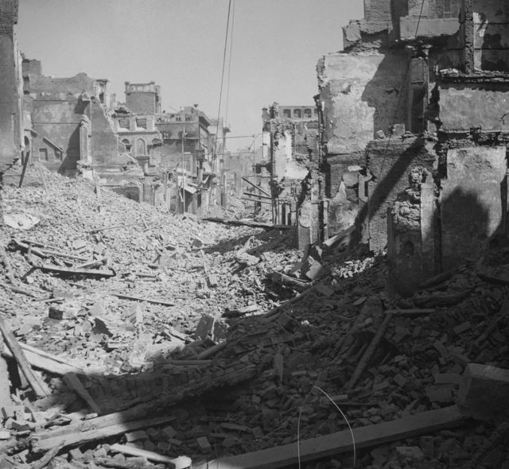

# 印巴分治： 75年前英属印度为什么被分而治之？

#  印巴分治： 75年前英属印度为什么被分而治之？

最近更新： 2022年8月15日

> 图像来源，  Getty Images
>
> 图像加注文字，自1959年以来，印度和巴基斯坦边境瓦加哨卡的两国边防军每天傍晚同时举行降旗仪式。瓦加哨卡在阿姆利则附近。

**1947 年 8 月，英国同意印度独立。**

英属印度被分割为印度和新的巴基斯坦邦（东巴基斯坦后来成为孟加拉国）。这种状况导致不断升级的暴力冲突，约有1500万人流离失所，估计有100万人丧生。

自那以后，印度和巴基斯坦一直处于敌对状态。

##  为什么会分治？

1946年，英国宣布将同意印度独立。它再也负担不起这个国家的治理费用，希望尽快离开。

最后一任总督路易斯·蒙巴顿勋爵将日期定为1947年8月15日。

当时，印度人口中约有25%是穆斯林，其余的主要是印度教徒，另外还包括锡克教徒，佛教徒和其他少数民族宗教的成员。

> 图像来源，  Getty Images
>
> 图像加注文字，印度独立运动领袖甘地（右）和尼赫鲁希望独立后的印度是一个多元、包容的多宗教、多族裔的中央集权国家。图为1940年代的尼赫鲁和甘地在交谈

“英国人把宗教作为将印度人分为几类的方式，”印度艺术与人文研究委员会研究员纳夫特吉·普里瓦尔（Navtej Purewal）教授说。

“ 例如，他们为地方选举分别建立了穆斯林和印度教选民名单。议会中包括为穆斯林政治家保留的席位，也有为印度教徒保留的席位。宗教成为政治生活的一个因素。”

伦敦智库查塔姆外交政策研究所（Chatham House Foreign Policy Institute）的加雷斯·普莱斯（Gareth Price）博士说：“当印度看起来有可能获得独立时， 许多印度穆斯林对将来要生活在一个印度教徒占多数的国家的前景感到担心。

“他们觉得自己会无所适从，不知所措，”他说。“他们开始支持那些为创建一个独立的穆斯林家园而奋斗的政治领导人。”

国大党独立运动领袖莫罕达斯·甘地和贾瓦哈拉尔·尼赫鲁表示，他们希望建立一个包容所有信仰的统一的印度。

> 图像来源，  Getty Images
>
> 图像加注文字，穆罕默德·阿里·真纳（Muhammad Ali Jinnah），之间夹纸烟者，强烈反对甘地对印度独立和建国的设想。1939年甘地和真纳在后者住家外争论。

然而，全印穆斯林联盟（All-India Muslim League）领导人穆罕默德·阿里·真纳（Muhammad Ali Jinnah）要求将分治纳入印度独立的解决方案。

普莱斯博士说：“就统一的印度将如何运作达成一致需要花费很长时间。”

分治似乎是一个“快速而简单的解决方案”。

> 图像来源，  Huw Evans picture agency
>
> 图像加注文字，1946年加尔各答印度教徒和穆斯林爆发暴力冲突，据信 2000人在斗殴中丧生

##  分治造成怎样的痛苦？

印度和巴基斯坦之间的新边界是由英国公务员西里尔·拉德克利夫爵士（Sir Cyril Radcliffe）于1947年划定的。

他将印度次大陆大致分为印度教徒占多数的中部和南部，以及穆斯林占多数的西北部和东北部两部分。

然而，英属印度境内各地都有印度教徒和穆斯林社区。这意味着印巴分治后，大约有1500万人要长途跋涉 - 通常是数百英里 - 跨越新的边界线。

在许多情况下，人们被本地的暴力赶出家园。第一个此类案例是1946年的加尔各答杀戮惨案，估计有2000人被杀害。

“穆斯林联盟组建了民兵组织，右翼印度教团体也成立了民兵组织，”伦敦大学亚非学院（SOAS）南亚历史高级讲师埃莉诺·纽比金（Eleanor Newbigin）博士说。

她说：“激进恐怖组织会把人们赶出村庄，扩大自己一方的控制权。”

据估计，在难民营中，有20万至100万人被杀或死于疾病，数以万计的印度教徒和穆斯林妇女被强奸、绑架或毁容。

> 图像来源，  Getty Images
>
> 图像加注文字，阿姆利则难民营的锡克族难民。分治导致1200万到2000万人背井离乡，流离失所

##  分治的后果是什么？

自分治以来，印度和巴基斯坦为克什米尔的控制权争执不休。

两国为此打了两场战争（1947-8年和1965年），1999年克什米尔卡吉尔危机中双方也爆发冲突。

印巴两国都声称克什米尔是自己的。双方目前分别控制着该地的不同区域。

印度在1971年与巴基斯坦开战。当时，东巴基斯坦（现在的孟加拉国）争取从巴基斯坦独立，印度出兵干预那场战争。

现在，巴基斯坦只有不到2%的人口是印度教徒。

普莱斯博士说：“巴基斯坦已经变得越来越伊斯兰化，部分原因是巴基斯坦现在穆斯林人口众多，而印度教徒却很少。

“印度现在更多地受到印度教民族主义的影响。”

纽比金博士说： “分治的历史遗留问题令人痛苦，”

“它在两国都营造了强大的宗教多数派。少数派比以前更微小，更脆弱。”

> 图像来源，  Getty Images
>
> 图像加注文字，印巴分治过程充满暴力和血腥，城镇被毁，民众流离失所

普利瓦尔教授说，其实分治是有可能避免的。

她说：“1947年完全有可能建立一个统一的印度。它可能是一个松散的联邦，包括穆斯林占多数的州。”

但甘地和尼赫鲁都坚持建立一个中央集权的统一国家。他们没有真正考虑过穆斯林作为少数人口如何在那样的国家里生活。

