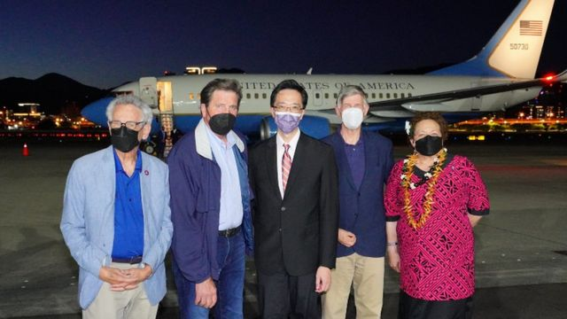
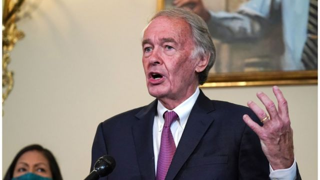

# 佩洛西之后又一美国国会代表团访问台湾 解放军再次举行台海军演

#  美国和台湾：继佩洛西之后又一美国国会团队访台，解放军再次举行台海军演

> 图像来源，  Reuters
>
> 图像加注文字，台湾外交部在推特上发布了一张该团体成员在台北机场受到欢迎的照片。

**一个美国国会代表团已经抵达台湾进行访问。就在12天前，美国众议院议长南希·佩洛西（Nancy Pelosi）访问了台湾。**

美国在台协会确认了这五名议员访问台北的消息。中国解放军周一宣布，在台岛周边海空域组织了多军兵种联合战备警巡和实战化演练。

美国参议院外交委员会亚太小组主席埃德·马基（Ed Markey）抵台后在推特上发文说，他率领跨党派国会代表团访问台湾，是要重申美国对台支持，鼓励台湾海峡的稳定及和平。

除了马基，访问团成员还包括美国众议员加勒曼帝（John Garamendi）、鲁文索（Alan Lowenthal）、贝耶（Don Beyer）和罗德薇（Radewagen）。

佩洛西8月早些时候访问台湾之后，中国在台湾周边展开了有史以来规模最大的军事演习。

中国将这个自治的岛屿视为自己的领土，并强调不会放弃武力统一。

在本月早些时候的露面中，佩洛西成为25年来访问台湾最高级别的美国政治人物。

她短暂但有争议的访问被中国外交部长王毅称为“狂躁、不负责任、极不理性”。

王毅在柬埔寨举行的东南亚外长会议上坚称，台湾”最终会回到祖国的怀抱“。

周日早些时候，台湾方面表示，在台湾海峡及其周围发现了2架中国飞机和6艘海军舰艇。

在中国军事演习高峰时期，台湾指责大陆方面试图改变该地区的现状。

##  访问目的

周日，台湾外交部发布了美国国会代表团成员在机场被欢迎的照片。

美国在台协会的一份声明说，该代表团的访问是对印度太平洋地区更广泛访问的一部分。

它还说，由民主党参议员马基带领的五名成员将与台湾领导人讨论包括区域安全、贸易和投资等问题。

蔡英文总统办公室说，这个月第二次美国高层访问标志着对台湾的”坚定支持“。

台湾外交部称，马基在台湾期间将与总统蔡英文会面，接受外交部长吴钊燮款宴，并拜会立法院外交及国防委员会，双方将就台美安全与经贸关系等议题广泛交换意见。

台湾外交部指出，此次访团组成横跨参、众两院两党，成员来自外交、军事等重要委员会。”在中国持续升高区域紧张情势之际，美国国会再度筹组重量级访团来台，展现无惧中国威胁恫吓的友我情谊，并彰显美国对台湾的强力支持。“

美国没有正式承认台湾，只有少数国家承认。但是，美国确实与该岛保持着牢固的关系，其中包括向台湾出售武器保护自己。

##  中国反应

中国外交部发言人汪文斌周一在例行记者会上回应称，美参议员马基一行，不顾中方严正交涉和坚决反对，执意窜访中国台湾地区，公然违反一个中国原则和中美三个联合公报规定，侵犯中国主权和领土完整，向”台独“分裂势力发出严重错误信号。

汪文斌说，中方再次敦促美方恪守一个中国原则和中美三个联合公报规定，慎重妥善处理涉台问题，停止在虚化、掏空、歪曲一个中国原则的错误道路上越走越远，以免对中美关系和台海和平稳定造成进一步损害。

> 图像来源，  Getty Images
>
> 图像加注文字，埃德·马基

中国国防部发言人吴谦则回应称，中国人民解放军持续练兵备战，坚决捍卫国家主权和领土完整，坚决粉碎任何形式的”台独“分裂和外来干涉图谋。

另外周一当日，中国解放军就组织了实战化演练。

中国东部战区新闻发言人施毅陆军大校称，8月15日，中国人民解放军东部战区在台岛周边海空域组织多军兵种联合战备警巡和实战化演练。

施毅称，这是针对美台继续玩弄政治把戏、破坏台海和平稳定的严正震慑。战区部队将采取一切必要措施，坚决捍卫国家主权和台海地区和平稳定。

