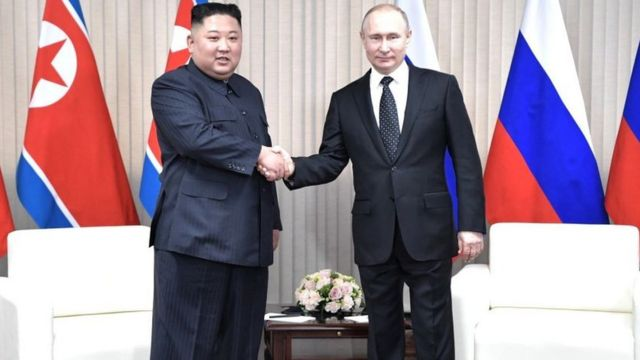
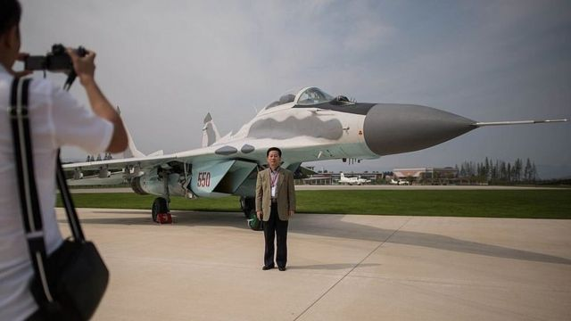

# 普京金正恩互相致信关键词：同志友谊，先进武器，乌克兰

#  普京金正恩互相致信关键词：同志友谊，先进武器，乌克兰

6 小时前

> 图像来源，  Getty Images
>
> 图像加注文字，金正恩与普京2019年在符拉迪沃斯托克会面。

**俄罗斯领导人普京（Vladimir Putin）表示，俄罗斯和朝鲜将扩大“全面和建设性的双边关系”。**

普京在平壤解放日给金正恩的一封信中说，这一举动符合两国利益。

金正恩回应说，两国的友谊是在第二次世界大战中战胜日本后建立起来的。

他补充说，他们的“同志友谊”将变得更加坚固。

苏联曾经是朝鲜的主要共产主义盟友，为其提供经济合作，文化交流和援助。

据朝鲜中央通讯社，普京表示，扩大的双边关系将“符合两国利益”。

金正恩在信中说，俄罗斯和朝鲜的友谊“在反日战争中建立起来”，“在一个世纪又一个世纪中巩固和发展”。

他还说，两国之间的战略和战术合作、支持和团结，在共同战线上挫败敌对势力的军事威胁和挑衅，已上升至新高度。

朝鲜并未指明敌对势力，但一直反复使用该词来指美国及其盟友。

周一，普京总统在莫斯科附近的一个武器展上说：“我们已经准备好为盟友和伙伴提供最现代化的武器，从小型武器到装甲车和火炮，战斗机和无人机。”

他自夸，俄罗斯武器因其“可靠性和质量”而受重视，并称“几乎所有武器都在实际作战中使用过不止一次”。

然而，尽管俄罗斯拥有巡航导弹等先进武器，但2月24日入侵乌克兰对俄罗斯军队来说代价高昂。规模较小的乌克兰军队火力较弱，但装备有造成重大损伤的各种西方武器。

> 图像来源，  AFP
>
> 图像加注文字，朝鲜拥有一些俄罗斯武器。

今年7月，在俄罗斯签署法令宣布乌克兰东部两个由俄罗斯支持的分离主义“人民共和国”独立后，朝鲜成为少数几个正式承认这两个共和国的国家之一。作为报复，乌克兰切断了与朝鲜的所有外交关系。

俄罗斯军队仍在努力巩固对顿涅茨克和卢甘斯克地区的控制，对抗乌克兰的激烈抵抗。

朝鲜的许多俄罗斯设计的武器都是苏联时代的旧武器，但它拥有与俄罗斯类似的导弹。

俄罗斯驻朝鲜大使亚历山大·马塞戈拉（Alexander Matsegora）告诉俄罗斯《消息报》，更紧密的合作可能意味着“技能精湛、勤劳的”朝鲜工人帮助重建俄罗斯控制的顿涅茨克和卢甘斯克受损的基础设施。

他还说，朝鲜渴望从乌克兰东部获得苏联时代重型设备的替换部件，并运送到朝鲜的工厂和发电厂。他说，斯洛夫扬斯克和克拉马托尔斯克这两个仍被乌克兰军队控制的城市是这些装备的主要来源。

1991年苏联解体后，俄罗斯与朝鲜的关系有所下滑，但随着俄罗斯与西方国家关系的恶化，两国关系近年来逐渐回暖。

