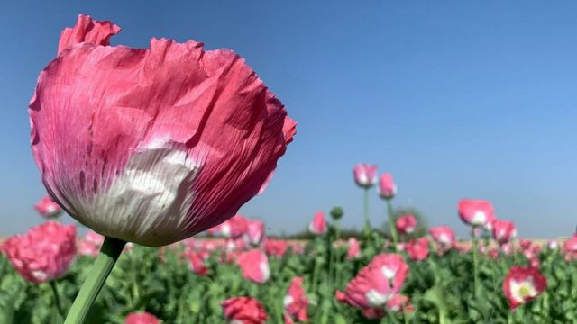
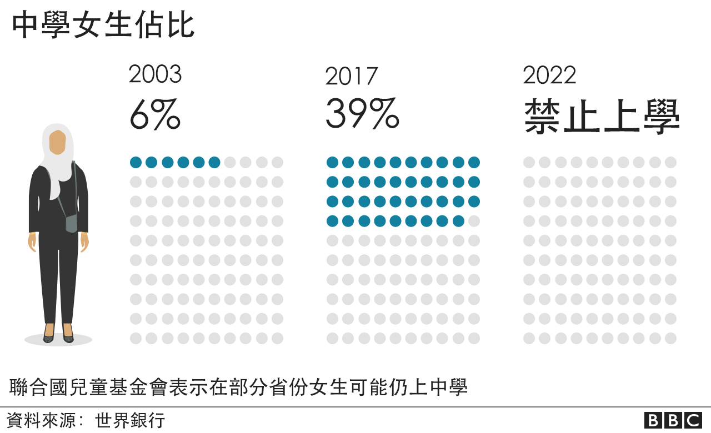
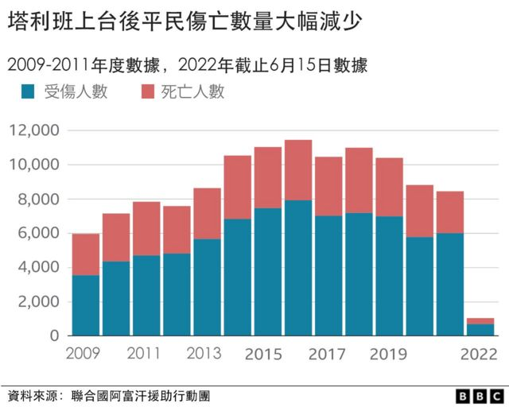
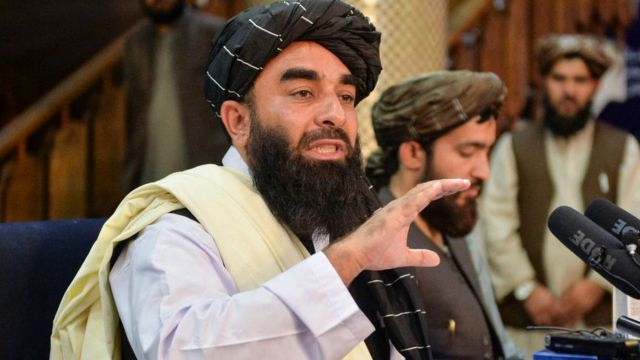
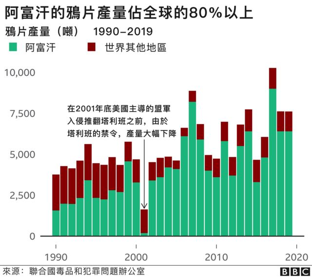

# 塔利班政权上台一周年：四大承诺兑现了多少？

#  阿富汗塔利班上台一周年 四大承诺兑现了多少？

  * 苏鲁提·梅农（Shruti Menon） 
  * BBC事实查核 

7 小时前

> 图像来源，  Getty Images
>
> 图像加注文字，2021年的主要收获季节，鸦片产量有所增加。

**一年前，外国军队匆忙结束了从阿富汗的撤军，塔利班迅速进入首都喀布尔重新掌权。**

作为新上台的塔利班政府的发言人，扎比胡拉·穆贾希德经常召开记者会，代表政府做出了不少承诺。

一年后的今天，来看看塔利班政权是否兑现了它所做出的承诺。

##  一、我们将允许妇女工作和学习，妇女将积极参与社会，但要在伊斯兰教的框架内

在20世纪90年代塔利班上次掌权期间曾严厉限制妇女的自由。自从去年塔利班接管政权以来，实际上对阿富汗妇女重新实施了一系列限制。

已经得以执行的法律包括对服装的规定和禁止女性在没有男性监护人的情况下进入公共场所。

3月，学校在新学年重新开学，但塔利班一改先前的承诺，至今仍然不允许女孩上中学。

塔利班就此归咎于女教师缺乏和需要安排隔离设施。

据联合国统计，大约110万名学生因此受到影响，并引起了国际社会的广泛批评。

女孩的小学教育已被允许。

一些公立大学在2月份重新对男女生开放。

但是，根据世界银行的数据，自去年夏天塔利班接管政权以来，阿富汗妇女在劳动生产中的参与度有所下降。

在1998年至2019年的短短十多年间，女性参加工作的比率从15%上升到22%。

然而，随着塔利班重新掌权并对妇女在家庭以外的活动施加更多限制后，2021年，阿富汗女性参加工作的比例缩减到15%。

“国际特赦组织”7月的一份报告称，塔利班在阿富汗 "削弱了妇女和儿童的权利"。 报告还特别强调一些参与抗议塔利班实施新限制的妇女遭受的虐待和酷刑。

##  2\. 我们将奋发图强......以重振经济，重建繁荣昌盛

6月，联合国安理会报告说，自去年8月塔利班接管以来，阿富汗经济估计萎缩了30%-40%。

负责监督美国对阿富汗资助重建工作的官方机构最新一项评估认为，尽管一些国际援助陆续到达阿富汗，但阿富汗经济状况仍然“很糟糕”。

> 图像来源，  BBC

大多数国际援助暂停和对阿富汗外汇储备的冻结已经给阿富汗带来了严重的经济后果。

为了补偿收入方面的损失，塔利班试图增加税收，并利用全球价格上涨的机会加大煤炭出口。

今年1月公布的季度预算显示，塔利班在2021年9月至12月期间征收了近4亿美元的国内税收。但专家们对这些数字的整理方式缺乏透明度表示担忧。

失去国际支持、安全仍然面临挑战、以及气候相关问题和全球粮食通胀都导致阿富汗经济形势迅速恶化。

> 图像来源，  AFP
>
> 图像加注文字，塔利班发言人在喀布尔。2021年7月

##  3\. “阿富汗将不再有毒品生产....，我们将使鸦片生产回零”

塔利班承诺解决罂粟种植问题，这反映了他们上次二十多年前执政时推行的政策，当时取得了一些成功。

鸦片被用来制造海洛因。多年来，阿富汗一直是世界上最大的鸦片来源国。

今年4月，塔利班宣布禁止种植罂粟。

尽管来自南部赫尔曼德省一些罂粟种植区的报告显示，塔利班一直在强迫农民废弃罂粟田，但没有关于取缔罂粟种植进展情况的确切数据。

7月的一份美国官方报告指出，尽管塔利班有可能失去种植罂粟农民和其他参与毒品贸易者的支持，但他们“似乎致力于（推行）他们的毒品禁令”。

然而，阿富汗毒品经济专家大卫·曼斯菲尔德博士（David Mansfield）指出，在实施禁令时，主要的罂粟作物已经收获。“......所以禁令对产量不会产生重大影响。”

还值得注意的是，其他毒品的生产和制造，如冰毒，一直在增长，尽管塔利班已经禁止了用于制造冰毒的野生植物——麻黄。

##  4\. “我们（塔利班）致力于确保安全”

尽管使塔利班上台的冲突已基本结束，但根据联合国的数据，去年8月至今年6月中旬，仍有超过2000名平民伤亡报告，其中700人死亡，1400多人受伤。

然而，这些数字远远低于前几年冲突最激烈时的数字。

自2021年8月以来，大约50%的伤亡是由伊斯兰国-霍拉桑（IS-K）组织的行动造成的，该组织是伊斯兰国组织在阿富汗境内仍然活跃的分支。

最近几个月，发生了几起针对平民的IS-K袭击，特别是在有什叶派穆斯林或其他少数民族人口的城市地区。

其他反塔利班力量，如全国抵抗阵线（NRF）和阿富汗自由阵线（AFF）的势力也有所增加。

联合国在6月说：“阿富汗整体安全环境正变得越来越不可预测。” 联合国还提到在阿富汗至少有十几个反对塔利班的独立武装团体存在。

据联合国称，侵犯人权的情况也有显著增加，包括塔利班的法外处决、拘留和酷刑。

在2021年8月至2022年6月期间，它记录了至少160起针对前政府和安全部队官员的法外处决事件。

