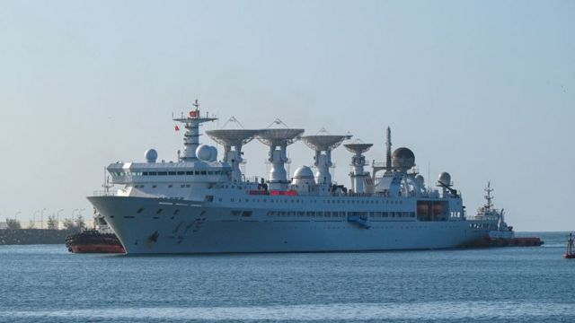
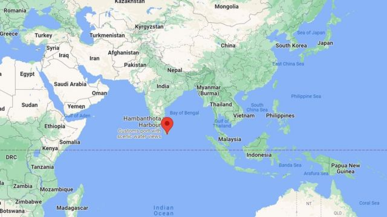
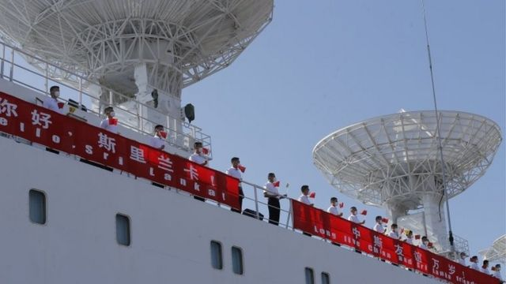

# 中国“远望5号”：印度的“间谍船”担忧和斯里兰卡的平衡游戏

#  中国“远望5号”测量船停靠斯里兰卡：印度的“间谍船”担忧和斯里兰卡的平衡游戏

> 图像来源，  Getty Images
>
> 图像加注文字，远望5号从8月16日至22日停靠在斯里兰卡汉班托塔港。

**在印度表示担忧后，斯里兰卡仍然同意中国航天测量船“远望5号”8月16日在南端面向印度洋的汉班托塔港停靠。**

中国的这艘科学考察船将在此停泊至8月22日。据中国媒体报道，此前，“远望5号”曾因印度“阻挠而推迟靠港补给计划”。

“远望5号”从中国江阴港出发，原计划8月11日抵达由中国招商局运营并租用99年的汉班托塔港。

有关“远望5号”停靠斯里兰卡引发的争议，BBC中文梳理了以下四个重点：

##  印度和美国为什么担忧、关注？

本次“远望5号”停靠斯里兰卡之时，正值这个印度洋岛国刚刚经历了政治动荡，因债务危机经济处于崩溃边缘之际。

就“远望5号”停靠斯里兰卡，印度方面曾表示密切关注。

7月底，印度外交部发言人巴格奇（Arindam Bagchi）曾表示，印度将密切关注“影响印度安全和经济利益的任何事态发展”。其后，针对有关印度就“远望5号”停靠汉班托塔港向斯里兰卡施加压力的报道，巴格奇表示否认，称印度不接受“含沙射影”（insinuation），并表示斯里兰卡是一个主权国家，可以独立做出决定。

有印度媒体指该船为一艘“间谍船”，可能监视印方军事设施。

据美国《华盛顿邮报》的报道，除了印度之外，美国官员也曾就此向斯里兰卡施加压力。

8月11日，《华盛顿邮报》报道称，“一艘730英尺长的中国卫星监测船成为紧张上升的根源，并成为印度与美国和中国在斯里兰卡问题上日益加剧的地缘政治角力的象征。”

美国国防部称，“远望5号”隶属于中国解放军战略支援部队，具有监视火箭及洲际弹道导弹发射功能。

中国外交部回应称，“远望5号”科考船进行海洋科考活动，符合国际法和国际通行惯例，不影响任何国家的安全和经济利益，也不用受到第三方干扰。

> 图像来源，  Google Maps
>
> 图像加注文字，汉班托塔港位于斯里兰卡的南端，面向广袤的印度洋。2017年中国招商局购得该港口70%的股权，并租用港口及周边土地，租期为99年。

据斯里兰卡外交部所发表的声明，斯里兰卡的确在8月5日要求中方推迟靠港计划，此后斯里兰卡与“各方进行了高级别的广泛磋商”。

声明表示，斯里兰卡外交部在斟酌考虑所有材料后，批准了“远望5号”的停靠许可。

中国外交部发言人汪文斌8月16日在记者会上表示，“在斯里兰卡方面积极配合下，中国远望5号科考船已在斯里兰卡汉班托塔港顺利靠泊。中国驻斯大使戚振宏在现场主持欢迎仪式。斯里兰卡总统代表维拉塞卡拉议员及十余位党派主席和友好团体负责人出席。”

汪文斌还说，多年来，中国和斯里兰卡两国在海洋科考领域保持着密切合作。

##  斯里兰卡在寻求“难以企及”的平衡？

**BBC新闻驻德里记者维卡斯·潘德伊（ Vikas Pandey）** **分析说，** 这艘船引发的争议反映出斯里兰卡每次不得不在印度和中国之间做出选择时所面对的外交困境。

虽然印度否认在这艘船的问题上对斯里兰卡施加了任何压力，但印度的确间接评论过对这艘船的看法，即“密切关注影响印度安全和经济利益的任何事态发展”。

近几个月来，德里一直站在向斯里兰卡提供援助帮助其克服经济危机的最前沿，但最新这场争议可能给援助工作蒙上阴影。

德里外交界的许多人都在想，科伦坡的新政府是否又在试图在印度和中国之间找到那种难以企及的平衡。

未来几天德里领导人无论是与斯里兰卡领导人私下还是公开讲话中就此事的表态，都将很有意思，值得关注。

##  围绕汉班托塔港有过哪些争议？

斯里兰卡位于连结亚非欧繁忙航线的十字路口，战略地位重要，近年来，中印两国都在努力扩大对该国的影响力。

汉班托塔港位于斯里兰卡南部省汉班托塔区首府，自2007年起在中国的援助下开始建设，2012年开始运营。

2017年7月，斯里兰卡与中国签署协议，中国招商局控股港口有限公司购得汉班托塔港口70%的股权，并租用港口及周边土地，租期为99年。

汉班托塔港的地理位置非常得天独厚，东近马六甲海峡，西望霍尔木兹海峡和红海。

围绕汉班托塔港的建设一直有不少争议，其中之一是指责中国使斯里兰卡陷入债务陷阱后不得不同意出租港口。另外，中国租用港口后的用途也一直引起周边国家，特别是印度的高度警惕。

斯里兰卡官员表示，港口的安全事务完全由斯里兰卡政府负责，已经告诉中国不允许港口被用作军事目的。

中国方面则强调，汉班托塔港口的主要目的是为中国海上贸易增多做准备，可以为中国在印度洋航行的舰船提供另外一条路线或停靠地点。

> 图像来源，  EPA

##  “远望5号”是什么？

“远望5号”是中国自主设计研制的第三代航天远洋测量船，远望号则是中国航天远洋测控以及火箭运输船队的总名称。

“远望5号”建成于2007年，长222米，宽25米，高40米，被中国称为达到国际先进水平的航天测量船，参与了中国近年来神舟载人飞船、嫦娥系列月球探测器、天问一号火星探测器、北斗导航卫星等航天工程项目的海上测控。

本次“远望5号”停靠斯里兰卡汉班托塔港之前，中国媒体报道该船承担“问天”实验舱发射的海上测控。

7月24日，中国问天实验舱从海南文昌发射时，“远望5号”已经在预定海域等待，跟踪测控发射情况。

