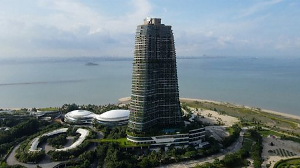

# 马来西亚大型地产项目“森林城市”疫情下宛如“鬼城”

#  马来西亚大型地产项目“森林城市”疫情下宛如“鬼城”

**马来西亚大型地产项目“森林城市”疫情下宛如“鬼城”**

**在马来西亚与新加坡交界的柔佛海峡，一排排住宅楼在人工岛上拔地而起，却大多无人居住，宛如“鬼城”。**

这个名为“森林城市”的豪华楼盘主要由中国房地产巨头碧桂园开发，最初预计约有70万人将在这里定居，但在开工八年后，据估计只有约2000人在这里落户。其中许多是开发商员工、国际学校学生和家属。

KGV国际咨询公司研究总监陈蔚天认为，“森林城市”有两个主要问题：一是入住率低，二是商业活动缺乏，因此“森林城市”本身“没有多少生气”。

“森林城市”是马来西亚最具争议的房地产项目之一。它距离柔佛州新山市郊，距离新加坡只有数公里。

它最初希望招揽想在马来西亚定居、并经常往来新加坡的中国富人，但随着马来西亚前总理马哈蒂尔批评该项目将导致大量移民涌入，以及中国更加严厉打击资本外流，购房者的热情降低。

不过，碧桂园表示，这个预期20年建成项目的进展开发进度一切正常。

碧桂园太平洋景公司说，随着经济活动恢复和旅游禁令解除，期待“森林城市”再次蓬勃发展。

