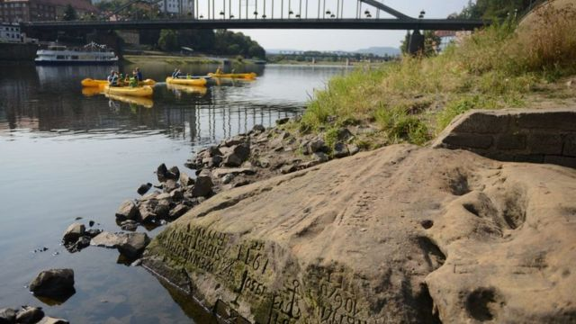
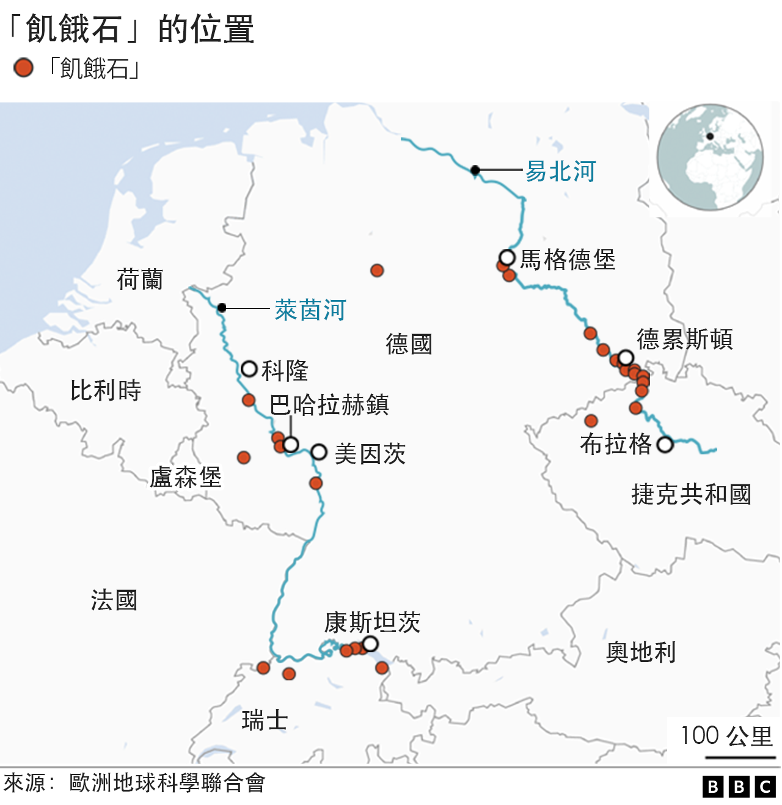
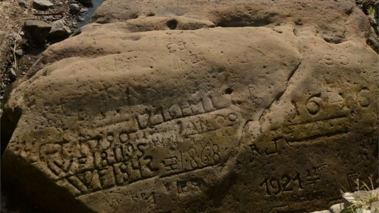
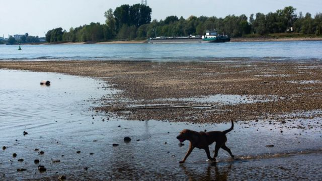
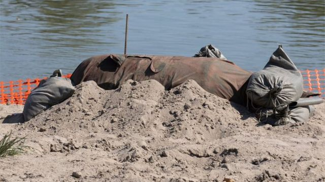

# “看见我就哭吧”：欧洲大旱年“饥饿之石”重见天日

#  欧洲大旱：“饥饿之石”重见天日的不祥警告

  * 克里斯蒂娜·J·奥尔加兹（Cristina J. Orgaz） @cjorgaz 
  * BBC西班牙语 

2022年8月19日上午10点46分

> 图像来源，  Getty Images
>
> 图像加注文字，“饥饿石”提醒人们以前的干旱

**持续高温少雨导致欧国数国严重干旱。欧洲一些河流水位降低，并显露出“饥饿石”（也称“饥饿之石”，“hunger stones”），上面刻有我们祖先关于艰辛时刻即将到来的不祥警告。**

这些所谓的“饥饿石”其实是一些河床岩石，只有在水位极低时它们才会见天日。

先人在石头上刻上一些有关干旱所引发灾难的信息，无情地提醒着人们过去的干旱给人们所带来的苦难。这些碑文可以追溯到几十年、甚至几百年前。正如一位推特用户@Batallitass在8月8日上传的一则推文中显示的那样。目前这条推文已被广泛转发。

其中在易北河（Elbe river）流域所发现的碑文最古老，可以追溯到1616年。上面的文字用德语写成：“如果你看见我，就哭吧”。

##  干旱日历

这块“饥饿石”特别有名，因为它上面包括了几次严重干旱的日期。

（下面推特显示了德文镌刻的一张照片。它写着：“如果看见我，就哭吧”。）

根据捷克考古学家小组在2013年所作的一项研究，石头上可以找到这些年代：1417、1616、1707、1746、1790、1800、1811、1830、1842、1868、1892以及1893年。

另一块岩石上写着，“一旦这块石头消失，生命将会再度繁荣。”

还有一块石头上写到：“曾经看到我的人哭了。现在看见我的人将会哭。”

“如果你再见到这块石头，你将会哭。这就是1417年河水有多浅，”另一石头上有这样的留言。

##  宣示贫穷

过去，如果河流水位落到如此之低，对许多人来说则意味着贫穷与苦难。

干旱不但使庄稼受毁，同时也切断了运输粮食和各种供应的河道，之后便是饥荒的到来。

> 图像来源，  Getty Images
>
> 图像加注文字，“饥饿石”上写着从前干旱的日期。

过去，包括奥地利、捷克、德国、匈牙利、波兰和瑞士部分地区的中欧都依赖河流两岸的肥沃土地生产粮食。

德国记者科恩斯（Olaf Koens）也在推特上解释说，在德语中甚至专门有一个词来形容这些岩石 - “hungersteine”（直译为“饥饿之石”）。

其灵感来自于人们在其中一块石头上所发现的碑文，它把1947年形容为“饥饿之年”。

下面是德国记者科恩斯的一条推文，文中显示形容1947年饥饿之年的一块“饥饿石”。

近年来，干旱已经成为中欧气候变化最突出的标志之一。

##  过去的警示

其中，捷克北部城镇杰钦是露出更多“饥饿石”的城镇之一。它靠近德国边界，在易北河和普洛乌奇尼采河交汇之处。

易北河河床上出现了多达十几块这样的石头，提醒当地居民从前的艰难时刻。

另外一块“饥饿石”正在德国舍讷贝克镇的博物馆中展出，这块石头曾经位于一个低水位的河港盆地附近。如果看见这块石头就意味着水位已经太低，船只无法航行通过。

> 图像来源，  Getty Images
>
> 图像加注文字，中欧经历干旱

大多数“饥饿石”都是在易北河找到的，但在该地区的其他河流中也有出现，例如，莱茵河、摩泽尔河以及威悉河。

##  欧洲大旱

根据欧洲干旱观测站（EDO）的数据，干旱警告目前正在影响着60%以上的欧洲地区。德国、英格兰和意大利的主要河流水流量都在减少。

意大利曼托瓦市的低水位虽然没有让“饥饿石”显现，但却在波河的河床上发现了二战时一枚重达450公斤未爆炸的炸弹。

> 图像来源，  Getty Images
>
> 图像加注文字，波河的河床上发现了二战时一枚重达450公斤未爆炸的炸弹。

最近几周，法国和西班牙等国家都已经不得不开始限制用水。在这两国的部分地区，当局还在某些特定情况下被迫切断供水。

法国当局在8月7日宣布，该国正面临自1958年有记录以来最严重的旱情。

据路透社报道，在德国，莱茵河（从瑞士阿尔卑斯山流向北海）水位太低，已经迫使航运公司减少货运航行。

