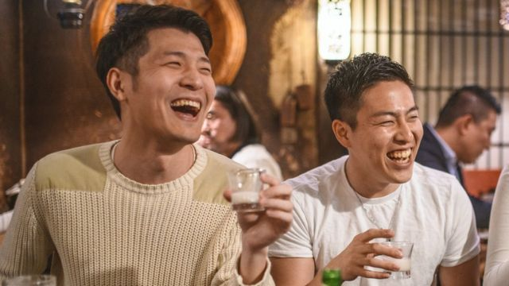
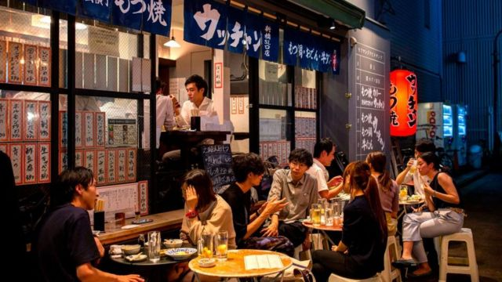
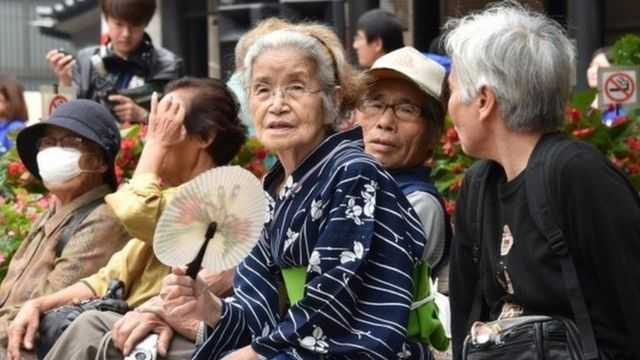

# 干杯！日本劝说年轻人多喝酒帮助提振经济

#  干杯！日本劝说年轻人多喝酒帮助提振经济

2 小时前

> 图像来源，  Getty Images
>
> 图像加注文字，在东京居酒屋喝酒的年轻人

**日本年轻人喝酒少本来应该是好事，但日本政府却发起新的宣传活动，希望年轻人多喝点酒振兴经济。**

和父母一辈比起来，日本年轻一代更少喝酒，从销售酒类得来的税收也大受影响。

日本国税厅发起“清酒万岁！”（Sake Viva!）的全国竞赛，希望能通过比赛征求促销酒类销售的创意计划，振兴税收经济。

该竞赛要求20至39岁的年轻人分享能够开启年轻人饮酒需求的商业构想，不论是日本清酒、烧灼、威士忌、啤酒或葡萄酒。

> 图像来源，  Getty Images
>
> 图像加注文字，竞赛团队希望提高酒类饮料对年轻人的吸引力

##  征求创意构想

负责竞赛的团队表示，新冠疫情期间生活习惯改变，加上日本逐渐老化的人口，都促使了酒类销售下滑。

竞赛团队希望年轻人能提供促销酒类的创意构想，加大酒类品牌对年轻人的吸引力，甚至利用人工智能高科技手法来提升酒类饮料的消费。

日本媒体表示，人们对促销酒类销售的竞赛反应不一，有人批评活动鼓励年轻人养成不健康的饮酒习惯，也有人在网上提出很有创意的想法，例如用人气很旺的女明星作为虚拟女性侍酒师，招揽更多酒客光顾。

促销酒类销售的竞赛到九月底截止，最佳创意计划将在11月公布，并获得专家进一步发展付诸实现。

> 图像来源，  AFP
>
> 图像加注文字，日本近三分之一的人口年龄在65岁以上，该比例为全球最高

##  人口老年化和酒类销售减少

竞赛网站表示，日本酒精饮料市场逐年萎缩，人口老年化和出生率下降是背后主要因素。

日本国税厅最近的数字显示，2020年酒类消费人均75升，1995年人均年消费量为100升。

销售酒类饮料得来的税收也是逐年减少，根据英文《日本时报》（The Japan Times）的资料，1980年酒类税收占总税收的5%，2020年只占1.7%。

世界银行（World Bank）估计，日本近三分之一的人口年龄在65岁以上，该比例为全球最高。

酒类饮料消费下降并非日本人口老年化影响经济的唯一问题，许多人担心未来某些行业工作找不到年轻人愿意做，老年人的照顾看护也会成为一大问题。

