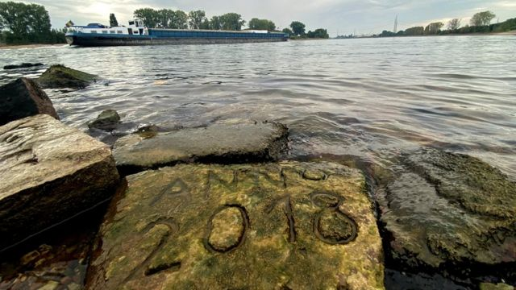
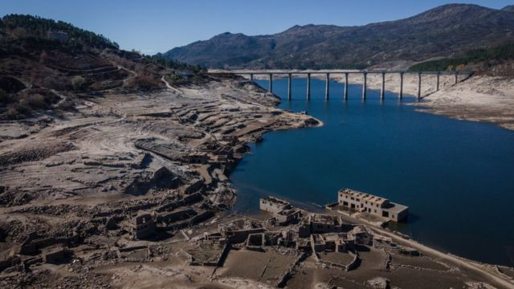
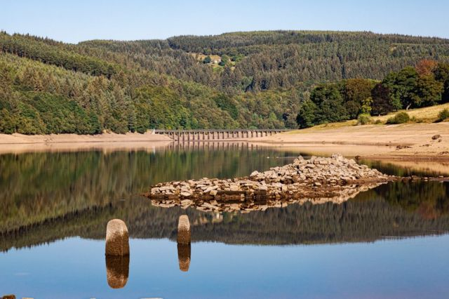
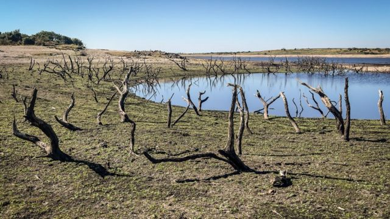

# 欧洲大旱福兮祸兮 河底“不祥之石”和各种秘密重见天日

#  欧洲大旱 河床湖底年代久远的秘密纷纷浮出水面

  * 埃尔莎·梅什曼（Elsa Maishman） 
  * BBC 新闻 

> 图像来源，  Reuters
>
> 图像加注文字，莱茵河，一块刻着年份字样的“饥饿石”，随着水位降低而暴露，显示了过去水位曾经降低到什么程度

**在中国各地酷热大旱同时，欧亚大陆另一端的欧洲也已经持续数周热浪不退；高温无雨造成干旱，河流湖泊水位骤降甚至干涸。**

这不但给航运和船只往来造成重大问题，也意外让一些通常埋藏在水下的宝藏和秘密再度暴露在阳光下。

其中最令人感到不祥的是“饥饿石”。它们位于昔日干旱期间刻在河流的水线上，似是留给后代的警告：当石头浮出水面时，说明要遇到麻烦了。

大多数“饥饿石” 再度出现的地方，是在易北河的河岸；易北河从捷克共和国流经德国。

1616年，河里一块石头露出水面，上面刻了一句话，据信年代最早可以追溯到15世纪，这句话的意思是“如果你看到我，哭泣吧”。

塞尔维亚境内多瑙河水位降低，则暴露出第二次世界大战期间沉没的船只残骸，有些还满载着炸药。

这些船只在普拉霍沃镇附近的河段被发现，它们是1944年在那里沉没的纳粹舰队的一部分。

随着干旱的持续，预计还会有更多水下掩藏多年的秘密见光。

> 图像来源，  Reuters
>
> 图像加注文字，几艘二战期间沉没的德国军舰在水下静静待了70余载，现在暴露在阳光下。这些战舰沉没时正在逃离苏军的追击

意大利的波河水下躺了很多年的没有爆的弹药也重见天日。

2022年7月，曼图亚市附近一个村庄的 3 千村民被疏散，让专家拆除并安全引爆一枚淹没在水下的二战炸弹。

> 图像来源，  Reuters
>
> 图像加注文字，意大利军人从波河干涸的河床移除一枚二战留下的未爆炸弹

波河水位下降，露出水面的还有德国人战时适用的一艘驳船，这艘船 1943 年沉没。

几个月前，随着水位下降，当地人目睹 Zibello 号驳船浮出水面。随着干旱的持续，船身越来越多暴露在阳光下。

> 图像来源，  Getty Images
>
> 图像加注文字，齐贝罗号驳船逐渐露出水面

罗马台伯河水位下跌后，一座古桥的废墟出现在人们眼前。这座桥可能是公园 50 年前后尼禄皇帝时代建造的。

每逢低水位的时候，总有一小部分废墟浮出水面，但现在可以看到的部分比平时多得多。

它位于一座现代桥梁，维托里奥·埃马努埃莱二世桥（Vittorio Emanuele II） 的下方。

> 图像来源，  Getty Images
>
> 图像加注文字，尼禄皇帝时代修建的一座古桥残亘露出台伯河河面

在西班牙中部，卡塞雷斯省的瓦尔德卡纳斯水库中“西班牙巨石阵”也浮出水面。

这片巨石圈正式名称叫瓜达尔佩拉尔的石墓，据信年代可以追溯到公元前 5 千年。

它们于1926年被考古学家发现，1963年当地实施农村发展项目，兴建水库，这些石墓被淹没。

从那时起，它们曾四次浮出水面。

> 图像来源，  Reuters
>
> 图像加注文字，西班牙中部水库枯水，库底的“巨石阵”暴露无遗。

在与葡萄牙接壤的加利西亚，一个水库今年稍早完全干涸，一座“鬼村”森然出现在人们眼前。

这个水库所在的地方有一个叫阿塞莱多的村庄。当时迁移到别处的原村民闻讯赶回故乡，再看一眼当年家园的遗迹。

> 图像来源，  Getty Images
>
> 图像加注文字，西班牙靠近葡萄牙边境的一个村庄被划入水库库区，没入水下，只有水位极低的时候会露出水面

英国也有销声匿迹已久的宝藏重见天日。

德比郡德文特村一个水库干涸，露出一处废墟，被认为是当地一个古老教堂的残亘。

那里 1940年代建水库，整个村庄都成了库区，没入水中。

> 图像来源，  Terry Westerman

康沃尔郡的科利福德湖水库干涸，露出一片古树残骸。

博德明荒原（Bodmin Moor）地区1980年代修水库，大片林地沉入水下。

> 图像来源，  Getty Images
>
> 图像加注文字，博德明荒原的水库建成后这些树木便沉入水底，现在重见天日

英格兰西南部斯温顿的利迪亚德公园里出现了一些 17 世纪花园的痕迹，因为持续高温下绿茵草坪枯死，暴露出地面的印痕。

附近的郎列特庄园（Longleat）也出现了类似的“幽灵花园”。

> 图像来源，  Phil Jefferies
>
> 图像加注文字，莉迪亚德公园地面显露出昔日花园的痕迹

