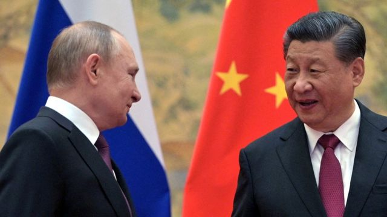
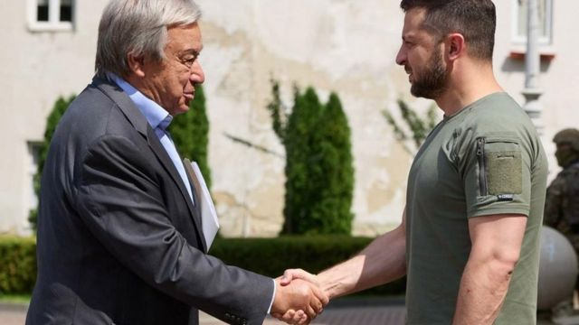
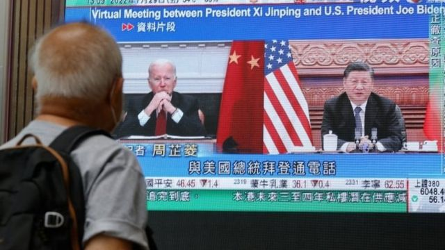

# “习近平普京均将出席” 印尼G20峰会或会出现什么画面？

#  印尼总统称中俄领导人都将参加G20 或成习近平“二十大”后首次出访

2022年8月20日

> 图像来源，  Reuters
>
> 图像加注文字，在俄罗斯和中国各自与世界交恶之际，两国首脑许诺中俄关系“上不封顶”。

**印度尼西亚总统佐科·维多多（Joko Widodo；佐科威）表示，中国主席习近平和俄罗斯总统普京都计划出席11月在巴厘岛举行的二十国集团（G20）峰会。他在本周接受彭博社采访时表示：“习近平会来，普京总统也告诉我他会来。”**

印尼是本次G20峰会的轮值主席国，这也是首次有消息确认两位领导人都将出席这次峰会。

对于普京和习近平这两位世界瞩目的领导人而言，此次出席具重要意义。一方面，今年2月俄罗斯入侵乌克兰，8月台湾海峡局势急速升温，美国在两次事件中分别谴责俄罗斯和中国，而现在三国领导人可能将同时出现在国际政治舞台上。

另一方面，在疫情爆发两年多以来，习近平第一次离开中国， 他只在今年7月1日香港回归中国25周年时离开中国内地  ；而普京的对手，乌克兰总统泽连斯基也收到参加会议的邀请。

> 图像来源，  EPA
>
> 图像加注文字，佐科（左）上月成为在年初北京冬奥会以后习近平接待的首位外国领导人。

##  泽连斯基与普京同台？

入侵乌克兰后，在国际政治舞台上，普京被西方国家孤立。因此，在今年4月，印尼在宣布邀请普京参加G20会议后，受到了来自西方的压力，要求将普京排除在会议之外，比如华盛顿方面此前已呼吁G20取消俄罗斯的成员资格并撤回对普京的邀请。

在佐科确认普京参会的消息后，8月19日，英国外交部发言人表示：“当俄罗斯对乌克兰的侵略仍在继续，它就没有道义上的权利列坐于20国集团中。”

不过，克里姆林宫官员在6月说，普京已经接受了佐科的峰会邀请，只要新冠疫情允许，他就会出席。

路透社援引一位熟悉情况的官员称，普京计划出席。

> 图像来源，  UKRAINIAN PRESIDENTIAL PRESS SERVICE/EPA
>
> 图像加注文字，自俄罗斯对乌克兰开战以来，多国领导人亲身到访基辅，向泽连斯基表达支持。

各种消息也透露，正在与普京处于战争状态的乌克兰总统泽连斯基也将以某种形式参加G20。

白宫国家安全委员会一位发言人称，如果普京“确实参加G20，那么泽连斯基应该参加”。

印尼已经邀请泽伦斯基，后者表示他至少会以虚拟形式出席。乌克兰并非G20集团的成员。

在世界局势动荡不安的2022年，印尼作为G20轮值主席国，试图保持中立立场，将自己定位为国家之间的和平使者。

“大国之间的竞争确实令人担忧，”佐科向彭博社表示，“我们希望的是这个地区能够稳定、和平，这样我们才能建立经济增长。”

佐科还在今年6月成为首位分别访问基辅和莫斯科的亚洲领导人，他还分别会见了泽连斯基和普京。佐科在本周早些时候表示，俄罗斯和乌克兰都接受印尼作为“和平的桥梁”。

英国外交部发言人表示：“我们欢迎印尼的努力，以确保俄罗斯战争影响被纳入考量，以及有迹象显示乌克兰总统泽连斯基可能代表该国参加G20领导人峰会。”

##  拜登上任后首次与习近平会面？

> 图像来源，  Reuters
>
> 图像加注文字，习近平与拜登7月底的通话气氛因佩洛西访台而显得紧张。

拜登与习近平的会面同样值得关注。两位领导人 在上个月的电话中  同意当面会晤，但没有宣布时间或地点。有迹象表明，两位可能很快会有一次面对面的会谈，时机可能在峰会之前或在峰会期间。

如果成行，这将成为拜登上任以来首次与习近平的当面会晤。

因人权、贸易问题，以及最近美国众议院议长佩洛西（Nancy Pelosi；裴洛西、波洛西）对台湾的访问，华盛顿和北京之间的关系不断恶化。尤其是佩洛西历史性地访问台湾，促使中国在台湾周围进行了近一周的军事演习。
 美国谴责中国军演是“不负责任”  ，中国外交部则回应，中方反制措施完全是正当、合理、合法的，既是对挑衅者的警示，也是对“台独”势力的惩戒。

就时机来看，这是习近平自2020年1月访问缅甸以来首次离开中国。

其次，中共将在2022年10月或11月召开“二十大”，这次会议上中共将进行领导层换届。考虑到此前中国修改宪法，取消了国家主席任期限制，外界普遍预计现任领导人习近平将开启第三个任期。

“二十大”的日期尚未公布，但前两次党代会分别在10月底和11月中旬举行。这意味着习近平很可能在前往巴厘岛参加G20分会前获得第三个党内领导人任期。

不过值得一提的是，习近平在今年“二十大”上可能获得的是“中共中央总书记”和“中共中央军委主席”职务，要待2023年3月召开的全国人民代表大会上，才可能连任“中国国家主席”和“国家军委主席”职务。

##  您也许还会有兴趣收看……

