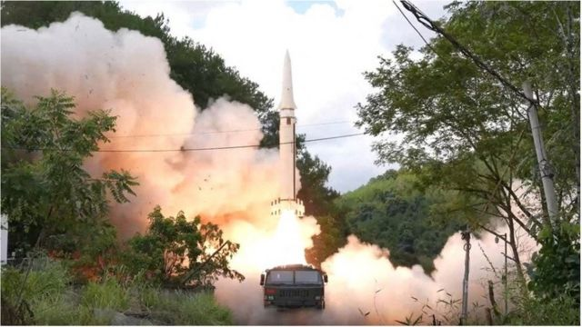

# 日本考虑部署射程1000公里的远程导弹覆盖中国朝鲜领土

#  环台军演后续：日本考虑部署射程1000公里的远程导弹，可覆盖中国朝鲜领土

2022年8月21日早上7点33分

> 图像来源，  Reuters

**日本《读卖新闻》周日（8月21日）报道称，日本正在考虑部署射程1000公里的巡航导弹，以抗衡中国。**

该报道援引日本政府信源称，这种远程导弹是在现有的射程100公里导弹基础上改进而来，从海上或者空中进行发射，将主要部署在该国南部的琉球群岛，能够覆盖中国和朝鲜海岸线。

日本外务省尚未对此做出回应。

##  中国环台军演

> 图像来源，  Reuters
>
> 图像加注文字，中国军方发射的飞弹“穿越台湾上空”，据称还落入了日本专属经济区。

美国众议院议长佩洛西（裴洛西，Nancy Pelosi）本月初访问台湾后，中国解放军在台海进行了规模空前的军演。日本称，北京在此次军演中有五枚导弹落在了日本专属经济区。

这被理解为北京向美国和日本发出的警告：如果台海地区发生冲突，美国和日本不要援助台湾。

东京向中国发出正式抗议，日本防卫大臣岸信夫说，该事件是“一个严重的问题，关系到我们的国家安全和人民的安全”。

此后，中国取消了外交部长王毅和日本外相林芳正的会晤。中国外交部发言人华春莹表示，中日在有关海域还没有划界，所以不存在有关中方军事行动是位于或者进入了日本专属经济区的说法。

