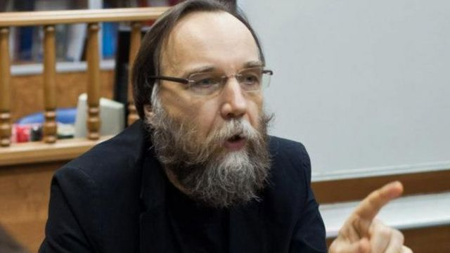
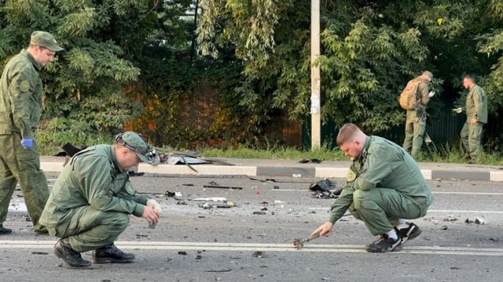

# 普京盟友女儿被杀牵动俄罗斯乌克兰局势

#  达里亚·杜吉娜汽车爆炸案：俄罗斯称乌克兰杀害普京盟友的女儿

> 图像来源，  Reuters
>
> 图像加注文字，达里亚·杜吉娜女士是俄罗斯电视新闻的常客

**俄罗斯指责乌克兰特勤部门在周末的一次汽车爆炸事件中杀死了普京总统的一位盟友的女儿。**

现年29岁的达里亚·杜吉娜（Darya Dugina）周六（8月20日）在莫斯科附近驾驶一辆汽车时发生爆炸时死亡。

杜吉娜的父亲是俄罗斯著名的极端民族主义者亚历山大·杜金（Alexander Dugin），据说与普京关系密切，可能是这次袭击的预定目标。

乌克兰官员否认与爆炸有任何牵连。

但俄罗斯联邦安全局（FSB）在周一表示，杜吉娜汽车爆炸案已破案，并表示乌克兰对此负有直接责任。

俄罗斯联邦安全局对本国媒体说，一名乌克兰妇女于7月与女儿一起搬到了俄罗斯——但她实际上是一名乌克兰特勤部门承包商。

报道称，这名女子在杜吉娜居住的同一栋楼里租了一套公寓，时间达一个月，为袭击做准备。在那段时间里，她据称在莫斯科乘坐“迷你库珀”（Mini Cooper）汽车跟随杜吉娜，使用了三个不同的车牌。

俄罗斯联邦安全局称，嫌疑人在爆炸后逃往爱沙尼亚。

乌克兰总统泽连斯基（Volodymyr Zelensky）的顾问米哈伊洛·波多利亚克（Mykhailo Podolyak）表示，俄罗斯联邦安全局对事件的描述是来自“虚构世界”的“俄罗斯宣传”。

俄罗斯联邦安全局后来发布了据称显示嫌疑人的汽车进入俄罗斯的视频，以及她进入据说是杜吉娜所在的大楼并离开俄罗斯的画面。

> 图像加注文字，亚历山大·杜金被指塑造了普京总统的世界观。

周六晚上，杜吉娜和她的父亲正在莫斯科附近参加一个节日活动，作为哲学家的杜金在那儿发表了演讲。据报道，他们原本打算乘坐同一辆车离开，但在最后一刻改变了计划。

调查人员表示，杜吉娜驾驶的丰田陆地巡洋舰下方被放置了炸药。

网上发布的现场视频似乎显示，杜金望着紧急服务人员处理着火的车辆时感到震惊。

杜金的朋友康斯坦丁·马洛费耶夫（Konstantin Malofeev）代表他在社交媒体上发表了一份声明，称杜金女儿杜吉娜被杀是“乌克兰纳粹政权的恐怖行为”。

他指的是俄罗斯领导层毫无根据但一再重复声称在乌克兰境内存在着强大的纳粹势力——而这是俄罗斯于2月24日入侵乌克兰的主要原因之一。

在Telegram上发表的声明写道：“我的女儿达里亚·杜吉娜在我面前被残忍地谋杀了”，“她是一位美丽的东正教女性、爱国者、战地记者、电视评论专家和哲学家”。

“我们只需要胜利。我的女儿将其年轻的生命献给了祭坛。所以，请获得胜利！”

> 图像来源，  Reuters
>
> 图像加注文字，俄罗斯调查人员公布了这张调查小组检查爆炸现场的照片。

周一（8月22日），普京总统在克里姆林宫发表的声明中亲自向杜吉娜女士致敬，称她的死是“卑鄙、残忍的罪行”。普京总统还签署命令，追授杜吉娜勇气勋章，并称赞她“在履行职业职责时表现出的奉献精神”。

杜吉娜是她父亲领导的“国际欧亚运动”组织的政治评论员，并定期为亲克里姆林宫的媒体撰稿。

##  有关爆炸案的揣测

**BBC记者威尔·弗农（Will Vernon）发自莫斯科**

周一早上，俄罗斯国家电视台的《时间会告诉你》（Time Will Tell）节目向经常上节目的嘉宾达里亚·杜吉娜致敬。主持人奥莱西亚·洛西耶娃（Olesya Losyeva）说：“她为‘俄罗斯世界’的想法而死。”

一位演播室嘉宾暗示，俄罗斯将作出“圣怒”回应。该节目展示了一张显然属于乌克兰的亲俄罗斯部队的迫击炮弹照片，其中一边潦草地写着“这是给达里亚（报仇）！”

几位嘉宾在节目上咆哮说，如果杜吉娜的杀戮是为了恐吓俄罗斯，那“它会产生相反的效果”。

分析师叶卡捷琳娜·舒尔曼（Yekaterina Shulman）表示，亲克里姆林宫的评论员对汽车炸弹袭击事件的愤怒似乎很可疑：有关“反应……是立竿见影的。看起来他们正在等待这样的事情发生。”

舒尔曼说，无论谁应对此负责，这次杀戮“可能被用来在（俄罗斯）国内激起一些公众的愤怒，以证明国家采取更积极的镇压行动是正当的”。

杜吉娜曾发声对俄罗斯入侵乌克兰予以支持，她7月因被指“频繁且高调地发布有关乌克兰的虚假信息”而受到英国制裁。

她的父亲亚历山大·杜金也被称为“普京的大脑”，长期以来一直表达一种反西方的极端民族主义哲学，这使他成为莫斯科的重要人物，但杜金本人没有担任任何政治职务。

作为俄罗斯反欧洲运动的创始人，杜金在2014年曾对BBC表示，俄罗斯与乌克兰的战争“是不可避免的”。杜金还长期呼吁吞并克里米亚，就在2014年，俄罗斯吞并了克里米亚。

也是在那一年，网上流传的一段视频显示杜金用俄语说：“我认为，杀、杀、杀（乌克兰人），不能有任何其他谈话。”这些言论激怒了许多乌克兰人。

