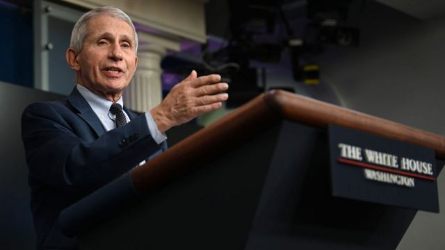

# 美国传染病专家安东尼·福奇宣布年底卸下公职

#  安东尼·福奇：美国应对新冠代表人物宣布年底卸下公职

> 图像来源，  Getty Images

**美国顶级传染病专家安东尼·福奇（Anthony Fauci）宣布，将于今年12月卸任美国国家过敏和传染病研究所（National Institute of Allergy and Infectious Diseases，NIAID）所长和白宫首席医疗顾问。**

美国总统拜登发表声明表示，相信无论福奇今后从事什么工作，美国国民乃至整个世界都将继续受惠福奇的专业知识。拜登对福奇的精神、活力以及科学操守表示感谢。

福奇博士担任美国国家过敏和传染病研究所所长38年，他表示，离开上述两个职位后自己将追求职业生涯的另一个篇章。

81岁的他在声明中说，领导美国国家过敏和传染病研究所是一个终身的荣誉。

福奇是美国应对新冠大流行的标志性人物。今年7月，他表示自己会在拜登总统目前任期结束前退休。

福奇于1968年加入美国国家卫生院（National Institutes of Health），当时的美国总统是林登·约翰逊。1984年艾滋病肆虐的时候，他被任命为美国国家过敏和传染病研究所所长，此后曾为7位美国总统服务，从共和党的里根一直到民主党的拜登。

随着2020年新冠疫情的爆发，他成为了美国最著名的医生，经常出现在美国国内和国外的媒体镜头中，成为抗击疫情的代表人物。但在此期间对他的评价两极分化严重。

一方面很多人成为他的粉丝——2020年，一份要求人物杂志将他命名为“在世的最性感的男性”的请愿信获得了28000个签名。另一方面，福奇惹恼了一些右派人物，他被视为推广封锁和强制戴口罩举措的代表。

更吸引关注的是，他时常和前任美国总统特朗普在疫情应对措施上发生冲突。

福奇周一还表示，尽管即将离开政府职位，但自己不会从医疗系统彻底退休。

“我仍富有活力和激情，会努力追求下一阶段的职业目标。”

