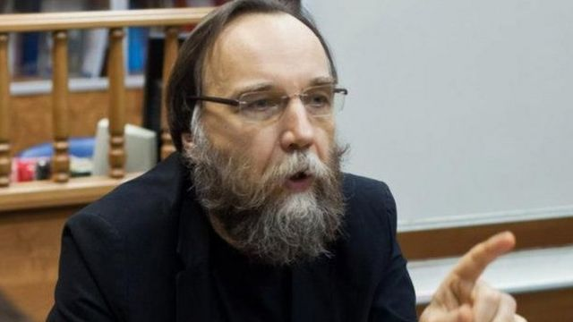
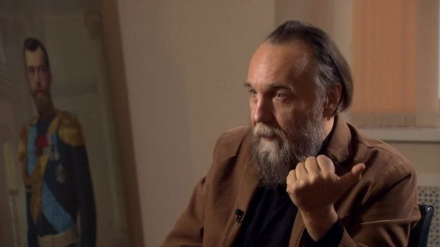
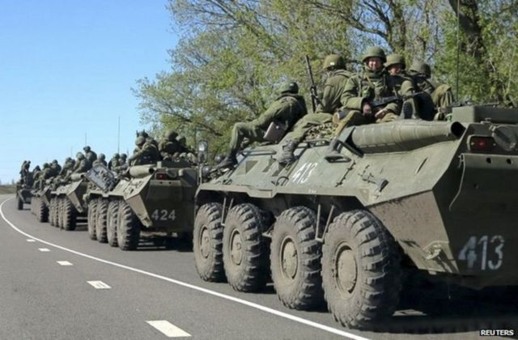

# 预言“乌克兰战争”普京智囊杜金的其人其事和对中国态度的转变

#  乌克兰战争“预言者”——普京智囊杜金的其人其事和对中国态度的转变

2 小时前

> 图像加注文字，亚历山大·杜金被称为“普京的大脑”

**莫斯科郊外一宗汽车炸弹刺杀案近日再度让俄罗斯争议性哲学家亚历山大·杜金（Alexander Dugin）成为国际媒体聚焦点——虽然死者是他的女儿杜金娜。**

亚历山大·杜金（Alexander Dugin）被广泛认为是一个极端民族主义者，他也被认为与普京关系密切，且很可能是这次炸弹袭击的预定目标。

尽管俄罗斯安全部门指控乌克兰特勤制造了爆炸案，但是乌克兰方面官员则严词否认与爆炸有任何关系。

杜金的名字被人们贴上不少标签：俄罗斯哲学家、极端民族主义知识分子、普京盟友、智囊、“普京大脑”，而最引人咂舌的是他2014年就曾语言乌克兰将会爆发战争的那番言论。

那么，杜金究竟是什么人？又如何成为“普京大脑”？他早年希望分裂中国为作为大俄罗斯帝国的缓冲带的思想近年又为何有所转变？

##  生性叛逆

亚历山大·杜金1962年出生于莫斯科一个据称是苏联红军军事情报部门少校军官的家庭，母亲是医生。

他曾在莫斯科航空学院就读，被开除，之后当过街道清洁工，也曾用伪造的图书馆卡到列宁图书馆看书学习。

查尔斯·克洛弗（Charles Clover）,《金融时报》前驻莫斯科记者站站长，在《黑风白雪：俄罗斯新民族主义的兴起》一书中说，杜金的父亲在儿子三岁时离开了他的母亲，虽然父子之间后来几乎没有接触，但他的父亲似乎在他的生命中占有重要地位，据说儿子惹麻烦后曾多次出手救他出困境。

他写道：“杜金在各种采访中对他父亲的职业含糊不清。他告诉我和其他人，盖利是军事情报（GRU）的将军。但当被追问时，他承认他实际上并不知道自己做了什么”。

“杜金的朋友坚持认为，他的父亲一定是苏联体制内有地位的人。首先，这个家庭拥有地位声望的象征—— 一幢不错的别墅，拥有漂亮别墅的亲戚们，以及优先的机会。”

杜金学习外语和历史，并将不少哲学和地缘政治作品翻译成俄语。

> 图像来源，  COURTESY ALEXANDER DUGIN
>
> 图像加注文字，亚历山大·杜金认为，乌克兰的分离主义活动重新激发了他所形容的“俄罗斯精神”

##  长期反对派

现年60岁的杜金是俄罗斯欧亚运动的创始人，他的观点被认为在鹰派俄罗斯精英中很受欢迎。他长期以来一直主张建立一个庞大的新俄罗斯帝国，包含所有俄语地区和其他领土，希望将乌克兰纳入帝国范围。

杜金青年时期是政治异见者，反对共产主义，1980年代末开始与俄罗斯当时的极右翼团体来往密切，并以知识分子和活动家身份与欧洲新右派人士接触。

苏联解体后，杜金与爱德华·利莫诺夫（Edward Limonov）共同创立了国家布尔什维克党（NBP），拥护民族布尔什维主义，杜金是该党首席思想家。1998年，因为与利莫诺夫的分歧无法调和而退党。2007年NBP被当局定性为”极端主义组织“封杀。

杜金长期以来一直与知名反对派人物亚历山大·普罗哈诺夫（Alexander Prokhanov）有联络，杜金早期的许多文章发表在普罗哈诺夫编辑的报纸《Den》（The Day）和《Zavtra》（《明天》）上。

1997年，杜金出版《地缘政治的基础：俄罗斯的地缘政治未来》（The Foundations of Geopolitics： The Geopolitics Future of Russia），全面阐述了他的世界观，呼吁俄罗斯通过联盟和征服来重建其影响力，并挑战以美国为首的“大西洋主义帝国”。

杜金在书中猛烈批评美国在欧亚大陆的影响，呼吁俄罗斯在该地区重建自己的权威，并主张分裂其他国家的领土。
 剑桥大学地理系学者艾伦·英格拉姆（Alan Ingram）说  ，这部著作是在俄罗斯总参谋部军事学院战略系讲师的协助下撰写，书中收录了他1990年代在俄罗斯反对派报纸和自己创建的网站（Elementy) 上发表的文章，出版后被视为入门教材。

路透社说，这本书出现在军队阅读清单上，但没有迹象表明杜金曾经对俄罗斯的外交政策产生过直接影响。

杜金对俄罗斯政府和普京总统的影响多深仍有争议。一些俄罗斯观察家断言他的影响力很大，许多人称其影响力微乎其微。他与克里姆林宫没有官方关系。

有学者指出，他与克里姆林宫没有官方关系，所谓“普京的大脑”、左右俄罗斯外交决策的智囊云云，只是部分媒体的曲解，也有分析人士认为杜金对克里姆林宫的影响力有限且被夸大，而之所以如此，原因之一是他的著作和文字与俄罗斯外交政策之间有很强的相关性，给人们留下了深刻印象。

美国华盛顿一名学者，乌克兰和俄罗斯问题专家乔治·巴洛斯（George Barros），2019年 撰文  指出，他认为西方高估了杜金在俄罗斯政治生活和意识形态中的影响。

> 图像加注文字，2016年，杜金在克里姆林宫附近自己的电视台接受BBC采访。他说，所谓真相其实是个关乎是否相信的问题

##  政坛红人

《地缘政治的基础》一书的出版提高了他在政坛的声望。

英格拉姆写道：“自弗拉基米尔·普京（Vladimir Putin）登上俄罗斯总统宝座以来，杜金的声望越来越高，俄罗斯官方的欧亚主义取向得到了巩固......主张俄罗斯大国地位的理论不仅变得可以接受，而且成为官方话语的真正组成部分，反对派在普京的纲领中发现了很多值得称赞的地方。"

杜金曾担任国家杜马议长根纳季·谢列兹尼奥夫和执政的联合俄罗斯党主要成员谢尔盖·纳里什金的顾问，担任过地缘政治中心主任，他的言论经常被普京的顾问格列布·巴甫洛夫克西（Gleb Pavlovksy）的网站引用。

2005年，他创立了以欧亚大陆未来为核心理念的欧亚党，与西方意识形态针锋相对，还曾在2015年开播的亲克里姆林宫东正教频道 Tsargrad TV 短暂担任主编。这个频道的老板，商人康斯坦丁·马洛菲耶夫（Konstantin Malofeev），2014年因资助乌克兰亲俄分离主义分子受到美国和欧盟的制裁，他本人否认指控。

2009年至2014年，他担任莫斯科国立大学国际关系社会学系主任，后因乌克兰冲突言论引发强烈反对而被辞退。

美国于2015年对杜金实施制裁，理由是“对威胁乌克兰和平，安全，稳定或主权或领土完整的行动或政策负责”。

美国财政部声明说，他的欧亚青年联盟积极招募具有军事和战斗经验的个人，为乌克兰东部的“顿涅茨克人民共和国”作战；他控制的网站“地缘政治”是“俄罗斯极端民族主义者传播针对西方和其他受众的虚假信息和宣传的平台”。

杜金对此予以反驳，称那是对“不违反法律的智力活动”实施制裁。

##  对中国的态度转变

杜金的女儿杜金娜遇害后，上海复旦大学中国研究院院长助理余亮2022年8月23日撰文哀悼，开篇写道，“一位朋友的女儿遇害了”。文中为杜金的思想和理论做了辨析，还反驳了一些针对杜金的抨击。

余亮在文中写道：“杜金这些年在基本面上是中国统一的支持者，是中国反抗美帝压迫的支持者，放弃了他过去的‘中亚缓冲区’的分裂思想，坚定支持中国的新疆治理和一带一路愿景”。

“杜金就是俄罗斯1990年代大混乱时期寻求出路的知识分子缩影，其思想有混沌的地方，但是他在不断努力，与时俱进。他有学术造诣，文学艺术修养也很高，关键是认真。我们并不赞同他的一些观念，但这不妨碍认真的人之间能够求同存异，保持理性交流，面对紧迫的大问题进行真诚合作。”

2014年，杜金在俄罗斯政坛失势，却在中国找到了一条出路。2018年，复旦大学中国研究院院长张维为聘他担任高级研究员。自那以后，他对中国的态度大改，对中俄联盟和中国的“一带一路”明确表示支持。

杜金在他早年的地缘政治理论著作中主张分裂中国以达到化解中国威胁的目的，把西藏、新疆、内蒙古和东北作为安全缓冲区，而这片安全区应该纳入俄国势力范围。

因此他在中国被斥为企图分裂中国的反华分子不足为奇，不少人对聘他去复旦工作颇为不满，认为只因他坚定反美并不等于他不敌视中国。他调整了自己的理论，不再把中国视为俄国的威胁之后，中国舆论对他的敌意减弱，甚至出现褒扬之声。

> 图像来源，  Reuters
>
> 图像加注文字，2014年4月，俄罗斯和乌克兰边境的坦克

**“** **俄罗斯精神** **”**

2014年7月，杜金接受BBC电视采访时断言，俄罗斯和乌克兰之间的战争“是不可避免的”，并呼吁普京总统对乌克兰东部进行军事干预，“以拯救俄罗斯的道德权威”。

他的地缘政治理论的核心是，俄罗斯的使命是在伊朗以及目前在欧洲崛起的欧洲怀疑论政党的帮助下，挑战美国对世界的统治。

他被贴上了普京总统广受欢迎的克里米亚吞并背后的大脑标签。

他宣称，下一步是对乌克兰东部的军事干预，他经常称之为Novorossiya（新俄罗斯）。普京总统也曾使用过这个名字。

他说，自己的观点没有改变，但当权者对他的观点的态度可能正在发生变化。

2014年，俄罗斯吞并克里米亚，同年，杜金丢掉了大学教职。

杜金认为，乌克兰东部的分离主义斗争重新唤醒了“俄罗斯精神”，他称之为“俄罗斯之春”。

这种精神的象征是叛军指挥官伊戈尔·斯特列尔科夫（Igor Strelkov），他得到了杜金的支持，杜金经常与顿涅茨克的战士保持联系。

亚历山大·杜金早在2008年俄罗斯与格鲁吉亚的战争期间就呼吁吞并克里米亚。

他前往有争议的南奥塞梯地区，还在那里跟一枚火箭发射器合影留念。

他的女儿杜金娜生前曾发声对俄罗斯入侵乌克兰予以支持，她7月因被指“频繁且高调地发布有关乌克兰的虚假信息”而受到英国制裁。

2014年，网上流传的一段视频显示杜金用俄语说：“我认为，杀、杀、杀（乌克兰人），没有其他话好讲”。这些言论激怒了许多乌克兰人。

杜金娜遇害后，杜金的朋友康斯坦丁·马洛费耶夫（Konstantin Malofeev）代表他在社交媒体上发表了一份声明，称汽车炸弹是“乌克兰纳粹政权的恐怖行为”。乌克兰方面对这种指控嗤之以鼻，断然否认。

杜金8月23日在女儿的追悼会上说，她为国捐躯，为俄罗斯人民牺牲在前线，她无畏无惧，只希望民众也能为国为民而战斗。

