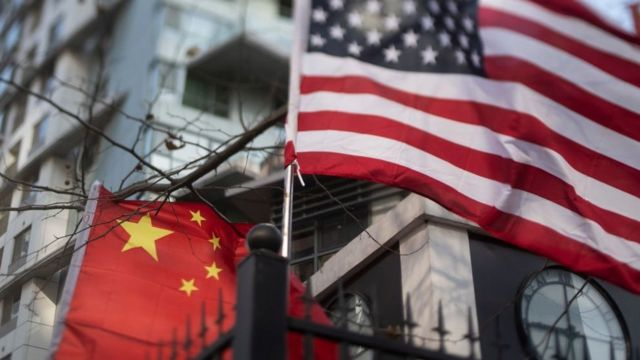
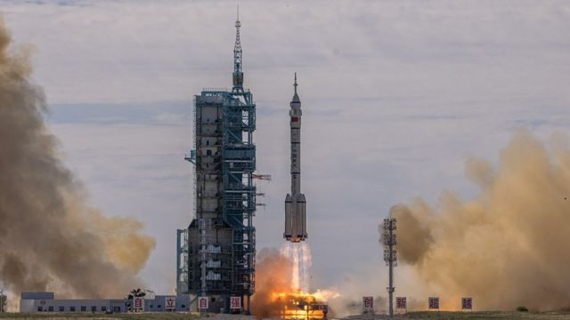

# 美国将7家中国机构列入出口管制清单 涉航空航天和电子领域

#  美国将7家中国机构列入出口管制清单 涉航空航天和电子领域

> 图像来源，  Getty Images

**美国商务部周二（8月23日）发布通告，将7家与中国实体列入出口管制清单，这些实体大多与航空航天有关。**

这7家实体包括中国航天科技集团公司第九研究院771研究所、中国航天科技集团公司第九研究院772研究所、中国空间技术研究院502研究所、中国空间技术研究院513研究所、中国电子科技集团公司第43研究所、中国电子科技集团公司第58研究所，以及珠海欧比特宇航科技股份有限公司。

通知称，这7家实体被列入清单是因为其活动违背美国国家安全和外交政策利益，他们为支持中国的军事现代化而获取或试图获取美国的物品。

“用来支持太空和航空航天活动的美国技术不应被用于支持中国的军事现代化。我们一直监控这些部门，获得技术转移的证据，”美国商务部副部长艾伦∙埃斯特韦斯（Alan Estevez）说，“中国的军民融合项目需要工业与安全局保持警惕，在必要时采取有力行动保护我们的敏感技术。”

美国商务部部长助理肯德勒（Thea D. Rozman Kendler）表示，实体清单是一项有力的工具，表明美国政府将毫不犹豫使用出口管制来保护美国国家安全，但这不是唯一的工具。

> 图像来源，  EPA
>
> 图像加注文字，美国商务部表示，用来支持太空和航空航天活动的美国技术不应被用于支持中国的军事现代化。

美国表示，已将约600家中国实体列入了实体清单，其中110多家是自拜登政府上台以来新增的。

中国商务部新闻发言人高峰6月在回应美国有关出口管制的问题时表示，美方将出口管制作为政治打压和经济霸凌的工具，在缺乏事实依据的情况下，对他国企业、机构和个人进行打压遏制。

高峰称，美国的举动给包括中美企业在内的各国企业正常经贸合作制造困难和障碍，严重破坏国际经贸秩序和贸易规则，严重威胁全球产业链供应链稳定。

