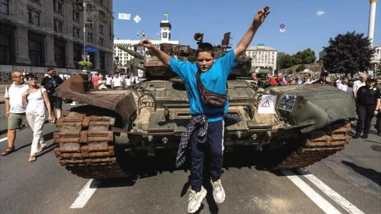
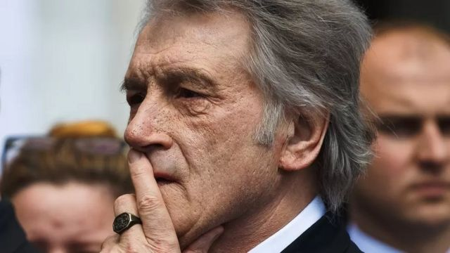
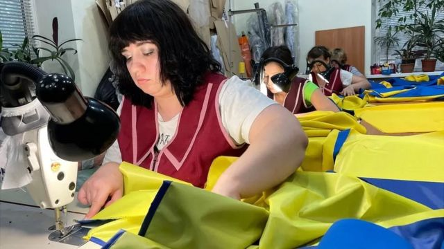
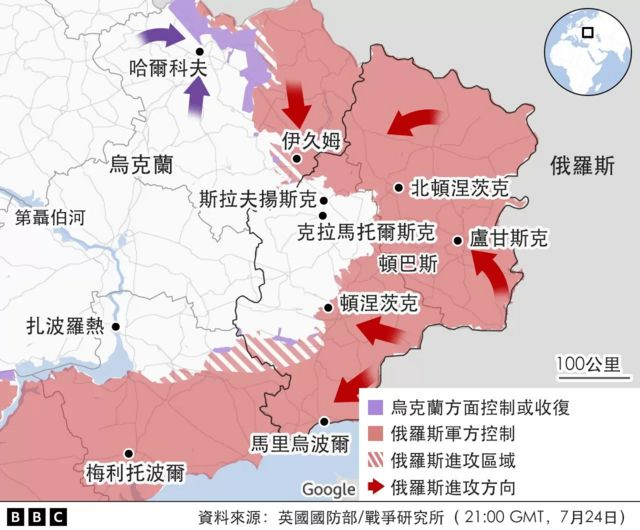

# 乌克兰战争：战事六个月后俄军速胜计划破灭 乌克兰欲驱逐入侵者也谈何容易

#  乌克兰战争：战事六个月后俄军速胜计划破灭 乌克兰欲驱逐入侵者也谈何容易

  * 詹姆斯·沃特豪斯（James Waterhouse） 
  * BBC驻乌克兰记者 

> 图像来源，  Reuters
>
> 图像加注文字，乌克兰独立日，基辅街头展出被摧毁的俄罗斯军车

**很少有人比维克多·尤先科（Viktor Yushchenko）更清楚挑战俄罗斯影响力要付出的代价了。**

这位乌克兰前总统在2004年大选中活动中遭人投毒险些丧命并导致毁容；他当时的竞争对手则是莫斯科当局支持的候选人。

案发后，他带头反对大选舞弊，并在次年竞选胜利，成为乌克兰总统。

坐在基辅郊外一桩木制结构房中的尤先科赞扬了乌克兰“民族精神的力量”，称那是乌克兰独立的关键所在。

“今天我可以自信地说，乌克兰4200万人民万众一心，而这正是这一点能让我们面对任何敌人，包括俄罗斯。”

你仍然可以看到这位前总统脸上由于中毒所留下的疤痕。

> 图像来源，  Getty Images
>
> 图像加注文字，乌克兰前总统尤先科赞扬乌克兰人的民族精神

乌克兰的独立日也恰逢普京发动的入侵乌克兰战争六个月之际。乌克兰军方说，这期间共有近9000军人阵亡。联合国确认已经有5500名平民死亡。

##  坚信会取胜

尽管当时这里很少有人能预测到这场战争，但尤先科先生认为，它在很大程度上是由于西方在面对俄国侵略方面所表现出的历史性无能所致：特别是2008年发生的格鲁吉亚冲突，以及6年后（2014年）俄罗斯吞并克里米亚。

然而，尤先科认为对乌克兰的终极考验改变了它在世界上的地位。

他说，“今天，50多个国家对我们的战斗理念表达了支持。他们为我们提供了各种帮助 -军事、财政以及人道主义支持。”

现如今，尤先科大部分时间用于做木工，我们周围有十几个木雕。这位乌克兰前总统告诉我，他坚信乌克兰将会在这场战争中取得胜利。

俄国越想把乌克兰纳入自己的轨道，乌克兰人民的民族认同感就越强。

##  国旗的力量

> 图像加注文字，乌克兰国旗订单激增

在基辅第聂伯河左岸的一家小工厂里，娜塔莉亚过去的业务是给酒店做制服，但现在则是生产乌克兰国旗。

她在入侵的早期就开始收到来自军方检查站的订单请求，现在她一个月有超过2500个订单，不光是来自军方的，还有其他商家的。

“这些颜色对我们来说非常珍贵，”她在缝纫机的噪声中对我说。

她说，“每一个乌克兰人都能感受到这些颜色，我们到处都可以看到它们 - 在天空中，在小麦田里。它给了我们快乐、喜悦和正面情绪，因为我们的工作很有用。”

乌克兰战争已经持续了6个月，乌克兰也面临一些令人不安的现实。在经过数周的讨论后，乌克兰在南方的反攻计划，即夺回被占领的赫尔松市，仍未得到落实。

虽然乌克兰向俄罗斯所控制的领土发射了一些远程导弹袭击，但目前这场战争还是主要围绕大炮所主导的前线进行，但它几乎处于停滞状态。

到目前为止，西方武器正在帮助乌克兰防守战线，并干扰了俄国的补给线。但如果要改变战局，并能让基辅完全迫使俄国撤走，那还将需要一些地动山摇之力。

##  泽连斯基受批评

因此，这种军事现状似乎仍将继续下去，而对数以万计的家庭来说，代价越来越大，令人难以想象。

此外，虽然被广泛视为乌克兰英雄的总统泽连斯基目前也由于他应对俄国袭击的方式而面临批评，尤其是他决定不对美国的警告采取行动，称那将会造成恐慌，并损害乌克兰的经济。

##  乌克兰不屈的标志

> 图像加注文字，《基辅独立报》的主编奥尔佳·鲁丹科

《基辅独立报》的新闻编辑室是乌克兰反抗不屈的另一标志。这家英文新闻网站在俄国入侵前几个星期才成立，短短几天内，他们的受众和粉丝就从数万人增长到数百万。

“这是我们（当时）无法得知将会发生的一个独立日，”其主编奥尔佳·鲁丹科（Olga Rudenko）说。

她把他们的出版物形容为乌克兰的声音，以及世界了解乌克兰的一个窗口。

“回首2月份时事如此不定，我们不知道乌克兰大部分地区是否会遭到入侵，或者我们遭到屠杀，”她说。“（今天我们）仍然在这里，能够庆祝（独立日），意义非常不寻常。”

##  唯一外交突破

最近达成的一项允许乌克兰再次通过黑海出口其谷物的协议是这场战争今年唯一的一个外交突破。

一些人把它视为最终和平协议的基础。

但它距离和平还有很长一段路要走。乌克兰已经失去了对五分之一领土的控制权。

如果要保持独立，乌克兰将在很长一段时间内需要依赖外部世界的帮助。

