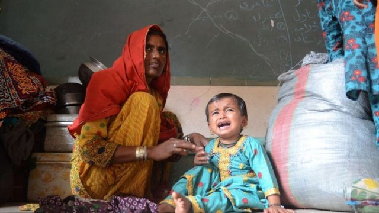
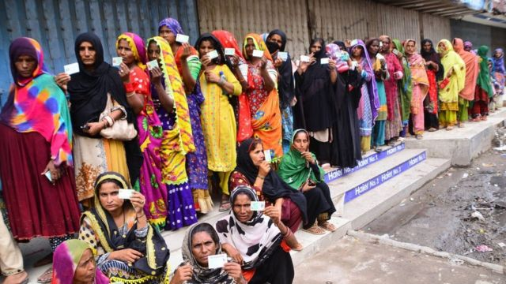
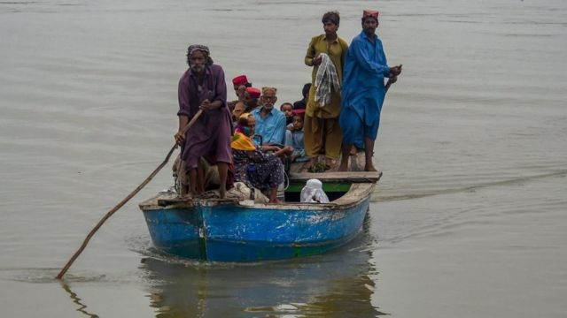
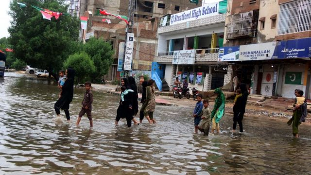

# 巴基斯坦大洪灾上千人死亡数百万人失去家园 政府恳求全球援助

#  巴基斯坦大洪灾上千人死亡数百万人失去家园 政府恳求全球援助

> 图像来源，  Getty Images
>
> 图像加注文字，卡拉奇省流离失所的人们逃离家园后等待援助。

**巴基斯坦洪灾已导致超过1000人死亡，该国政府呼吁国际社会提供进一步援助。**

一位内政部官员萨尔曼·苏菲（Salman Sufi）告诉BBC，美国、英国、阿联酋和一些其它国家已经为该国季风灾害捐款，但还需要更多的资金。

他说，自6月以来已有超过1000人死亡，数百万人流离失所。巴基斯坦政府正在尽其所能帮助灾民。

在该国西北部，开伯尔-普什图省的河流冲破堤岸，引发洪灾，成千上万的人逃离家园。

“我们多年辛苦建造的房子就在我们眼前沉没，”23岁的朱奈德（Junaid Khan）接受法新社采访时表示，“我们坐在路边，看着我们梦想的房子沉没。”

该国东南部的信德省也受到严重影响，数千人流离失所。

> 图像来源，  Getty Images
>
> 图像加注文字，信德省南部灾民在银行外排队等待接受财政援助。

苏菲接受BBC采访时表示，该国迫切需要更多的国际援助。

“巴基斯坦一直在努力应对经济问题，但就在我们即将克服这些问题时，季风灾害来了。”他说。

他还说，许多发展项目的资金已经转移到受影响的民众手中。

##  3300万人受影响

巴基斯坦总理夏巴兹·谢里夫（Shehbaz Sharif）表示，3300万人受到洪水影响，约占该国人口的15%。

他说，洪水造成的损失与2010至2011年的洪水相当，是有记录以来最严重的。

该国官员将这场灾难归咎于气候变化。但地方政府规划不当也被认为是加剧灾情的一个因素，因为建筑物往往建在容易发生季节性洪水的地区。

> 图像来源，  Getty Images
>
> 图像加注文字，在苏库尔，受困人员被疏散到船上。

谢里夫在视察灾区后表示，灾难的程度比预期的要大。谢里夫视察的信德省降雨量几乎是8月平均降雨量的8倍。

在拉尔卡纳市（Larkana）附近，数千座泥屋被水淹没。数英里中，能看见的只有树梢。在水位稍低的地方，茅草屋顶从水下露出。

在一个村庄，人们极度渴望食物。在另一个村庄，许多儿童患上了水传染病。

> 图像来源，  EPA
>
> 图像加注文字，卡拉奇连日降雨后，人们穿过被洪水淹没的街道。

当一辆卡车停在路边时，许多人立即跑向它。孩子们抱着其他孩子朝长长的队伍走去。

一名12岁的女孩说，自己和妹妹已经一天没吃东西了。

“这里没有食物，但我妹妹生病了，她一直在呕吐，”女孩说，“我希望他们能帮忙。”

绝望在每个社区都非常明显，人们跑向车窗寻求帮助。

在信德省，地方当局承认已经力不从心。

省政府说，这是一场“气候变化灾难”，巴基斯坦人民尤其是贫困人群受到的影响最严重。

