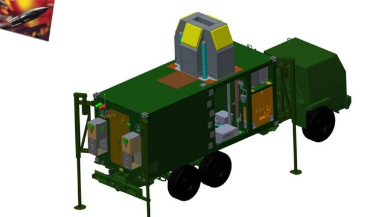

# 北约调查黑客出售导弹公司数据

#  乌克兰战争：北约调查黑客出售导弹公司数据

  * 乔·蒂迪（Joe Tidy）和本尼迪克特·加曼（Benedict Garman） 
  * BBC记者 

> 图像来源，  MBDA Missile Systems
>
> 图像加注文字，“MBDA导弹系统”公司是世界上最大的武器制造商之一。

**北约（Nato）正在评估黑客组织在线出售的机密军事文件数据遭泄露的影响。**

这些数据包括北约盟国在乌克兰冲突中使用的武器蓝图。

在窃取与欧洲主要武器制造商有关的数据后，黑客犯罪分子正在出售这些档案。

“MBDA导弹系统”（MBDA Missile Systems）承认，这些档案中有该公司的数据，但声称有关机密文件都不属于该公司。

这家总部位于法国的泛欧公司表示，其信息是从一个受损的外部硬盘驱动器中窃取，并补充说数据泄露发生在意大利，该公司正在与意大利当局合作。

据了解，调查主要围绕MBDA公司的一家供应商展开。

北约发言人在一份声明中说：“我们正在评估与据称从MBDA窃取的数据有关的指称。我们没有迹象表明任何北约网络已受到损害。”

在俄语和英语论坛上活动的网络犯罪分子正在以15个比特币（约18,000英镑）的价格出售80GB的被盗数据，并声称迄今为止已将这些藏匿物卖给了至少一个不知名的买家。

> 图像来源，  MBDA Missile Systems
>
> 图像加注文字，一个被盗文件夹包含MBDA设备的详细图纸，但该公司表示该材料并非敏感数据。

在他们为被盗数据发出的广告中，黑客声称拥有“参与开发已关闭军事项目的公司员工的机密信息”以及“设计文件、图纸、演示文稿、视频和照片材料、合同协议和与其他公司的通信”。

BBC记者看到的免费50MB数据样本包括标有“北约秘密”（NATO CONFIDENTIAL）、“北约限制”（NATO RESTRICTED）和“非机密受控信息”（Unclassified Controlled Information）的文件。

除了样本之外，犯罪分子还通过电子邮件提供了其他文件，其中包括两份标有“北约机密”（NATO SECRET）的文件。

北约的分类级别是：

  * 宇宙绝密：未经授权的披露将对北约造成异常严重损害 
  * 北约机密：未经授权的披露将对北约造成严重损害 
  * 北约秘密：未经授权的披露将损害北约利益 
  * 北约限制：未经授权的披露将不利于北约利益 
  * 非机密受控信息是美国政府创建或拥有的信息的安全标签；需要根据适用的法律、法规和政府范围的政策进行保护或传播控制的信息 

黑客不愿确认这些材料是否来自多个被黑客窃取的来源。

BBC无法独立核实这些文件。该文件详细说明了一个美国空军中队于2020年底在爱沙尼亚的波罗的海上空执行的一次“通信情报”任务。

该文件包括据称处于行动中心的人员通话记录、全名、电话号码和GPS坐标。

一位前北约官员说：“北约有很多过度分类的问题，但这些标签很重要。它们是由信息的发起者使用的，而‘北约机密’并不是轻易使用的标签。”

这位前北约官员说：“这确实是北约不想公开的那种信息。”

他补充说，考虑到大多数文件似乎是在2017年至2020年之间创建的，文件被解密的可能性很小。

样本文件还包括一个演示文稿，该演示文稿似乎详细介绍了陆地捕获接收器CAMM（通用防空模块化导弹）的内部工作原理，包括其中电子存储单元的精确位置。

其中一个最近被送往波兰，作为“天空军刀”（Sky Sabre）系统的一部分用于乌克兰冲突，并且正在运行。

“MBDA导弹系统”对其信息已被泄露并无异议，但表示：“该公司的内部验证流程表明，在线提供的数据既不是机密数据，也不是敏感数据。”

然而，一些已知从MBDA被盗的文件被标记为“不得披露或复制的专有信息”。

“MBDA导弹系统”成立于2001年12月，它是在在法国、意大利和英国的导弹系统公司合并后成立的。

该公司拥有13,000名员工，是空中客车公司（Airbus）、英国宇航系统公司（BAE systems）和莱昂纳多公司（Leonardo）的合资企业。

去年它公布的收入为35亿英镑，英国国防部、美国军方、欧盟和北约都是其武器系统的客户。

