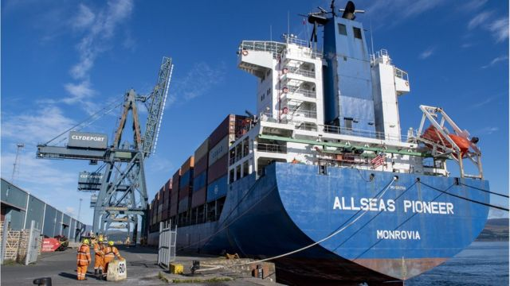
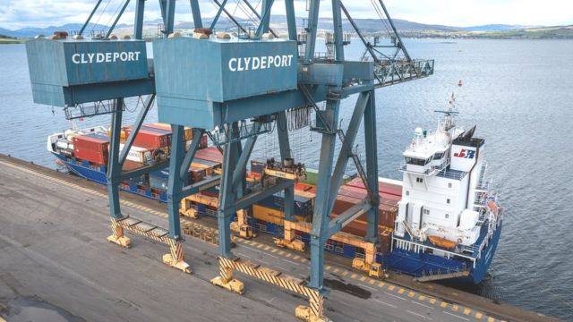

# 中国苏格兰开通首条集装箱海运直航航线

#  中英关系：中国苏格兰开通首条集装箱海运直航航线

> 图像来源，  Peel Ports
>
> 图像加注文字，直航航线的首批集装箱船已从中国宁波驶抵苏格兰格林诺克。

**超过100万瓶威士忌将很快从苏格兰西海岸通过直航方式运往中国，中国和苏格兰之间首次开通一条直航海运航线。**

这条新航线被寄予厚望，能改变现有游戏规则和结果。

英国的“Allseas Pioneer”集装箱船稍早时候从中国宁波港抵达苏格兰西部的格林诺克（Greenock），运送的货物是衣物、家具和玩具。

和现有中国驶向欧洲大陆或英国南部码头的线路相比，这条直航航线能大大缩短货物运输时间。

六艘货轮将在这条航线上运行，每艘装载量达到1600个集装箱。每个月会有三个船队分别从中国和苏格兰驶出。由于避免了在鹿特丹港出现拥堵而耗费的时间，整个航程预计可以从过去的60天缩短到33天。

格林诺克海运枢纽（Greenock Ocean Terminal）于1969年开航，目前的吞吐量为每年10万集装箱。

苏格兰最深的集装箱码头格林诺克Clydeport的运营商吉姆（Jim McSporran）说，“非常高兴看到这一重要服务终于到来。”

他表示，相信这一伙伴关系将惠及商业发展和客户利益，同时有益于优化供应链。“我们期待着在未来几个月里和合作伙伴一道投身其中。”

投入到这条直航航线的运营方包括KC Liner Agencies, DKT Allseas和China Xpress。

> 图像来源，  Peel Ports
>
> 图像加注文字，首班从格林诺克驶出的船只将于下月出发。

KC Group Shipping的运营总监大卫（David Milne）表示，公司对于这条航线立即产生的效应感到吃惊。他说，苏格兰的进出口商应该全力支持保护这条航线的长远未来。

“我们与中国的直航减少了过去令人失望的延误，极大地有利于苏格兰商界，能在这一困难时期帮助消费者。”

“我认为此举能帮助苏格兰改变现有游戏规则和结果，帮助到苏格兰的家具、药品、包装以及酒类行业。”

因弗克莱德（Inverclyde）地区的领导人史蒂芬（Stephen McCabe）表示，这条航线会给因弗克莱德和格林诺克带来好处，让这里成为重要的进出口中心和旅游中心。“相比于繁忙的轮渡时间表，这里的货运功能往往被忽视。”

