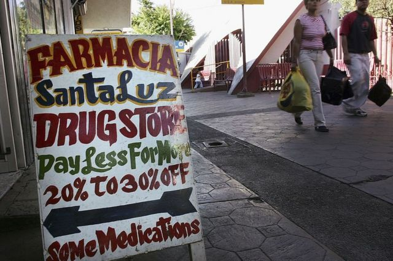
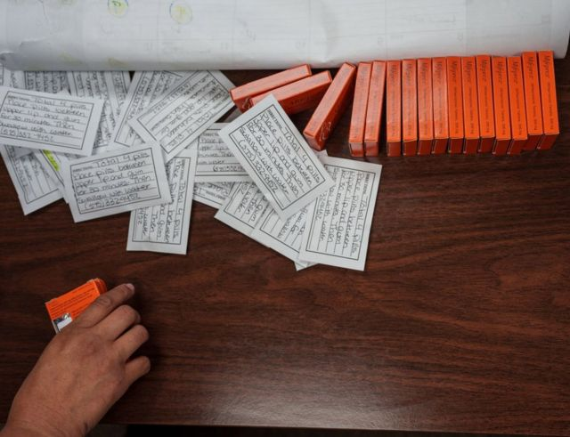
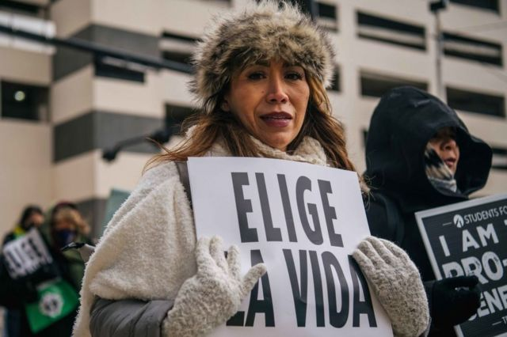

# “我需要堕胎” -- 美国女性转向墨西哥寻求帮助

#  美国堕胎权：“我需要堕胎” -- 美国女性转向墨西哥寻求帮助

  * 莱尔·万塔斯（Leire Ventas） 
  * BBC西班牙语记者发自洛杉矶 

> 图像来源，  Getty Images

**23岁的安娜（化名）知道她不能再要一个孩子。**

她还知道，她无法在德克萨斯州堕胎，虽然她就住在这里，德州是美国堕胎法最严的州之一。

因此，有着一个4月大孩子的安娜决定去社交媒体寻求答案。她在网上找到一个手机号，并在即时通讯软件WhatsApp上发了一个求救短信：“我需要堕胎”。

在边境对面的墨西哥蒙特雷，桑德拉·卡多纳收到了这条短信。

六年前，54岁的卡多纳创立了一个堕胎网络（西班牙文 the Red Necesito Abortar，英文直译为：“我需要堕胎网络”，I Need an Abortion Network）。

他们帮助墨西哥妇女提供堕胎药，因为当时墨西哥严禁堕胎。

她之所以选择这个名字是为了让那些需要堕胎的女性在网上更容易找到它。

他们会把堕胎药米索前列醇（misoprostol）寄给那些有堕胎需求的女性，并在墨西哥北部新莱昂州他们的总部帮助安置其中一些接受（药物）堕胎的妇女。

一些人到卡多纳女士这里来取药，“我们会向他们解释（堕胎过程），”她说。“也有些人想呆在这里，我们会‘陪伴’他们，” 这意味着我们会坐下来，按照世界卫生组织所规定的在没有医生在场的情况下指导她们使用堕胎药的全过程。

过去，他们帮助的主要是蒙特雷女性以及那些北上的移民，但去年一年，美国人数量稳步增长。

“一年前左右我帮助了第一位（美国）妇女，”卡多纳女士告诉BBC。“我不会说英语，但借助谷歌翻译我们可以互相沟通理解。”

安娜在十月的一个午后抵达了蒙特雷，当晚她堕胎，第二天一早就离开。

安娜并非是唯一这样做的（美国客户），卡多纳女士说。“来自德州的需求大幅增长，” 也反映着墨西哥和它的邻国美国在堕胎这个问题上所选择的不同道路。

> 图像来源，  Getty Images
>
> 图像加注文字，来墨西哥堕胎的美国女性有增长趋势。

2021年9月，墨西哥做出了一项历史性裁决。最高法院当时一致否决了该国北部科阿韦拉州一项惩罚堕胎的法律，裁决实际意味着堕胎在全国合法化。

而就在同一个月，对面的德州却实施了美国当时最严格的堕胎法之一。

这项被称为德州参议会第8号议案（SB8）的法律，禁止妊娠6周以上的堕胎，而此时许多女性仍然不知道自己已经怀孕了。

该法律允许美国公民 - 无论他们是否在德州 - 对任何帮助妊娠6个星期以上妇女堕胎的人提起诉讼。

但随着美国最高法院2022年决定推翻罗诉韦德案（Roe v Wade）（有关堕胎权的）裁决，结束了全美近50年来对女性堕胎权力的宪法保护，堕胎选择越来越有限了。

8月25日，由推翻罗诉韦德案而引发的另一条进一步限制堕胎的法律开始在德州生效。

但即使在罗诉韦德案裁决之前，德州登记的堕胎人数已经开始下降。根据政府的数字，在截止到2022年2月的6个月中，德州堕胎数量为去年同期的一半。

德州最大堕胎服务机构之一“全体女性健康”的活动人士迪尔沃斯告诉BBC，“如果你想了解后罗诉韦德案的美国将会是什么样，那么德克萨斯州将是一个绝好的测试场所。”

当然，德州登记堕胎人数减少未必意味着堕胎数量减少了。许多人选择去那些堕胎法限制较少的州进行堕胎，或干脆越过南部边境去墨西哥堕胎。

> 图像来源，  Getty Images
>
> 图像加注文字，德州S.B.8法也被称为“心跳法案”。

卡多纳女士说，她收到了很多美国女性的短信，她正在把二楼书房改成一个可以让她们住的地方。

“早些时候，我们让她们借用我们的卧室，但我们看到需要开辟更多空间的必要，”她说。“它将被叫做‘堕胎之家’”。

“我需要一个堕胎网络”并不是唯一准备扩大其工作范围的组织。为另一家帮助妇女堕胎组织奇瓦瓦州Marea Verde (绿潮，GreenTide) 工作的玛丽拉·卡斯特罗介绍说，在美墨边境有一个完整的团体和活动人士网络，也提供这样的服务。

卡斯特罗女士说，一些女性去墨西哥因为她们所居住的州没有足够的生育健康服务机构或资金。

一些女性自己到墨西哥药店购买堕胎药，还有一些女性则被安排与接洽人取得联系后，由人带着她们去药店。

> 图像来源，  Getty Images
>
> 图像加注文字，米索前列醇本来被用于预防溃疡，但后来被用来堕胎。

由这些网络所提供的服务属于灰色运营地带。

在美国，堕胎药应该由专业医护人员开给法律允许堕胎的司法管辖区的患者。

美国政府批准的药物流产（简称药流）堕胎结合了两种药：美服培酮（mifepristone，中国称米非司酮）和米索前列醇。

第一种药物通过阻断黄体酮起作用，没有了黄体酮激素子宫内膜会变薄，胚胎则无法继续保持着床状态。

第二种药物米索前列醇往往在24到48小时之后再服。米索前列醇最初于1970年代开发，其主要用途是治疗胃溃疡，但很快就发现它还能引发流产，后被世卫组织接受用于该用途。

在服用后数小时之内，米索前列醇就可以引起宫缩并迫使胚胎排出体外。这一过程会导致疼痛和出血，在极其罕见情况下还会引发败血症和子宫损伤等严重并发症。

在美国，这两种药物已被批准用于妊娠10周以内的堕胎，现在这是美国最常见的堕胎方法。

但像“我需要一个堕胎网络”这样的墨西哥堕胎网络只提供米索前列醇一种药，因为美服培酮不太容易获得。

世卫组织表示，如果无法获得美服培酮，可以接受只使用米索前列醇来堕胎，但它不是美国食品和药品管理局认可的方法。

此外，加州圣荷西州立大学司法研究助理教授霍华德说，把药寄往禁止或限制药流的地方“可能被视为犯罪”。

甚至在最高法院推翻罗诉韦德案裁决之前，在2022年的头5个月立法者已经在美国22个州提出了117项专门针对药流堕胎的限制，其中包括彻底禁止使用药流。

近日，流产 - 包括药流 - 已经在至少10个州被禁，预计还有10几个州会效仿。

“一般来说，法律适用范围包括药物送达地和服药者所在地，”霍华德说。“但他们不太可能从墨西哥把人引渡出来。”

他们（指墨西哥药流提供者）的责任范围也不清楚。绿潮网络的卡斯特罗女士说，当“使用其服务者完全满意”时，他们的任务就结束了。

他们还培训其志愿者如何急救，获得情感支持，在发生并发症时咨询医生。

但反对堕胎的活动人士则认为，这些半隐秘网络让女性置身于风险之中，因为他们不会提供健康检查这样的医疗服务。他们还说，这些药物非常危险。

“在缺乏健康与安全标准的情况下，邮寄可能导致受伤、不孕、甚至死亡的药品是鲁莽和致命的政策，”美国最大反堕胎组织之一Students For Life的发言人哈姆里克告诉BBC。

哈姆里克说，他们正在研究如何能够阻止（人们）从国外获得堕胎药。

医学专家指出，那些寻求外国活动人士帮助以获取堕胎药的女性是出于绝望才这样做的，他们拒绝接受堕胎药在医学上不安全的说法。

“但重要的是在家服药者如果在任何阶段有需求的话，都可以获得正规医疗系统内安全、没有偏见和支持性的护理，”亚特兰大妇产科专家、美国妇产科医学会成员维尔玛医生说。

> 图像来源，  Getty Images
>
> 图像加注文字，一名女子在德克萨斯州达拉斯举行的堕胎抗议活动中，举着“选择生命”的标语。

来自德州圣安东尼奥市的简（化名）是一名22岁的艺术家，她使用墨西哥的堕胎药终止了早期妊娠，这已经是她第二次堕胎了。

为了在这一过程中帮助她，她所联系的组织专门给她配备了一名“个案工作者”。“她通过视频通话软件FaceTime、Skype 或是Zoom联系我，我们可以通话，”简告诉BBC。

“她向我介绍了我所有的选择，当我决定自己堕胎时，她打电话告诉我所有可能发生的一切，比如，如果我在一个小时之内流血超过两个卫生棉垫，那说明出血过多有危险，我应该去医院，”她说。

简解释说，“我有她的电话号码，我（堕胎当天）一整天都在给她发短信。而她就像一名个案工作者应该做的那样，帮助我获得安全感，并确保我拥有所需的一切。”

自己用药物堕胎“十分痛苦：它会引起恶心、腹泻和呕吐，”她说，“会引起身体极度不适。”

但简因为费用原因决定使用墨西哥网络。简说，因为同样的药在美国买要比在墨西哥买米索前列醇贵得多。

简说，她还帮助其他寻求堕胎的女性，让她们与曾帮助过她的墨西哥组织取得联系。

“我认为许多女性很希望能够发声，但不幸的是，德州目前所发生的一切让她们感到害怕并保持沉默，”她说。，

总部在墨西哥支持有选择权的活动人士表示，他们希望能够做更多努力帮助那些有需求的美国人获得堕胎药。

墨西哥捍卫药流堕胎的先驱Las Libres的克鲁兹女士说，墨西哥堕胎网络正在与美国同行合作，向美国边境一侧的妇女分发药物

“这很疯狂。在这件事情上，我们一直是以美国为榜样，”克鲁兹女士说。“现在世界却颠倒了过来。”

_注：为保护她们的隐私，文中一些堕胎女性使用了化名。_

