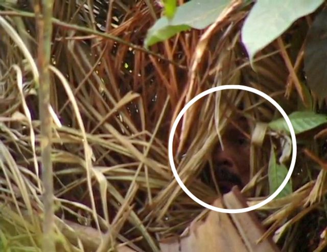
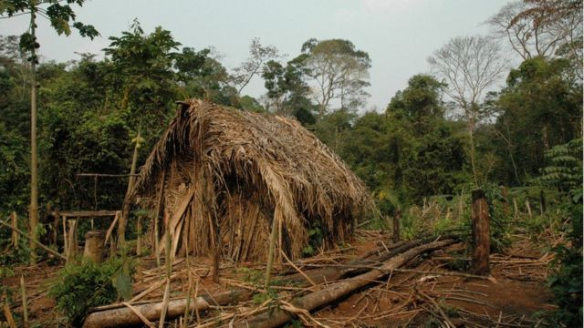
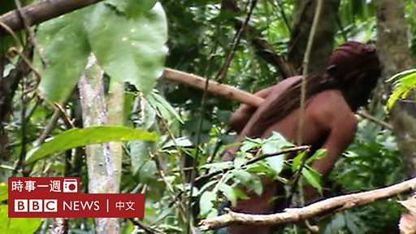
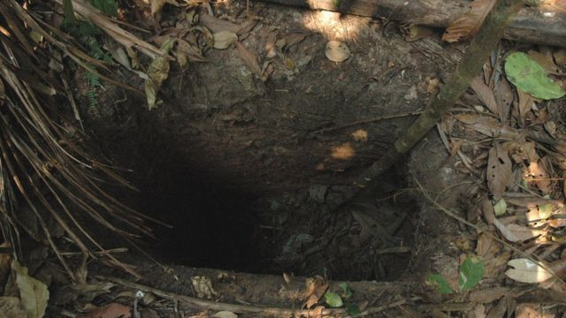

# 巴西与外界隔绝的“洞人”去世 生前部落只剩他一人

#  巴西与外界隔绝的“洞人”去世 生前部落只剩他一人

> 图像来源，  Vincent Carelli/Corumbiara
>
> 图像加注文字，一名人类学家用相机捕捉到了这名男子的脸部。

**巴西官员称，该国一个与世隔绝的原住民部落的最后一人已经去世。该男子的本名不为人知，通常被称为“洞人”。**

年龄约60岁的他被认为是自然死亡，其遗体于8月23日在他的草屋外的吊床上被发现。

这名男子生前生活在朗多尼亚州（Rondônia）塔纳鲁（Tanaru）地区，是当地一个原住民部落的唯一成员。据信，早在1970年代，他所在部落的大多数人就被想要扩大土地的农场主杀害了。

1995年，他所在部落的六名剩余成员遭到非法矿工的袭击后身亡，他成为唯一幸存者。

> 图像来源，  J Pessoa/Survival International
>
> 图像加注文字，多年来，巴西原住民机构国立印第安人基金会发现了他建造的几十个草屋。

巴西原住民机构国立印第安人基金会（FUNAI）在1996年才意识到他的存在，并从那时起一直监测他在该地区的安全。

在一次例行巡逻中，该机构人员在他所住的一间草屋外的吊床上发现了他的尸体，上面覆盖着金刚鹦鹉的羽毛。

原住民专家马塞洛·多斯桑托斯（Marcelo dos Santos）对当地媒体表示，他认为该男子知道自己即将死去，所以把羽毛放在了自己身上。

音频加注文字，

【BBC时事一周（粤语）——环宇风情】2018年，摄影师在一次偶然相遇中拍到该名男子。

“他在等待死亡，没有暴力的迹象，”他说道。他称这名男子的尸体被发现前，可能已经死亡了40到50天。

官员表示，他的小屋没有受到任何入侵的迹象，管理部门将对他进行尸检，以确定他是否感染了某种疾病。

由于这名男子一直避免与外界接触，所以不知道他说的是什么语言，也不知道他可能属于哪个民族。

他之所以被当地人称为“洞人”，是因为他曾挖过很深的洞，其中一些被他用来诱捕动物，而另一些似乎是用于藏身。

2018年，原住民管理部门的工作人员在丛林中成功拍摄了他。在画面中，可以看到他用类似斧头的东西砍树。

> 图像来源，  J Pessoa/Survival International
>
> 图像加注文字，他之所以被当地人称为"洞人"，是因为他曾挖过很深的洞，其中一些被他用来诱捕动物。

从那以后他就再也没有露过面，但工作人员发现了他的草屋和他挖的深洞。

有些洞的底部有削尖的尖刺，据信是他猎杀动物的陷阱，可以用来抓捕野猪。

多年来在该地区发现的证据还表明，该男子种植了玉米和木薯，还曾采集蜂蜜以及木瓜和香蕉等水果。

根据巴西宪法，原住民有权使用他们的传统土地，而从1998年开始，进入他居住的被称为塔纳鲁原住民保留地（Tanaru indigenous Territory）一直受到限制。

这片8070公顷土地的周边地区是农业用地，土地所有者过去曾对被禁止进入原住民领地表示不满。

