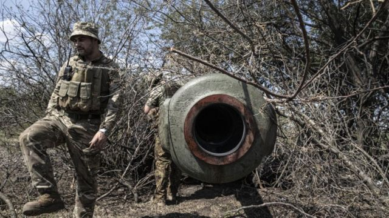
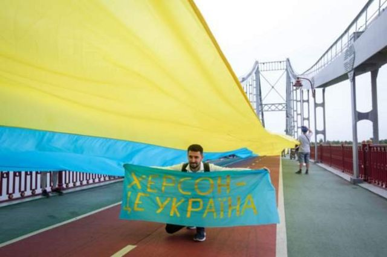

# 乌克兰反攻被占南部领土 赫尔松成“兵家必争”重镇

#  乌克兰战争：乌军向被占南部领土发起反攻，战场僵局有可能打破

> 图像来源，  Getty Images
>
> 图像加注文字，乌军士兵在南部前线的赫尔松地区准备大炮。

**乌克兰军方声称，已经突破了被俄罗斯占领的赫尔松（Kherson）地区的第一道防线。**

据报道，这次进攻是基辅酝酿已久，为了夺回该国南部地区而发起的一次反攻。

此前，乌克兰曾发动数周的攻击，旨在切断俄军在该区域的主要供应路线。但俄军方声称，乌军在一次失败的攻击行动中遭受 “重大损失”。

乌克兰和俄罗斯的说法都尚未得到独立核实。

俄军自2月24日入侵乌克兰以来已占领了赫尔松地区的大片领土。

本周早些时候，乌克兰南部的卡霍夫卡（ Kakhovka）行动小组说，俄罗斯支持的部队的一个团已经离开了赫尔松地区阵地。该小组补充说，提供后援的俄罗斯伞兵已逃离了战场。

乌克兰总统办公室顾问阿雷斯托维奇（Oleksiy Arestovych）说，乌克兰武装部队 “在几个地方突破了前线”。

与此同时，目击者称在距离赫尔松地区首府东北方向约55公里（34英里）的赫尔松市和新卡霍夫卡市（Nova Kakhovka）听到了更多爆炸声。最近几周，两地横跨第聂伯河（ Dnipro River ）的关键过境点多次成为乌军的目标。

俄罗斯国营新闻社Ria Novosti说，新卡霍夫卡市一夜之间失去了电力和水的供应。

乌克兰总统泽连斯基在深夜的电视讲话中向俄军发出严厉警告：“如果俄军士兵想生存，现在是他们逃离的时候了。回家吧！”

此外，泽连斯基和其他高级官员对反击行动的相关细节守口如瓶。他们并敦促乌克兰国民保持耐心。

回应乌克兰说法，俄罗斯国防部表示，乌军曾试图在赫尔松和邻近的尼古拉耶夫地区发动进攻。俄国国营新闻机构援引该部说法称乌克兰这次行动失败，乌军 “遭受了严重损失”。

基辅官员则声称，他们使用美国提供的海马士火箭系统摧毁了三座跨越第聂伯河的大桥。

根据西方军事消息，基辅的反攻行动是有针对性地锁定驻扎在第聂伯河流右岸（西边）的俄军，最终目的是夺回整个赫尔松地区。而莫斯科一直倚靠这些桥梁补给军队。

##  分析：赫尔松为什么重要？

**BBC新闻**

暂且不谈乌克兰的反攻到目前为止有多成功，很明显，赫尔松在最近几天和几周内已经成为一个关键的战场。

但是，为什么乌克兰要投入巨大的人力、物力与俄罗斯争夺控制权呢？

最明显的解释之一是它的地理位置。赫尔松位于乌克兰南部，第聂伯罗河口入口处的黑海沿岸。

赫尔松是一个主要的港口城市，距离被俄罗斯吞并的克里米亚仅约60英里（约100公里），是航运，海军和其他重要海上航线的通道。

城市以东不远就是北克里米亚运河的源头，这条运河提供克里米亚半岛淡水供应的很大一部分。

实际上，赫尔松这座城市就仿佛是连接自2014年以来被俄罗斯吞并的克里米亚半岛与乌克兰其他地区之间的桥梁。

此外，赫尔松仍然是迄今为止俄军在整个战争期间攻克、并成功占领的唯一一座乌克兰主要城市。

> 图像来源，  Getty Images
>
> 图像加注文字，这名男子手中的横幅上书：赫尔松是乌克兰

##  分析：乌克兰军队反攻可能面临怎样的挑战？

**BBC安全事务记者贾德纳（Frank Gardner）**

从俄罗斯人手中夺回赫尔松将是乌克兰面临的一个重大挑战。

这座拥有大约28万人口的乌克兰南部城市在战争初期被攻陷，俄罗斯军队几乎没有受到任何抵抗。因此，俄军已经有数月的时间备战，调入增援部队并准备迎接任何反攻。

自2月入侵开始以来，乌克兰方面一直在打的几乎是完全防御性的战斗，对压倒性的俄罗斯军队进行了顽强抵抗。乌军在进攻行动方面几乎没有经验，而进攻通常需要不同的技能、兵力优势以及大量的弹药和后续部队。

俄罗斯人之所以能够占领顿巴斯和马里乌波尔等地的领土，是因为他们会毫不犹豫地使用重炮火力把一座城镇变成一片废墟，并且很少考虑平民伤亡。

然而，乌克兰在这些方面会受到限制，它不希望看到自己这个重要的港口城市被夷为平地。

但是，对乌克兰有利的是，西方提供的远程武器数量不断增加，可以切断俄罗斯的补给线。再加上，这是他们的土地，他们收回土地的决心赋予他们比大多数俄罗斯入侵者更大的动力。

##  扎波罗热核电站

> 图像来源，  Reuters
>
> 图像加注文字，基辅的反攻行动有针对性地锁定驻扎在第聂伯河流右岸（西边）的俄军，最终目的是夺回整个赫尔松地区。而莫斯科一直倚靠这些桥梁给军队提供补给。

赫尔松市在战前有29万人口，是唯一被俄罗斯军队占领的地区首府，目前由莫斯科支持的当地官员管理。

据俄罗斯塔斯社（Tass news agency）报道，赫尔松地区的官员已经开始推进就正式加入俄罗斯举行公投的计划。这促使美国指责俄罗斯可能吞并被占领的乌克兰南部地区。

上个月，俄罗斯说，其军事重点不再仅仅是乌克兰东部，也包含乌克兰南部的赫尔松和扎波罗热（Zaporizhzhia）地区。

周一（8月29日）还有一件事情引人关注：俄罗斯在扎波罗热地区的官员声称，乌克兰的导弹袭击在扎波罗热核电站的一个燃料库屋顶上，打了一个洞。

但是，这一说法未得到独立核实。

最近，乌克兰和俄罗斯都指责对方炮击欧洲最大的核电站，该核电站于3月初被俄罗斯夺取。莫斯科让乌克兰人员来操作该核电站。

上周，泽连斯基说，全球险些面临该核电站的辐射灾难。

联合国核子监督机构的一个检查小组负责人说，他们预计将在本周晚些时候抵达该工厂进行调查。

##  分析：僵局可能打破

**BBC记者雨果·巴其加 （Hugo Bachega） 发自基辅**

有好一段时间，人们一直预期看到乌克兰发动一次重大攻势，以夺回赫尔松。现在，我们可能会看到这个行动已经展开，尽管任何行动都不太可能是容易的。

赫尔松自战争初期就被占领，它是俄罗斯手中最大的乌克兰城市之一。

几周来，乌克兰军队多次将目标锁定在那些远离前线，位于被占领土深处的俄军据点。而这确实是因为西方提供的先进武器，才得以实现。

而且，这对入侵的俄国部队产生了破坏其稳定的影响。之前，战情似乎陷入了僵局，乌俄双方都没有取得重大军事进展。

这种情况可能即将改变。

