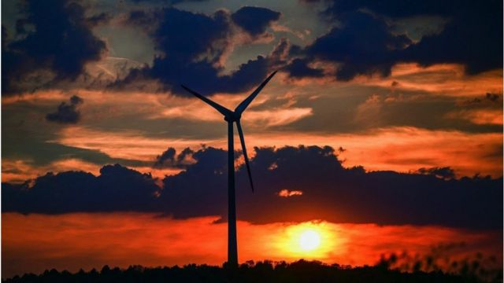
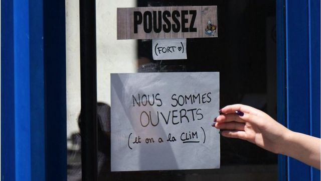
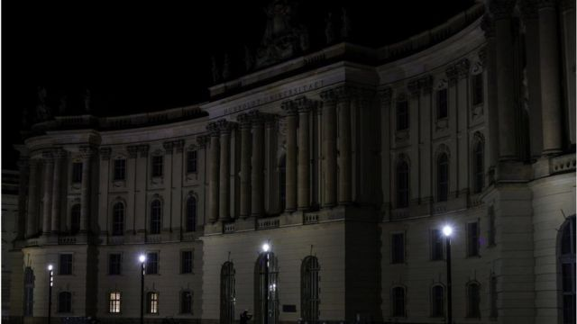
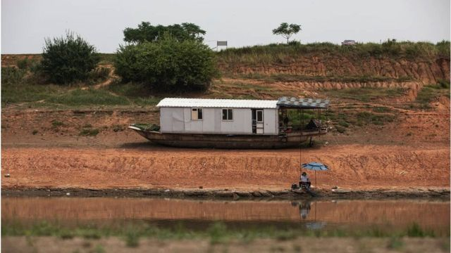
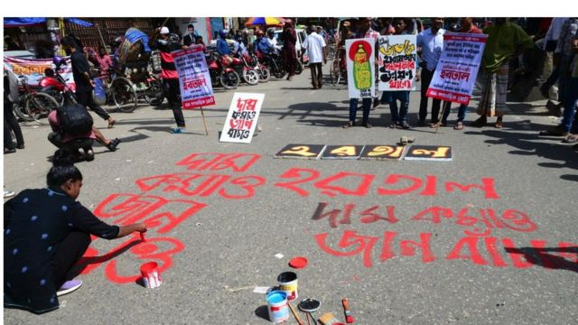
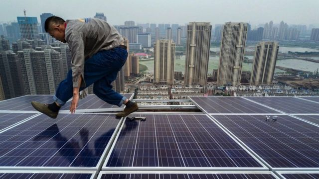

# 全球能源危机：盘点中国日本德国法国等欧亚国家的应对方式

#  停电、限空调、强制关灯，能源危机下中国法国德国日本等欧亚国家应对方式盘点

  * 斯泰芬妮·海伽蒂（Stephanie Hegarty） 
  * BBC人口事务记者 

> 图像来源，  Gettty Images

**面对热浪、干旱、新冠大流行和战争等诸多因素下而引发的全球能源危机，德国政府最近紧急提出一系列限制和遏制能源消耗的措施，包括强制限制室内温度设置等，让习惯了相对舒适生活的人们为之一震。**

不过，不断上涨的能源成本已经几乎触及到地球的每一个角落、每一个人，因此德国也并不是提出“创新”方法来应对的唯一国家。

以下是从欧洲到亚洲一些不同国家政府试图应对危机、解决问题的七种方式。

##  限制供暖和空调

直接受到乌克兰战争的影响，欧洲正面临着需要支付世界上最高能源价格的危机。此前，俄罗斯已经开始限制通过“北溪1号”（Nord Stream 1）输送天然气的供应量，作为对欧洲各国政府施压的一部分；因此，杜绝能源浪费已成为欧洲各国政府必须面对的首要任务。

欧盟已经制定计划，以期今年冬季天然气消费量减少15%，并确保天然气储备在11月1日之前达到总储存能力的80%。

德国，法国和西班牙都出台规则，将冬季公共建筑的供暖温度限制在最高19摄氏度以内。法国和西班牙还将夏季空调的最低温度分别设定为26和27摄氏度。

在法国，新规则要求开空调的商店必须把门关上，否则将被处以750欧元（约750美元）的罚款。

“简单的措施，例如在欧洲将暖气降低几度，就可以节省出与北溪管道冬季供应等同数量的天然气，”国际能源署说。

> 图像来源，  Getty Images
>
> 图像加注文字，法国商店门上贴着的通知：使劲推！我们在营业，我们开空调

##  熄灯节电

德国表示，公共建筑和纪念碑夜间将不再照亮；在西班牙，商店橱窗必须在晚上10点以后关灯。

法国认为，他们推出的措施可以减少能源消耗的10%。

法国对俄罗斯天然气的依赖程度与邻国德国不同，因为法国42%的电力供应来自核能。但是，热浪和干旱影响了几个核电站的冷却机制，迫使发电量减产。

> 图像来源，  Getty Images
>
> 图像加注文字，柏林旧宫--夏洛滕堡宫停止照明

##  人工降雨

中国正面临着另一种能源危机。虽然来自俄罗斯的石油和天然气供应没有受到战争的严重影响，但中国遭遇严重高温和干旱，导致河流干涸，极大地影响了水电行业。

在四川省，80%的电力来自水力发电，监管机构迫使工厂关闭六天以遏制电力消耗，办公室和商店必须关灯、停用空调。重庆等邻近城市也颁布了类似的措施。

中国农业部宣布了“云播种”计划，将化学物质释放到云中以刺激降雨，但是尚未提供有关人工降雨确切地点等详细信息。

> 图像来源，  Getty Images
>
> 图像加注文字，中国经历有记录以来最严重的干旱之一，长江水位骤降

##  减少工作

巴基斯坦也提出了省电的新方法。

六月，伊斯兰堡宣布将把政府部门的工作时间从每周6天减少到5天，推翻了几个月前刚刚宣布的另外一项措施，当时巴基斯坦新政府上任，承诺提高政府效率。

仅仅几周后，巴基斯坦的气温就达到了50摄氏度，给国家电网带来巨大压力。全球能源价格飙升雪上加霜，现在当局正在考虑让政府工作人员每周五居家办公。

##  学校停课

巴基斯坦南亚邻居孟加拉国正在采取类似措施。学校每周多关闭一天 -- 学生现在周六和周五休课。公务员的办公时间每天减少一小时。

孟加拉国依赖进口液化天然气，这是价格最昂贵的燃料之一。这也意味着，它必须与欧洲更富裕的经济体竞争供应。

> 图像来源，  Getty Images
>
> 图像加注文字，孟加拉人抗议示威，要求降低能源、燃料、食品价格

##  转向核能

在一些地方，飙升的能源价格导致人们重新转向化石燃料。印度6月份进口的煤炭数量创下历史新高，尽管政府此前计划减少煤炭进口。

但各国也在考虑其他选择。日本在由于福岛核电站灾难决定放弃核能11年之后，正在考虑投资新的核电站并重新激活闲置反应堆。

> 图像来源，  Getty Images
>
> 图像加注文字，中国出台措施，鼓励安装太阳能

##  求助太阳

这场能源危机也可能成为再生能源的福音。法国正计划提高风能产量。

南非和中国等国家鼓励企业和普通人投资安装屋顶太阳能板，制定规则和定价结构，允许人们将电力卖回电网。

