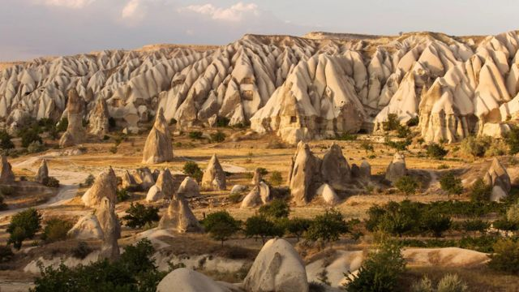
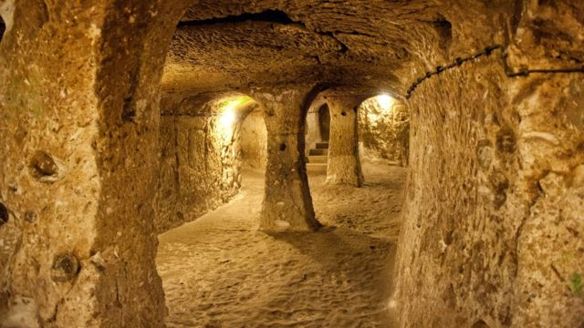
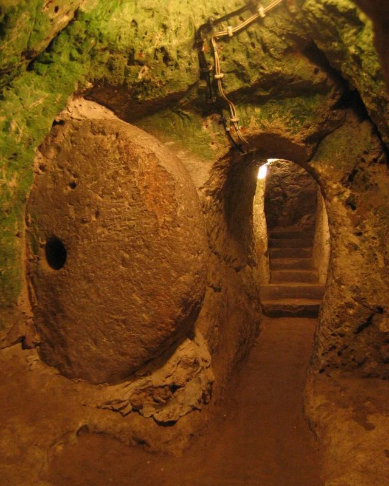
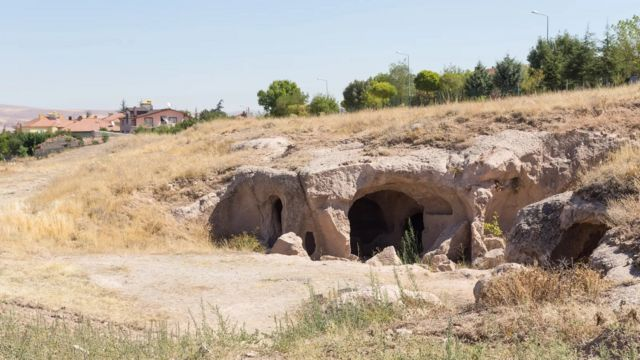

# 世界奇观：拥有两千年历史的土耳其地下城

#  土耳其地下城：拥有两千年历史的世界奇观

  * 吉娜·杜鲁门 
  * （Geena Truman） 

> 图像来源，  Getty Images

**在卡帕多西亚（Cappadocia）著名的"童话烟囱"下超过85米的地方，有一座巨大的地下城市，数千年来几乎一直在使用。**

当我徒步穿过卡帕多西亚（Cappadocia）的爱谷（Love Valley），猛烈的阵风把松软的泥土吹向空中。粉红色和黄色的山坡给连绵起伏的风景染上了深深的红色，烟囱般的岩层隐现在远处。天气干燥、炎热、多风，美得令人窒息。几千年前，这种不稳定的火山环境自然地将我周围的塔尖雕刻成蘑菇顶的锥形，现在吸引了数百万游客到土耳其中部地区徒步旅行或乘坐热气球。

但在卡帕多西亚破碎的表面下，一个同样巨大的奇迹隐藏了几个世纪；这是一座地下城市，可以一连几个月隐藏多达两万名居民的行踪。

埃伦古布古城（Elengubu），今天被称为代林库尤（Derinkuyu），深埋地表85米以上，包括18层隧道。它是世界上挖掘出来的最大的地下城市，几千年来几乎一直在使用，从弗里吉亚人到波斯人，再到拜占庭时代的基督徒。在20世纪20年代，当卡帕多西亚的希腊人在希腊- 土耳其战争中面临失败，最终将它放弃，并突然集体逃往希腊。不仅洞穴般的房间绵延数百英里，该地区被认为发现了200多个小型、独立的地下城市，可能与这些隧道相连，形成了巨大的地下网络。

据我的导游苏尔曼（Suleman）说，代林库尤直到1963年才被一个不知名的当地人“重新发现”，因为他的鸡不断走失。在装修家居时，这些家禽消失在改造过程中产生的一个小裂缝中，再也不会出现。经过进一步调查和挖掘，土耳其人发现了一条黑暗的通道。这是通往代林库尤地下城市的600多个私人住宅入口中的第一个。

挖掘工作立即开始，发现了错综复杂的地下住所、干粮仓库、牛舍、学校、酒厂，甚至还有一座教堂。整个文明都被安全地藏在地下。这个洞穴城市很快被成千上万的土耳其最不害怕幽闭的游客挖掘出来，1985年，该地区被列入联合国教科文组织世界遗产名录（Unesco World Heritage）。

> 图像来源，  Getty Images
>
> 图像加注文字，代林库尤由地下85米18层的隧道组成

这座城市建造的确切日期仍然存在争议，但雅典的色诺芬（Xenophon of Athens）大约公元前370年所写的《阿纳巴希斯》（Anabasis）似乎是与代林库尤有关的最古老的文字作品。在书中，他提到了卡帕多西亚地区或附近的安纳托利亚人（Anatolians），他们住在地下挖掘出来的房子里，而不是该地区著名的更受欢迎的悬崖窑洞。

佛罗里达州立大学（Florida State University）古典研究副教授安德烈·德乔吉（Andrea DeGiorgi）表示，卡帕多西亚独特地适合这种地下建筑，因为土壤中缺乏水分，其岩石具有延展性，易于模塑。“该地区的地貌有利于挖掘地下空间，”她说。她并解释到，当地的凝灰岩或石灰岩土壤，很容易用铲子和镐等简单的工具雕刻。同样的火山碎屑物质自然地形成了童话般的烟囱和突出地面的阴茎状尖顶。

但究竟是谁创造了代林库尤仍然是个谜。地中海窑洞研究专家贝尔蒂尼（A Bertini）在他的一篇关于区域洞穴建筑的文章中指出，赫梯人（Hittites）往往是这些庞大地下洞穴网络的奠基人，“他们可能在公元前1200年左右受到弗里吉亚人（Phrygians）的攻击时，挖掘出了岩石的最初几层”。在德林库尤发现的赫梯人的手工艺品，进一步证实了这一假设。

然而，这座城市的大部分可能是由弗里吉亚人建造，他们是铁器时代技术高超的建筑师，有能力建造复杂的地下设施。“弗里吉亚人是安纳托利亚最著名的早期帝国之一，”德乔吉解释。大约在公元前一千年结束时，他们在安纳托利亚西部发展起来，喜欢将岩石形成纪念碑，并创造出引人注目的岩石切割外墙。虽然难以捉摸，但他们的王国扩展到安纳托利亚西部和中部的大部分地区，包括代林库尤地区。

> 图像来源，  Getty Images
>
> 图像加注文字，在入侵时期，半吨重的巨石可以滚到适当的地方来关闭隧道

最初，代林库尤可能是用来储存货物的，但它的主要用途是临时避风港，以抵御外国侵略者，卡帕多西亚在整个世纪看到了不断变化的统治帝国。“帝国的继承及其对安纳托利亚景观的影响解释了代林库尤这样的地下避难所，”德乔吉解释。“然而，在（第七世纪）伊斯兰袭击（以基督教为主的拜占庭帝国）的时候，这些住宅被充分利用了。”当弗里吉亚人、波斯人和塞尔柱人（Seljuks）等人都居住在这一地区，并在随后的几个世纪里扩张到这座地下城市时，德林库尤的人口在拜占庭时代膨胀到顶峰，有近两万居民生活在地下。

如今，只要花60土耳其里拉（2.8英镑），你就可以体验地下生活的残酷现实。当我进入发霉的狭窄隧道时，几个世纪以来火把点燃的煤烟把墙壁熏黑了，一种不熟悉的幽闭恐惧症的感觉开始袭来。然而，在德乔吉扩张的各个帝国的聪明才智很快显现出来。故意狭窄、简短的走廊迫使游客在迷宫般的走廊和住所中弯着腰，排成一列——显然对闯入者来说不合适。在昏暗的灯光下，重达半吨的圆形巨石挡住了18层楼之间的门，只能从里面移动。在这些笨重的门中央的小而圆的洞可以让居民们在保护周边安全的同时刺穿入侵者。

“地下生活可能非常艰难，”我的导游苏尔曼补充说。“居民们在密封的陶罐里解手，靠手电筒照明，在（指定的）区域处理尸体。”

城市的每一层都是为特定用途精心设计的。牲畜被养在最靠近地表的马厩里，以减少牛产生的气味和有毒气体，并为寒冷的月份提供一层温暖的生活绝缘层。城市的内层包括住宅、地下室、学校和会议空间。二楼是一所传统的拜占庭教会学校，它有着独特的桶形穹顶天花板，并配有相邻的学习房间。根据德乔吉的说法，“酿酒的证据是建立在酒窖、用来压制的大桶和双耳罐（高的、有两个柄的、窄颈的罐子）的存在之上的。”这些特殊的房间表明代林库尤的居民准备在地下生活数月。

> 图像来源，  Getty Images
>
> 图像加注文字，代林库尤有很多入口，包括600多个私人住宅的入口

但最令人印象深刻的是一个复杂的通风系统，而且保护得很好，可以为整个城市提供新鲜的空气和干净的水。事实上，人们认为代林库尤的早期建造围绕着这两个基本元素。50多个通风井分布在整个城市，以避免空气供应受到潜在的致命攻击。这些通风井使城市的许多住宅和走廊之间能够自然流动。通风井挖得超过55米深，而且在遭攻击时居民很容易就能从下面切断。

虽然代林库尤的建筑确实很巧妙，但它并不是卡帕多西亚唯一的地下城市。占地445平方公里的代林库尤只是安纳托利亚平原（Anatolian Plains）地下200座城市中最大的一座。在这些小城市中，有40多个位于地表以下3层或3层以上。许多城市通过精心挖掘的隧道与代林库尤相连，有些隧道长达9公里。所有这些地下城市都配备了紧急逃生路线，以防居民需要立即返回地面。但卡帕多西亚的地下秘密尚未全部挖掘出来。2014年，一个新发现的、可能更大的地下城市在内夫塞希尔（Nevsehir）地区被发掘出来。

当卡帕多西亚的希腊人撤离时，代林库尤的生活故事在1923年结束了。在这座城市可能诞生2000多年后，代林库尤最后一次被遗弃。它的存在几乎被现代世界遗忘了，直到一些误入歧途的鸡再度把这座地下城市带回了光明。

请前往 BBC Travel  阅读 英文原文 

