# 图辑：苏联领导人米哈伊尔·戈尔巴乔夫的一生

#  图辑：苏联领导人米哈伊尔·戈尔巴乔夫的一生

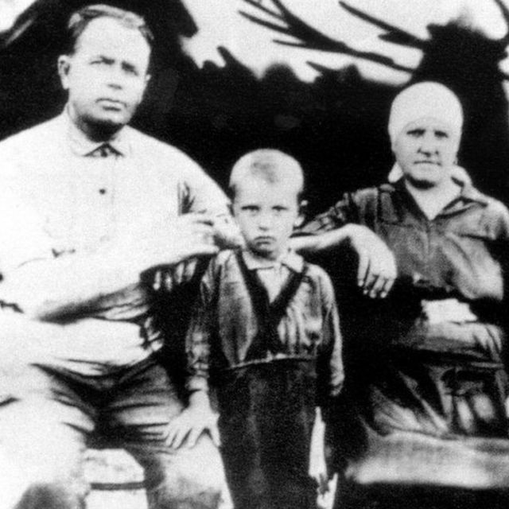

> 图像来源，  Getty Images
>
> 图像加注文字，米哈伊尔·戈尔巴乔夫早年与家人在俄罗斯南部的集体农场工作。

**和平结束冷战的前苏联领导人米哈伊尔·戈尔巴乔夫（Mikhail Gorbachev，戈巴契夫）逝世，享年91岁。**

戈尔巴乔夫于1931年3月2日出生在俄罗斯南部的斯塔夫罗波尔（Stavropol）地区，他在后来成为20世纪最有影响力的政治人物之一。

他的父母都在集体农场工作，年轻的戈尔巴乔夫在他十几岁的时候就经营联合收割机。

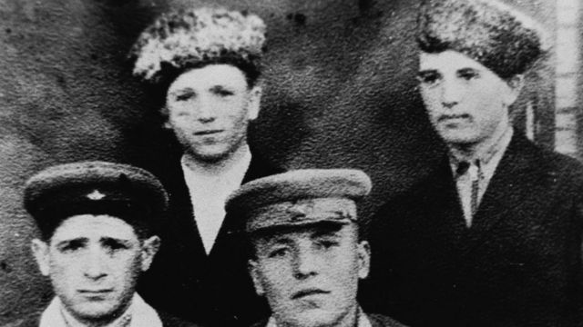

> 图像来源，  Getty Images
>
> 图像加注文字，1947年，戈尔巴乔夫（最右边）与同学合影。他后来在莫斯科国立大学学习法律。

在莫斯科国立大学学习期间，他结识了妻子赖莎（Raisa），并成为共产党的积极分子。

毕业后，他回到斯塔夫罗波尔，开始在共产党队伍中迅速崛起。

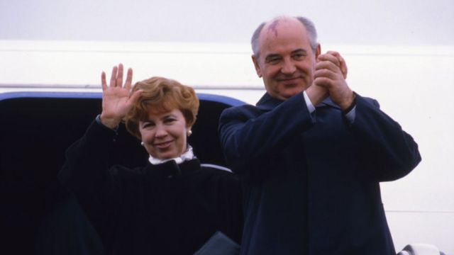

> 图像来源，  Getty Images
>
> 图像加注文字，1953年，戈尔巴乔夫与赖莎结婚。赖莎在1999 年去世后，戈尔巴乔夫写道，他的生活已经失去了“主要的意义”。

1985年，苏联领导人康斯坦丁·契尔年科（Konstantin Chernenko）上任仅一年就去世，米哈伊尔·戈尔巴乔夫成为苏联最年轻的领导人。

当时，苏联的经济正在努力跟上美国的步伐，戈尔巴乔夫寻求两种主要的解决方案。他说这个国家需要“改革”或重组，而他处理它的方法就是开放。

戈尔巴乔夫应对苏联体制停滞的另一个武器是民主。在他的领导下，苏联人民代表大会首次实行自由选举。

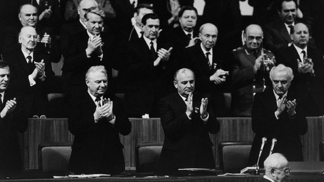

> 图像来源，  Getty Images
>
> 图像加注文字，戈尔巴乔夫在1986年苏共第二十七次代表大会上，这是他上台后主持的第一次共产党领导人会议。

戈尔巴乔夫还想结束冷战，为跟上美国军费开支的快速增长，他的国家每年要花费数十亿美元。

1985年，戈尔巴乔夫会见了美国总统罗纳德·里根（Ronald Reagan），就限制核导弹的生产和恢复两个超级大国之间的外交关系进行了会谈。他还结束苏联在阿富汗血腥而长期的战争，自1979年莫斯科介入支持阿富汗社会主义政府以来，这场战争已经造成数千人丧生。

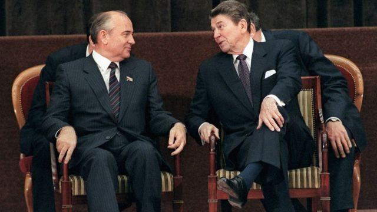

> 图像来源，  Getty Images
>
> 图像加注文字，1985年，戈尔巴乔夫在日内瓦首次会见了他的美国同行罗纳德·里根，就重构超级大国之间的国际关系进行会谈。

1987年，戈尔巴乔夫前往美国华盛顿特区签署了一项限制在全球范围内部署中程和短程陆基导弹的条约。

到1991年5月，美国和苏联根据条约销毁了2500多枚导弹。

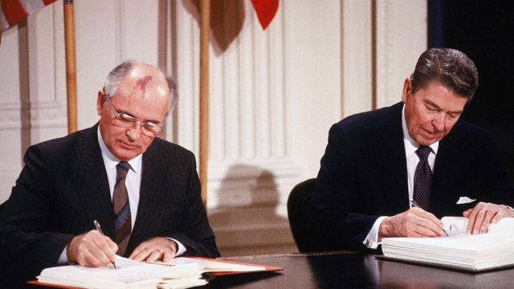

> 图像来源，  Getty Images
>
> 图像加注文字，里根和戈尔巴乔夫于1987年签署了“中程核导弹条约”。根据该协议，两国的数千枚导弹退役。

虽然他的改革受到西方领导人的​​欢迎，但苏联在他的领导下逐渐开始解体，1991年圣诞节前夕，戈尔巴乔夫接受了不可避免的结果——苏联解体。

戈尔巴乔夫继续在俄罗斯和国际事务中发声，但他在国外的声誉始终高于国内。

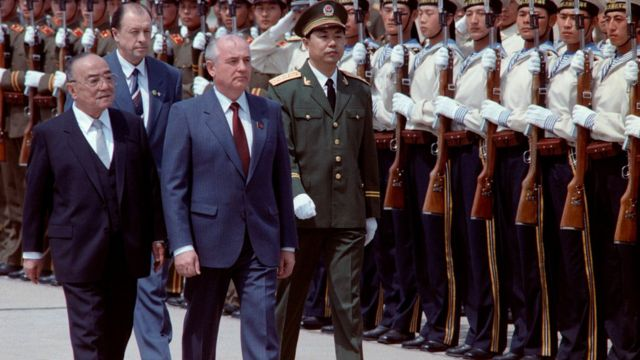

> 图像来源，  Getty Images
>
> 图像加注文字，1989年5月15日，时任中国国家主席杨尚昆在机场举行欢迎仪式迎接戈尔巴乔夫。

1989年5月15日，苏联最高领导人戈尔巴乔夫访问北京。戈尔巴乔夫到访正值天安门学潮期间，示威者当时占领了北京中心的天安门，还试图拦截车队。

当时中国官方由于抗议人群占据天安门广场，被迫改在首都机场举行欢迎仪式。

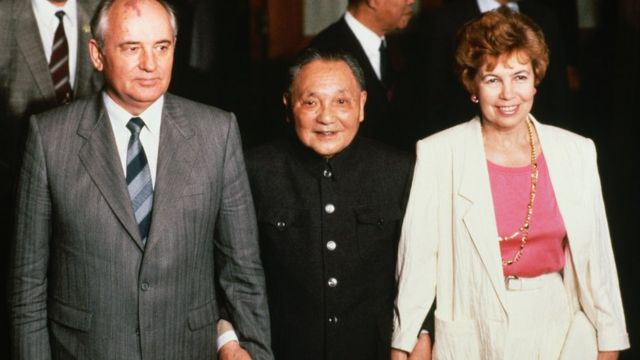

> 图像来源，  Getty Images
>
> 图像加注文字，戈尔巴乔夫夫妇访华时和中国领导人邓小平牵手合影。

在那次访问中， 提倡政治透明化和政治体制改革的苏共总书记兼苏联最高苏维埃主席团主席戈尔巴乔夫与时任中共总书记赵紫阳和中共中央军委主席邓小平分别举行会晤，实现了当时苏共和中共的关系正常化。

> 图像来源，  Getty Images
>
> 图像加注文字，时任中共总书记赵紫阳和戈尔巴乔夫会面。戈尔巴乔夫访华归国后不久，赵紫阳便因同情学潮被解职软禁。

不过，就在戈尔巴乔夫访问归国后不久，赵紫阳便因同情学潮被解职软禁。2005年1月赵紫阳逝世后，戈尔巴乔夫曾发表声明表示悼念。

戈尔巴乔夫后来在回忆录中透露，赵紫阳在他们的会谈中坦诚谈到社会主义国家能否放弃一党制、实行多党制的想法。

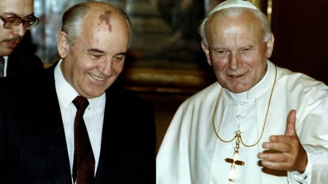

> 图像来源，  Reuters
>
> 图像加注文字，戈尔巴乔夫与教皇约翰·保罗二世在梵蒂冈。这位波兰神职人员是共产主义和苏联势力范围的强烈反对者。

1999 年，妻子赖莎死于白血病，戈尔巴乔夫深受打击。赖莎一直在戈尔巴乔夫身边，为他的政治改革增添了人性化的色彩。

弗拉基米尔·普京（Vladimir Putin ）上台后，戈尔巴乔夫成为了一个直言不讳的批评者，指责他管理着一个越来越专制的政权。

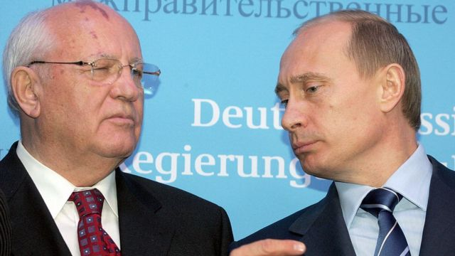

> 图像来源，  Getty Images
>
> 图像加注文字，戈尔巴乔夫晚年成为弗拉基米尔·普京总统的强烈批评者，他指责普京领导着一个日益压制的政权。

戈尔巴乔夫在俄罗斯入侵乌克兰期间在莫斯科去世，有人说这是普京总统试图重建旧苏联势力范围的行动。

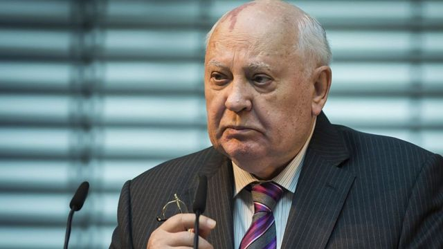

> 图像来源，  Getty Images
>
> 图像加注文字，米哈伊尔·戈尔巴乔夫于2022年8月30日去世，享年91岁。

