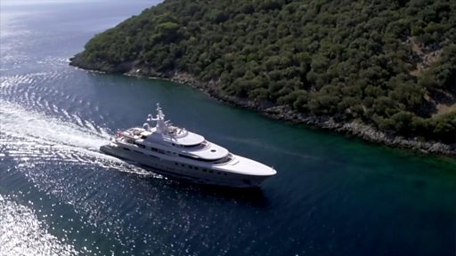

# 被扣押的俄罗斯富豪游艇在直布罗陀拍卖

#  被扣押的俄罗斯富豪游艇在直布罗陀拍卖

**被扣押的俄罗斯富豪游艇在直布罗陀拍卖**

一艘与受到制裁的俄罗斯寡头大亨有关的价值高达7500万美元的超级豪华游艇在位于西班牙南部海岸的英国领土直布罗陀拍卖。

据信这是俄罗斯入侵乌克兰之后，被扣押的俄罗斯寡头资产第一次被公开拍卖，拍卖所得部分将归给美国摩根大通银行（JP Morgan），该银行表示这艘游艇的主人，俄罗斯亿万富豪德米特里·庞皮扬斯基（Dmitry Pumpyansky）积欠2000万美元债务。

路透社引述消息来源报道称，多余金额将由法院决定如何分配。

超级豪华游艇“Axioma”全长75米，船上有游泳池、按摩浴缸、水疗设施、3D立体影院，还有水上摩托车和潜水装备。船上除了乘客之外，还能容纳20名工作人员。

俄罗斯入侵乌克兰之后，世界各国对俄罗斯发动制裁，全球各地有多艘俄罗斯寡头大亨有联系的超级豪华游艇遭到扣押或没收。

