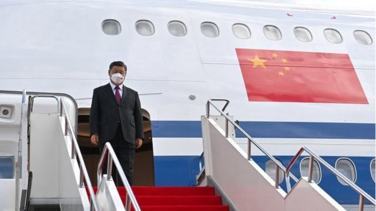
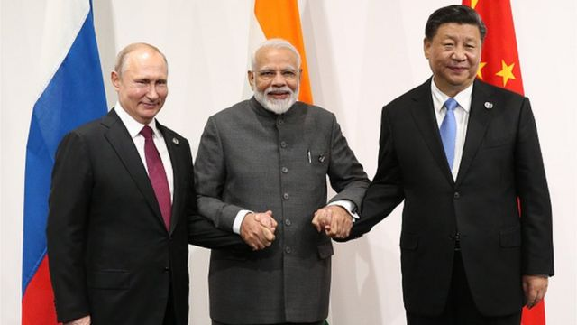
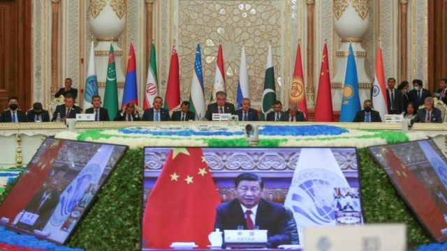
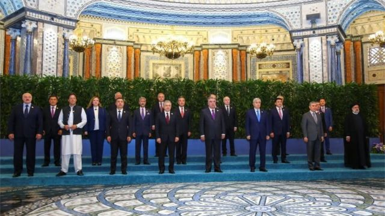

# 习近平疫情以来首次外访 上海合作组织峰会的看点与重头戏

#  习近平疫情以来首次外访 上海合作组织峰会的看点与重头戏

6 小时前

> 图像来源，  Reuters
>
> 图像加注文字，9月14日，习近平抵达哈萨克斯坦展开访问，并在15-16日参加在乌兹别克斯坦举行的上海合作组织峰会。这是他疫情近三年来的第一次外访。

**中国国家主席习近平抵达中亚国家哈萨克斯坦，并将参加9月15、16日在乌兹别克斯坦撒马尔罕举行的上海合作组织峰会。这是习近平自新冠疫情开始近三年以来的首次外访。**

本次上海合作组织峰会举行之际，正值俄罗斯入侵乌克兰战争的关键时刻：乌克兰近期大举反攻收复了东部城市哈尔科夫附近的数千平方公里的土地，而俄军在乌克兰东部战线节节撤退。

虽然中国官方至今没有正式确认习近平是否在本次峰会期间与俄罗斯总统普京见面，但俄罗斯方面早已经透露了会面的消息。

自2001年创立的上海合作组织，经过20多年的扩大，成员国除了中国和俄罗斯，还包括印度、巴基斯坦、和中亚国家，被认为是中、俄在应对西方同盟时的一个重要“有影响力的圈子”。

本次在乌兹别克斯坦举行的第22次上海合作组织峰会有哪些重要看点？

##  “习普会”与乌克兰局势

据中国官方统计，习近平与普京自2013年以来已经见面了38次。上一次见面是在今年年初北京举行冬季奥运会期间。在西方国家因新疆维吾尔族人权争议外交抵制北京冬奥会时，普京是为数不多前往北京出席开幕式的外国元首。

这一次在上海合作组织的会面对双方都有特殊的含义：习近平在新冠疫情近三年时间完全中断了海外的访问，首次出访前往中亚哈萨克斯坦和乌兹别克斯坦，既显示对上海合作组织的重视，更显示与成员国之间关系非比寻常：习近平与普京见面之时，正是俄罗斯因为入侵乌克兰受到西方国家孤立之际。

在俄罗斯入侵乌克兰的问题上，西方国家一直批评中国的模糊立场。中国官方在国际和国内舆论中，对俄罗斯的入侵也一直抱理解的态度和立场。

习近平本次参加上合组织峰会之前，中国人大委员长、中共政治局常委栗战书刚刚结束了对俄罗斯的访问。他在访俄期间表示，中国对俄罗斯入侵乌克兰“表示充分的理解，而且从不同的方面给予策应”。

栗战书并未详细阐述中方已经、或者还将如何“策应”，但他从“理解”到“策应”的此番表态受到外界普遍的关注。

本次习近平与普京的会面，无疑会再次提醒外界：中、俄战略合作关系“没有止境、没有禁区、没有上限”。

##  印度在上合峰会上的作用

> 图像来源，  Getty Images
>
> 图像加注文字，普京、莫迪和习近平都将出席本次在乌兹别克斯坦举行的上合组织峰会。

印度总理莫迪也将参加本次的上合组织峰会，外界普遍预计莫迪也将与普京和习近平分别举行双边会谈，但印度政府也至今没有确认这一消息。

印度在上海合作组织中的地位颇为独特，它既是上合组织成员国，也是由美国、日本、澳大利亚和印度组成的四边安全对话（Quad）机制中的一员。

在俄罗斯入侵乌克兰的问题上，印度与中国一样拒绝表示谴责之外，还增加了对俄罗斯打折石油的进口额。

BBC 在印度首都德里的记者佐雅·马汀（Zoya Mateen）分析指出，莫迪出席上合峰会“引起了人们的注意，因为这将是2020年中国与印度两国军队发生暴力冲突后他第一次与习近平会面。”

##  伊朗将成为上合组织成员国

> 图像来源，  Reuters
>
> 图像加注文字，2021年9月17日，中国领导人习近平用视频方式在上海合作组织成员国元首理事会第21次会议上讲话。

上海合作组织秘书长张明日前接受俄罗斯塔斯社采访时证实，上合组织成员国元首将在本次峰会上签署关于伊朗加入上合组织承诺的备忘录，随后伊朗将按程序完成加入上合组织工作。

伊朗外长也正式宣布了这一消息，伊朗总统本次也将出席上合组织峰会。

张明海表示，上合组织秉持开放态度，“我们欢迎任何认同‘上海精神’、遵守《上海合作组织宪章》的国家加入上合组织，我们将为促进这一进程作出积极努力。”

值得一提的时，伊朗加入上合组织之时，也是在它遭受国际孤立之际。

有评论认为，伊朗加入有可能增加与成员国在政治、经济和文化方面的联系机会，但有多少实际的好处，则仍需观察。

##  国际舆论怎样看2022上合峰会？

国际舆论对习近平的出访和他与普京可能的会面非常关注。

彭博社发表报道称：习近平重新回到世界舞台与普京一起对抗美国霸权。报道认为：在习近平上次出国后的近1000个日子里，中国发现自己在美国领导的世界秩序中越来越孤立。本周，习近平终于与俄罗斯的普京一起重新出现，展示他对美国领导世界秩序以外另一种可行方案的看法。

美国有限电视（CNN)报道认为，俄罗斯与中国之间的关系自乌克兰战争以来更加加强了。CNN引述专家的话说，普京在战场上受挫后，可能会比以往任何时候都更指望北京。

卡内基国际和平研究院研究副院长方艾文(EvanA.Feigenbaum)最新发表的分析文章认为，虽然所有的目光都将集中在中俄战略伙伴关系上，但上海合作组织的中亚成员比以往任何时候都更有信心和讨价还价的能力，北京对此心知肚明。

他认为，习近平在俄罗斯问题上很可能继续“骑墙”，一方面，中国将为俄罗斯提供外交支持，以制衡美国为理由和重点，继续对中俄协约作出广泛承诺；另一方面，中国将继续在事实上遵守西方的制裁，以避免自己成为标靶，同时将努力安抚对莫斯科入侵乌克兰战争感到不安的中亚国家和全球南方的合作伙伴。

##  什么是“上合组织”？

上海合作组织于2001年6月15日在上海成立，创始成员国为中国、俄罗斯、哈萨克斯坦、吉尔吉斯斯坦、塔吉克斯坦和乌兹别克斯坦六个国家。

上合组织的前身，是中国与俄罗斯、哈萨克斯坦、吉尔吉斯和塔吉克斯坦为解决边界问题建立的五国元首会晤机制。

上海合作组织自称，对内遵循“互信、互利、平等、协商，尊重多样文明、谋求共同发展”的“上海精神”，对外奉行不结盟、不针对其它国家和地区及开放原则。

2017年，印度和巴基斯坦加入上合组织成为成员国；现有观察员国四个：阿富汗、白俄罗斯、伊朗、蒙古国。

2021年9月上合组织启动接收伊朗为成员国的程序，另外新增了三个对话伙伴国，使对话伙伴国数量增加至九个：阿塞拜疆、亚美尼亚、柬埔寨、尼泊尔、土耳其、斯里兰卡、沙特、埃及和卡塔尔。

迄今，上合组织八个成员国领土总面积约3436万平方公里，超过欧亚大陆面积的五分之三；人口超过30亿，占世界总人口近一半；国内生产总值占全球20%以上，是世界上最大的区域组织。

另外，在世界拥核国家中，除了中国、俄罗斯这两个传统核大国之外，印度、巴基斯坦也开发了核武器，使上合组织有四个拥核国家，占世界总数的一半。

上合组织也是唯一一个在中国境内成立、以中国城市命名、总部设在中国境内的区域性国际组织。

##  上合组织的创建背景和演变历程

上海合作组织成立的2001年年初，美国共和党总统小布什走马上任，一方面将中国视为战略竞争者，表示“不惜一切代价保护台湾”；另一方面与俄罗斯的关系出现改善的势头：小布什与俄罗斯总统普京2001年6月在斯洛文尼亚首次会晤，建立起工作和私人关系。

上海合作组织建立之时也正是美俄关系热络之际。因此有观察人士认为，中国希望上合组织的成立，能够遏制美国在中亚地区的影响。

正如上海合作组织宗旨所说，除了“维护和保障地区的和平、安全与稳定”；还要“推动建立民主、公正、合理的国际政治经济新秩序”，不过这一秩序并不是美国主导的秩序。

实际上，美国曾在2005年申请成为观察员国遭到拒绝。

过去20年来，上合组织成员国数量有所增加、功能在不断扩大，从最初不被西方和外界重视的一个地区性组织，演变成美国撤军后影响阿富汗局势的重要国际组织。2021年，美国从阿富汗仓促撤军后，上合组织当年9月举行的峰会上，阿富汗问题成为重点。

> 图像来源，  Reuters
>
> 图像加注文字，9月17日，上海合作组织成员国元首理事会第21次会议在塔吉克斯坦首都杜尚别举行。

2017年，在印度和巴基斯坦成为上合组织成员国后，英国谢菲尔德大学政治经济研究所曾发表美国学者立克·罗登（Rick Rowden）的文章：上海合作组织，你从来没有听说过的最大国际组织（The Shanghai Cooperation Organization: the biggest international organization you've never heard of）。

文章写道：从最粗略的意义上来说，上海合作组织的核心是以俄罗斯和中国的战略合议为基础：俄罗斯有枪 ，而中国有钱。他们携手，寻求共同主导（英国地缘政治学家）麦金德（Sir Halford John Mackinder）所称的欧亚非“世界岛”。

“随着印度和巴基斯坦的加入，以及土耳其和伊朗的伺机而动，上海合作组织最终可能成为西方必须考虑的力量。”

2021年上海合作组织成员国元首理事会会议上，中国领导人习近平建议与会各国“坚定制度自信，决不接受‘教师爷’般颐指气使的说教”。

