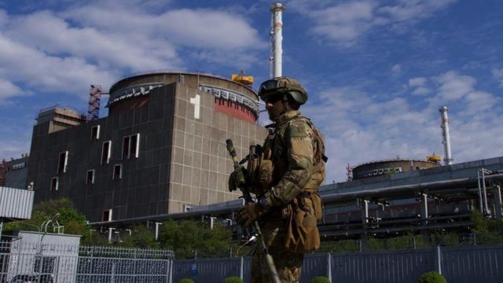
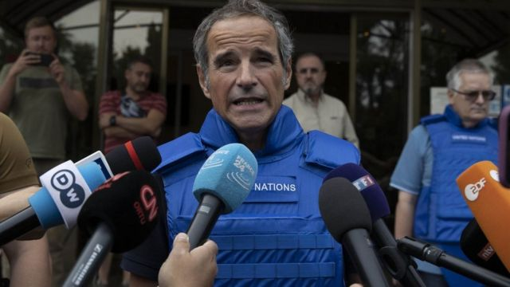
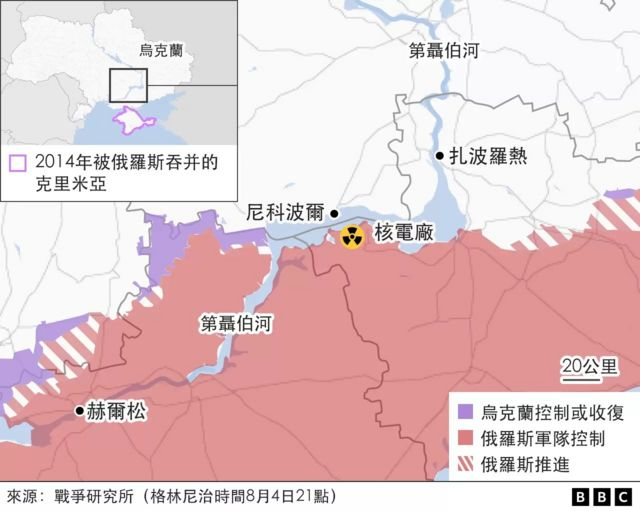
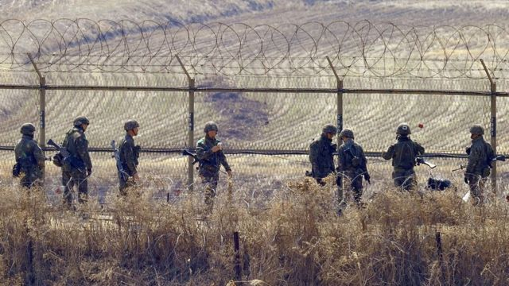
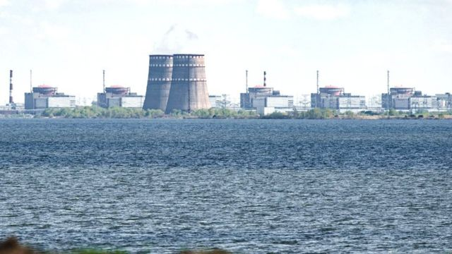

# 乌克兰核电站：什么是非军事区？它如何运作？

#  乌克兰扎波罗热核电站：什么是非军事区？它们如何运作？

8 小时前

> 图像来源，  Getty Images
>
> 图像加注文字，扎波罗热核电站可以为 400 万户家庭提供足够的能源。

**随着乌克兰战争的继续，世界各国非常关注的一个焦点是位于乌克兰南部欧洲最大核电站扎波罗热的安全问题。俄国和乌克兰都相互指责对方炮击核电站，引发人们对又一场切尔诺贝利式核灾难的担忧。**

虽然乌克兰工人继续维持这个核电厂的运作，但联合国核监督机构国际原子能机构（IAEA）说，这种情况“难以持续”。该机构已经在现场设立了支持和监督机制。

IAEA希望在核电站周围设立一个非军事安全区（demilitarised security zone）。但这意味着什么，发生的可能性有多大？

##  什么是非军事区？

红十字国际委员会将其定义为由武装冲突各方商定的区域，冲突的任何一方不得占领或将其用于军事目的。

> 图像来源，  Getty Images
>
> 图像加注文字，联合国国际原子能机构（IAEA）总干事格罗西警告核灾难风险非常高。

红十字国际委员会列出设立非军事区的四个必要条件：

  * 所有作战人员，以及移动武器和移动军事设备都已经撤离； 
  * 固定的军事装备和设施不得用于敌对目的； 
  * 无论当局或是居民都不得采取任何敌对行动； 
  * 所有与军事行为有关的活动都已经停止。 

根据IAEA的计划，交战双方谁也不能在扎波罗热核电厂内部署军队。乌克兰总统泽连斯基表示，他将会支持这一提议。乌克兰核问题负责人建议联合国维和人员能够维护核电站的安全。

但俄罗斯坚持在他们同意该计划之前有一些问题还需要进一步解释。

非军事区过去曾帮助世界其他一些地区的稳定。

##  朝鲜半岛

朝鲜半岛在经历了长达3年多的战斗后于1953年7月27日达成了停战协议，朝鲜战争却从未签署最终和平协议。但停战协议确实为后来沿三八线设置的非军事缓冲区铺平了道路。它长约250公里，宽约4公里。

> 图像来源，  Getty Images
>
> 图像加注文字，朝鲜非军事区

根据该协议，禁止在该地使用坦克和大炮等重武器。士兵可以在那里留守，但只为观察目的，且不能大规模部署。

即使在关系最紧张的时候，双方也基本上能尊重非军事区的神圣不可侵犯性。但据信大约有100万士兵驻扎在附近，使其成为世界上最戒备森严的前线之一。

由于非军事区地带在近70年时间里没有修建任何建筑物或耕种，一个意想不到的结果是，原本很多受威胁或是濒临灭绝的动物和鸟类现在在韩朝两国之间的这片狭长土地上繁衍繁荣。

##  南极洲

1959年，包括美国、前苏联、英国、阿根廷和澳大利亚在内的12个国家同意保持整个南极洲不用做任何军事用途。

> 图像来源，  Getty Images
>
> 图像加注文字，非军事化帮助本土物种在南极洲茁壮成长。

这意味着任何国家都不能在那里建立军事基地、进行训练、处理核废料或测试武器系统。不过，它确实允许各国进行科学实验。

更多的国家后来签署了该条约，并于 1991 年出台了一项单独议定书，禁止任何石油或其他资源的开采。

与此形成鲜明对比的是，俄罗斯和美国两国都允许在北极勘探石油并进行军事演习。

##  西奈半岛

在1967年的第三次中东战争期间（以色列方面称六日战争，阿拉伯国家方面称六月战争，Six Day War），以色列从埃及手中夺取了西奈半岛。

> 图像来源，  Getty Images
>
> 图像加注文字，以色列和埃及在 1978 年签署戴维营协议后同意将西奈半岛非军事化

经过 1978 年在戴维营进行的艰苦谈判，以色列同意撤出该地区。

由美国人斡旋的谈判所达成的协议，严格限制埃及和以色列在边境附近部署军事设施。

它还导致国际部队，即多国部队和观察员，在这里永久性部署，以监督和平协议执行的情况。

但近几十年来，来自伊斯兰激进分子的威胁日益增加，也让埃及和以色列同意部署更大规模的部队。

##  非军事区能适用于乌克兰吗？

> 图像来源，  Getty Images
>
> 图像加注文字，扎波罗热核电站

为确保核设施的安全，在扎波罗热核电站设立类似的非军事区是否能奏效呢？

伦敦国王学院战争研究系核安全专家皮尔博士说，首先，它需要满足一系列条件。

他说，正如IAEA所指出的那样，第一步是要把核电站保安控制权全部交还给乌克兰人员手中，并让俄国军用车量从安全以及安保关键区域撤出。

此外，俄罗斯核专家和军事人员需将把扎波罗热核电站的运营控制权交给乌克兰人，因为目前的情况对原有的安全以及安全事故管理指挥系统构成威胁。

对核电厂安全系统至关重要的场外电力供应也急需维修和重新连接。核电厂必要设备和材料的供应链也需要重新建立。与此同时，与乌克兰以及国际上重要机构的可靠通信系统也需要恢复。

但皮尔博士告诉BBC，鉴于莫斯科目前的立场，这不太可能很快发生。

“虽然俄罗斯驻联合国安理会的代表感谢联合国的报告，”皮尔博士说，“但他强调核电厂唯一的威胁来自乌克兰的炮击，而俄罗斯的军队正在保护该设施。”

皮尔博士认为，俄罗斯人将不会轻易放弃这一立场，至少在没有长期谈判情况下不会放弃。

皮尔博士说，“对俄罗斯来说将核电厂非军事化将意味着他们所说的乌克兰威胁或者已经被消除，或者不再危险。但这将在某种程度上让他们失去信誉，戳穿他们留在那里的理由。”

BBC在基辅的记者雨果·巴其加（Hugo Bachega）同意这一说法。

“俄罗斯一再拒绝从核电厂撤军，声称他们正在保护它。乌克兰人说这是他们的领土，在俄国人入侵前核电站是安全的，”巴其加说。

“目前看来，没有艰苦卓绝的谈判很难看到它会发生。到底怎么做？谁来执行呢？”

