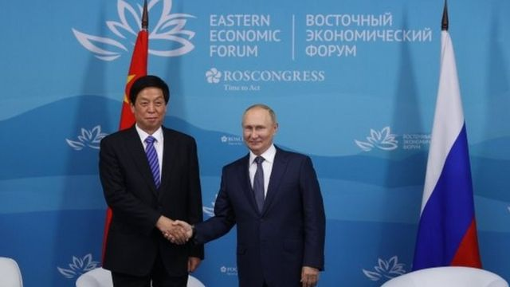
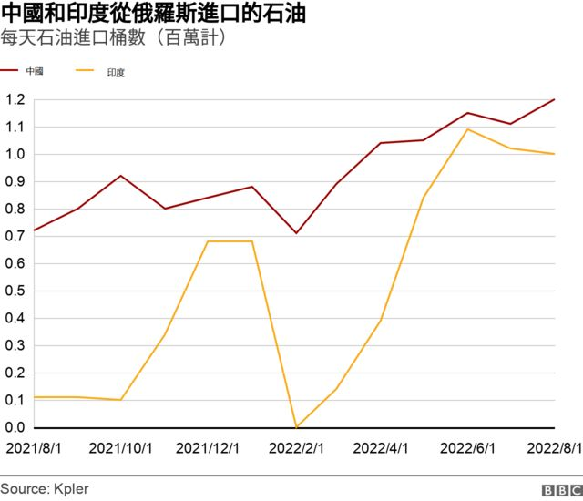
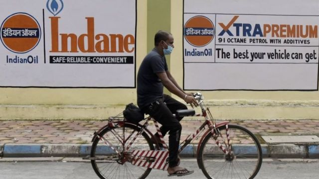
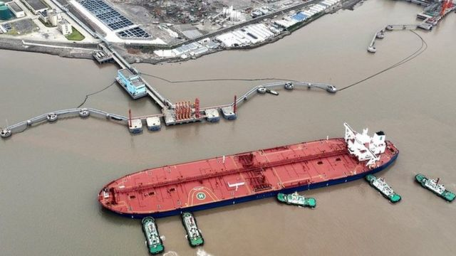

# 乌克兰战争与世界能源危机 中国和印度买了多少俄罗斯石油？

#  乌克兰战争 BBC事实查核：中国和印度买了多少俄罗斯石油？

> 图像来源，  Reuters
>
> 图像加注文字，在9月7日在海参崴举行的国际经济论坛上，俄罗斯总统普京表示，孤立俄罗斯是根本不可能的。他称赞亚洲的作用，称俄罗斯现在更着眼于亚洲。中共政治局常委栗战书出席论坛。

**俄罗斯入侵乌克兰战争已经持续了半年多。西方对俄罗斯实施制裁，并计划逐步减少对俄罗斯能源依赖的同时，亚洲国家从俄罗斯以打折价格买入油气。**

周三（9月7日）在俄罗斯远东海参崴（符拉迪沃斯托克）举行的国际经济论坛上，俄罗斯总统普京表示，孤立俄罗斯是根本不可能的。他称赞亚洲的作用，称俄罗斯现在更着眼于亚洲。

而最新运输数据显示中国正在采购更多的俄罗斯石油，印度也在加大从俄罗斯进口。

BBC事实查核记者希鲁提·孟农（Shruti Menon）从四个方面看俄罗斯的能源出口流向。

##  俄罗斯石油去哪儿了？

俄罗斯入侵乌克兰以来，对欧盟的能源出口已经下降，但欧盟仍在购买大量的石油，每天超过一百万桶。

然而，欧盟成员国已经表示，他们将从12月起禁止所有经海路运输的石油，而大多数俄罗斯石油是通过海路而不是管道运输的。

但印度和中国最近已经成为大买家，达到了俄罗斯所有海运石油出口的一半以上。

今年3月，中国和印度从俄罗斯进口的石油总量超过了27个欧盟成员国的进口总和。

今年年初，印度对被称为“乌拉尔”（Urals）的俄罗斯石油、即一种通常出口到欧洲的混合原油的购买量急剧增加。

航运信息显示，印度对另一种被称为“东西伯利亚太平洋”（ESPO）的俄罗斯混合原油的进口也出现了增长。

自3月以来，中国一直在购买大量的乌拉尔和ESPO。 据报道，7月初，中国已经连续第二个月购买了创纪录的数量。

> 图像来源，  Getty Images

相比之下，日本已经明确表示将逐步停止进口俄罗斯石油，而韩国的俄罗斯原油进口量也有所下降。

努力应对严重经济危机的斯里兰卡正在利用俄罗斯石油低价的机会，运输了三批俄罗斯石油。

缅甸的军事政权最近表示，他们也将开始从俄罗斯进口。

##  石油降价推动向亚洲的销路

俄罗斯2月入侵乌克兰后，乌拉尔原油买家减少，一些外国政府和公司决定回避从俄罗斯进口能源，俄罗斯能源的出口价格开始下跌。

今年早些时候，俄罗斯原油的每桶价格一度比布伦特原油低30美元。

虽然外界并不知道俄罗斯销售给印度石油的确切价格，但俄罗斯原油的折扣已经缩小到每桶20美元左右。

7月，印度对俄罗斯石油的进口量略有下降，因为与来自沙特阿拉伯的原油相比，俄罗斯石油价格并不是很有吸引力。

最近，乌克兰外交部长库勒巴（Dmytro Kuleba）说，“俄罗斯交付给印度的每一桶原油中都有相当一部分是乌克兰流的血”。

印度政府为其从俄罗斯购买石油辩护说，买最便宜的石油天经地义，无可厚非。

美国政府承认，无法阻止这些国际间对俄罗斯石油的采购，因为并没有对与俄罗斯做生意的国家进行二级制裁。

目前还不清楚印度或中国是否会遵循七国集团（英国、美国、加拿大、法国、德国、意大利和日本）的计划，对俄罗斯石油设定最高价格，限制莫斯科从能源出口获益。

##  制裁的影响

虽然俄罗斯石油的价格具有吸引力，但由于俄罗斯银行受到制裁，印度的大型炼油公司面临着如何为这些采购融资的困难。

> 图像来源，  Reuters
>
> 图像加注文字，中国舟山港正在准备一艘油轮进港

这是一个买卖双方都面临的问题

印度正在考虑的选项之一是用本地货币的交易系统，即印度对俄罗斯的出口商以卢布而不是美元或欧元支付，进口则以印度卢比支付。

美国已明确表示对此持保留意见，称这么做可能“支撑俄罗斯卢布，破坏以美元为基础的金融体系”。

据报道，俄罗斯还要求印度以阿联酋的货币付款，尽管相关贸易公司没有证实这一报道。

而中国的国有石油企业从国外购买石油正越来越多地使用人民币而不是美元。

##  印度和中国还从哪里获得石油？

印度从美国进口的原油在2021年底和今年早些时候急剧上升，但随后下降，然后才略有回升。

虽然印度从俄罗斯的进口量有所增长，但印度也从中东国家购买了大量的石油，最明显的是从伊拉克和沙特阿拉伯进口。

中国也继续从中东以及安哥拉和巴西购买石油，不过在7月份，俄罗斯连续三个月保持中国第一大石油供应国的地位。

