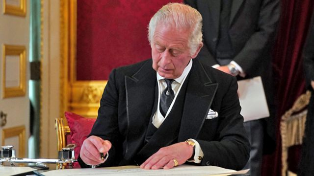

# 查尔斯三世在历史性仪式上正式成为英国国王

#  查尔斯三世在历史性仪式上正式成为英国国王

> 图像来源，  PA Media

**查尔斯三世在圣詹姆士宫（James's Palace）举行的一项历史性仪式上正式获得王位继承理事会（Accession Council）确认，成为英国新国王。**

查尔斯在他母亲伊丽莎白二世去世那一刻就成为了国王，但是王位继承理事会要在君主去世后尽快举行这项具有历史意义的仪式，正式宣布继任者。

在9月10日英国夏令时10：00举行的继承理事会仪式上，查尔斯说，他深知“这份伟大的传承”以及君主的“义务和重任”。

查尔斯三世国王还批准女王丧礼举行当天为公共假日，不过目前还不清楚国葬何时将举行。

这是王位继承理事会具有历史意义的仪式第一次有电视转播。

宣告查尔斯三世为国王的仪式结束后，为悼念已故女王而降下的旗帜再度升起，英国各地随即发布更多公告，直到周日再度恢复半旗。

此前，这位英国国王发表了感人肺腑的首次演讲，他承诺，将追随他“亲爱的妈妈”继续服务生涯。

周五晚，他向全国人民表示，他对母亲的去世“深感悲痛”，并赞扬她的热情、幽默，以及“总有能力精准地看到人们最好的一面”。

国王承诺，会像已故女王在位70年那样“坚定不移地奉献”国家。

在继承理事会仪式上，国王查尔斯三世对女王的去世发表个人声明，并宣誓保卫苏格兰教会——在苏格兰，教会与国家之间有权力划分。

与查尔斯结婚17年的妻子卡米拉（Camilla），以及国王的儿子威廉（William）出席王位仪式。

卡米拉目前的头衔是王后（Queen Consort），威廉的头衔是新威尔士亲王（Prince of Wales）。

王位继承仪式11点在伦敦圣詹姆士宫的修士宫（Friar Court）阳台上举行。这一时刻伴随着有数百年历史的壮观场面——在海德公园和伦敦塔，号手吹响号角，鸣枪致敬。

“女王去世，国王万岁”这句话并没有包含在正式公告中，通常是在之后加上的。

> 图像来源，  Getty Images
>
> 图像加注文字，国王的登基将在伦敦金融城皇家交易所宣布，就像他母亲70多年前登基一样。

周五，聚集在白金汉宫的人群向查尔斯欢呼，高呼“上帝保佑国王！”

查尔斯随后发表了电视演讲，表达他的愿望，希望威廉王子和他的妻子，也就是新威尔士亲王和王后，“继续激励并引领我们进行全国性对话”。

他表达了自己“对哈里和梅根的爱”，并称赞女王“忠于职守”。

国王承认他的生活已经改变，他说不能把“这么多时间和精力”用于慈善事业，以及他作为王位继承人支持了几十年的事务。

这位73岁的君主表示，尽管对女王的去世感到悲痛，但他希望英国和英联邦的人民“记住她树立起来的榜样，并从她身上汲取力量”。

##  王位继承理事会有什么程序？

  * 历史上来看，枢密院（Privy Council）的所有成员都要参加王位继承理事会。枢密院是君主顾问机构，可以追溯到诺曼国王时期。目前有700多名议员，其中大部分是过去及目前的政界人士，只需要从中召集200名议员。 

  * 他们最初聚集在圣詹姆士宫，没有国王在场。由首相特拉斯（Liz Truss，又译卓慧思）任命的枢密院议长（Lord President）、保守党议员彭妮·莫当特（Penny Mordaunt）宣布女王的去世。 

  * 议会司仪宣读声明，包括查尔斯的国王头衔，也就是是查尔斯三世。 

  * 公告由一众人签署，包括王后、威尔士亲王、坎特伯雷大主教、大法官、约克大主教和首相。 

  * 枢密院议长要求肃静，宣读余下的事务，并发布海德公园和伦敦塔鸣枪敬礼的公告和指示。 

  * 国王进入王位继承理事会的第二部分，并就女王过世发表个人声明。这部分只有枢密院参事出席。 

  * 他会宣誓保卫苏格兰教会，并签署两份文件以作记录。王后和威尔士亲王见证他的签署。 

  * 枢密院顾问会在离开前签署公告。 

